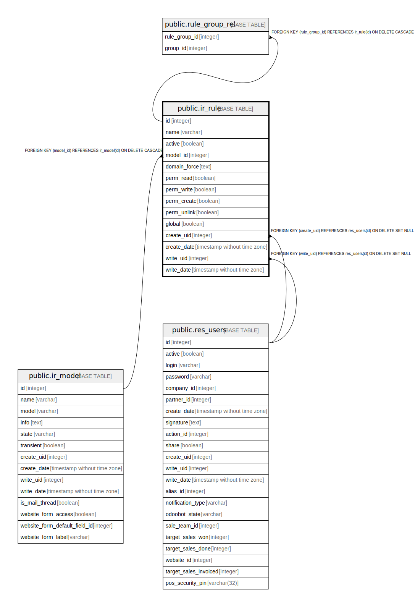

# public.ir_rule

## Description

Record Rule

## Columns

| Name | Type | Default | Nullable | Children | Parents | Comment |
| ---- | ---- | ------- | -------- | -------- | ------- | ------- |
| id | integer | nextval('ir_rule_id_seq'::regclass) | false | [public.rule_group_rel](public.rule_group_rel.md) |  |  |
| name | varchar |  | true |  |  | Name |
| active | boolean |  | true |  |  | Active |
| model_id | integer |  | false |  | [public.ir_model](public.ir_model.md) | Object |
| domain_force | text |  | true |  |  | Domain |
| perm_read | boolean |  | true |  |  | Apply for Read |
| perm_write | boolean |  | true |  |  | Apply for Write |
| perm_create | boolean |  | true |  |  | Apply for Create |
| perm_unlink | boolean |  | true |  |  | Apply for Delete |
| global | boolean |  | true |  |  | Global |
| create_uid | integer |  | true |  | [public.res_users](public.res_users.md) | Created by |
| create_date | timestamp without time zone |  | true |  |  | Created on |
| write_uid | integer |  | true |  | [public.res_users](public.res_users.md) | Last Updated by |
| write_date | timestamp without time zone |  | true |  |  | Last Updated on |

## Constraints

| Name | Type | Definition | Comment |
| ---- | ---- | ---------- | ------- |
| ir_rule_no_access_rights | CHECK | CHECK (((perm_read <> false) OR (perm_write <> false) OR (perm_create <> false) OR (perm_unlink <> false))) | CHECK (perm_read!=False or perm_write!=False or perm_create!=False or perm_unlink!=False) |
| ir_rule_create_uid_fkey | FOREIGN KEY | FOREIGN KEY (create_uid) REFERENCES res_users(id) ON DELETE SET NULL |  |
| ir_rule_write_uid_fkey | FOREIGN KEY | FOREIGN KEY (write_uid) REFERENCES res_users(id) ON DELETE SET NULL |  |
| ir_rule_model_id_fkey | FOREIGN KEY | FOREIGN KEY (model_id) REFERENCES ir_model(id) ON DELETE CASCADE |  |
| ir_rule_pkey | PRIMARY KEY | PRIMARY KEY (id) |  |

## Indexes

| Name | Definition |
| ---- | ---------- |
| ir_rule_pkey | CREATE UNIQUE INDEX ir_rule_pkey ON public.ir_rule USING btree (id) |
| ir_rule_name_index | CREATE INDEX ir_rule_name_index ON public.ir_rule USING btree (name) |
| ir_rule_model_id_index | CREATE INDEX ir_rule_model_id_index ON public.ir_rule USING btree (model_id) |

## Relations

---

> Generated by [tbls](https://github.com/k1LoW/tbls)
