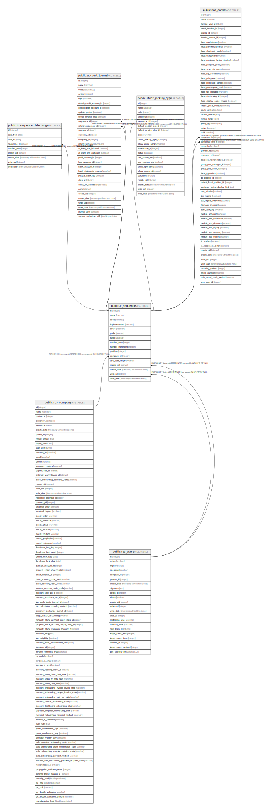

# public.ir_sequence

## Description

Sequence

## Columns

| Name | Type | Default | Nullable | Children | Parents | Comment |
| ---- | ---- | ------- | -------- | -------- | ------- | ------- |
| id | integer | nextval('ir_sequence_id_seq'::regclass) | false | [public.ir_sequence_date_range](public.ir_sequence_date_range.md) [public.account_journal](public.account_journal.md) [public.stock_picking_type](public.stock_picking_type.md) [public.pos_config](public.pos_config.md) |  |  |
| name | varchar |  | false |  |  | Name |
| code | varchar |  | true |  |  | Sequence Code |
| implementation | varchar |  | false |  |  | Implementation |
| active | boolean |  | true |  |  | Active |
| prefix | varchar |  | true |  |  | Prefix |
| suffix | varchar |  | true |  |  | Suffix |
| number_next | integer |  | false |  |  | Next Number |
| number_increment | integer |  | false |  |  | Step |
| padding | integer |  | false |  |  | Sequence Size |
| company_id | integer |  | true |  | [public.res_company](public.res_company.md) | Company |
| use_date_range | boolean |  | true |  |  | Use subsequences per date_range |
| create_uid | integer |  | true |  | [public.res_users](public.res_users.md) | Created by |
| create_date | timestamp without time zone |  | true |  |  | Created on |
| write_uid | integer |  | true |  | [public.res_users](public.res_users.md) | Last Updated by |
| write_date | timestamp without time zone |  | true |  |  | Last Updated on |

## Constraints

| Name | Type | Definition |
| ---- | ---- | ---------- |
| ir_sequence_create_uid_fkey | FOREIGN KEY | FOREIGN KEY (create_uid) REFERENCES res_users(id) ON DELETE SET NULL |
| ir_sequence_write_uid_fkey | FOREIGN KEY | FOREIGN KEY (write_uid) REFERENCES res_users(id) ON DELETE SET NULL |
| ir_sequence_company_id_fkey | FOREIGN KEY | FOREIGN KEY (company_id) REFERENCES res_company(id) ON DELETE SET NULL |
| ir_sequence_pkey | PRIMARY KEY | PRIMARY KEY (id) |

## Indexes

| Name | Definition |
| ---- | ---------- |
| ir_sequence_pkey | CREATE UNIQUE INDEX ir_sequence_pkey ON public.ir_sequence USING btree (id) |

## Relations

---

> Generated by [tbls](https://github.com/k1LoW/tbls)
