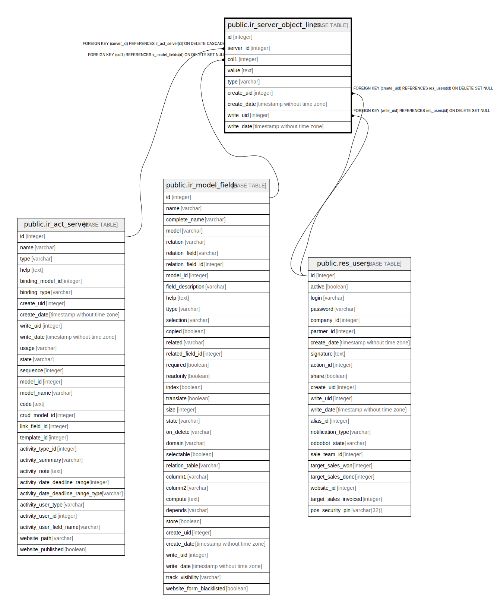

# public.ir_server_object_lines

## Description

Server Action value mapping

## Columns

| Name | Type | Default | Nullable | Children | Parents | Comment |
| ---- | ---- | ------- | -------- | -------- | ------- | ------- |
| id | integer | nextval('ir_server_object_lines_id_seq'::regclass) | false |  |  |  |
| server_id | integer |  | true |  | [public.ir_act_server](public.ir_act_server.md) | Related Server Action |
| col1 | integer |  | false |  | [public.ir_model_fields](public.ir_model_fields.md) | Field |
| value | text |  | false |  |  | Value |
| type | varchar |  | false |  |  | Evaluation Type |
| create_uid | integer |  | true |  | [public.res_users](public.res_users.md) | Created by |
| create_date | timestamp without time zone |  | true |  |  | Created on |
| write_uid | integer |  | true |  | [public.res_users](public.res_users.md) | Last Updated by |
| write_date | timestamp without time zone |  | true |  |  | Last Updated on |

## Constraints

| Name | Type | Definition |
| ---- | ---- | ---------- |
| ir_server_object_lines_server_id_fkey | FOREIGN KEY | FOREIGN KEY (server_id) REFERENCES ir_act_server(id) ON DELETE CASCADE |
| ir_server_object_lines_create_uid_fkey | FOREIGN KEY | FOREIGN KEY (create_uid) REFERENCES res_users(id) ON DELETE SET NULL |
| ir_server_object_lines_write_uid_fkey | FOREIGN KEY | FOREIGN KEY (write_uid) REFERENCES res_users(id) ON DELETE SET NULL |
| ir_server_object_lines_col1_fkey | FOREIGN KEY | FOREIGN KEY (col1) REFERENCES ir_model_fields(id) ON DELETE SET NULL |
| ir_server_object_lines_pkey | PRIMARY KEY | PRIMARY KEY (id) |

## Indexes

| Name | Definition |
| ---- | ---------- |
| ir_server_object_lines_pkey | CREATE UNIQUE INDEX ir_server_object_lines_pkey ON public.ir_server_object_lines USING btree (id) |

## Relations

---

> Generated by [tbls](https://github.com/k1LoW/tbls)
