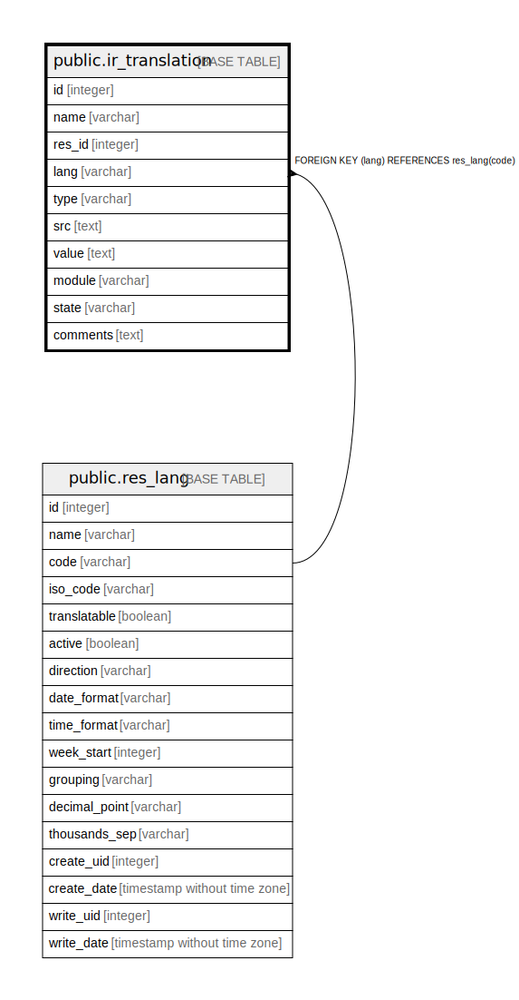

# public.ir_translation

## Description

Translation

## Columns

| Name | Type | Default | Nullable | Children | Parents | Comment |
| ---- | ---- | ------- | -------- | -------- | ------- | ------- |
| id | integer | nextval('ir_translation_id_seq'::regclass) | false |  |  |  |
| name | varchar |  | false |  |  | Translated field |
| res_id | integer |  | true |  |  | Record ID |
| lang | varchar |  | true |  | [public.res_lang](public.res_lang.md) | Language |
| type | varchar |  | true |  |  | Type |
| src | text |  | true |  |  | Internal Source |
| value | text |  | true |  |  | Translation Value |
| module | varchar |  | true |  |  | Module |
| state | varchar |  | true |  |  | Status |
| comments | text |  | true |  |  | Translation comments |

## Constraints

| Name | Type | Definition | Comment |
| ---- | ---- | ---------- | ------- |
| ir_translation_pkey | PRIMARY KEY | PRIMARY KEY (id) |  |
| ir_translation_lang_fkey_res_lang | FOREIGN KEY | FOREIGN KEY (lang) REFERENCES res_lang(code) | FOREIGN KEY(lang) REFERENCES res_lang(code) |

## Indexes

| Name | Definition |
| ---- | ---------- |
| ir_translation_pkey | CREATE UNIQUE INDEX ir_translation_pkey ON public.ir_translation USING btree (id) |
| ir_translation_res_id_index | CREATE INDEX ir_translation_res_id_index ON public.ir_translation USING btree (res_id) |
| ir_translation_type_index | CREATE INDEX ir_translation_type_index ON public.ir_translation USING btree (type) |
| ir_translation_module_index | CREATE INDEX ir_translation_module_index ON public.ir_translation USING btree (module) |
| ir_translation_comments_index | CREATE INDEX ir_translation_comments_index ON public.ir_translation USING btree (comments) |
| ir_translation_src_md5 | CREATE INDEX ir_translation_src_md5 ON public.ir_translation USING btree (md5(src)) |
| ir_translation_unique | CREATE UNIQUE INDEX ir_translation_unique ON public.ir_translation USING btree (type, name, lang, res_id, md5(src)) |
| ir_translation_code_unique | CREATE UNIQUE INDEX ir_translation_code_unique ON public.ir_translation USING btree (type, lang, md5(src)) WHERE ((type)::text = 'code'::text) |
| ir_translation_model_unique | CREATE UNIQUE INDEX ir_translation_model_unique ON public.ir_translation USING btree (type, lang, name, res_id) WHERE ((type)::text = 'model'::text) |
| ir_translation_selection_unique | CREATE UNIQUE INDEX ir_translation_selection_unique ON public.ir_translation USING btree (type, lang, name, md5(src)) WHERE ((type)::text = ANY ((ARRAY['selection'::character varying, 'constraint'::character varying, 'sql_constraint'::character varying])::text[])) |

## Relations

---

> Generated by [tbls](https://github.com/k1LoW/tbls)
