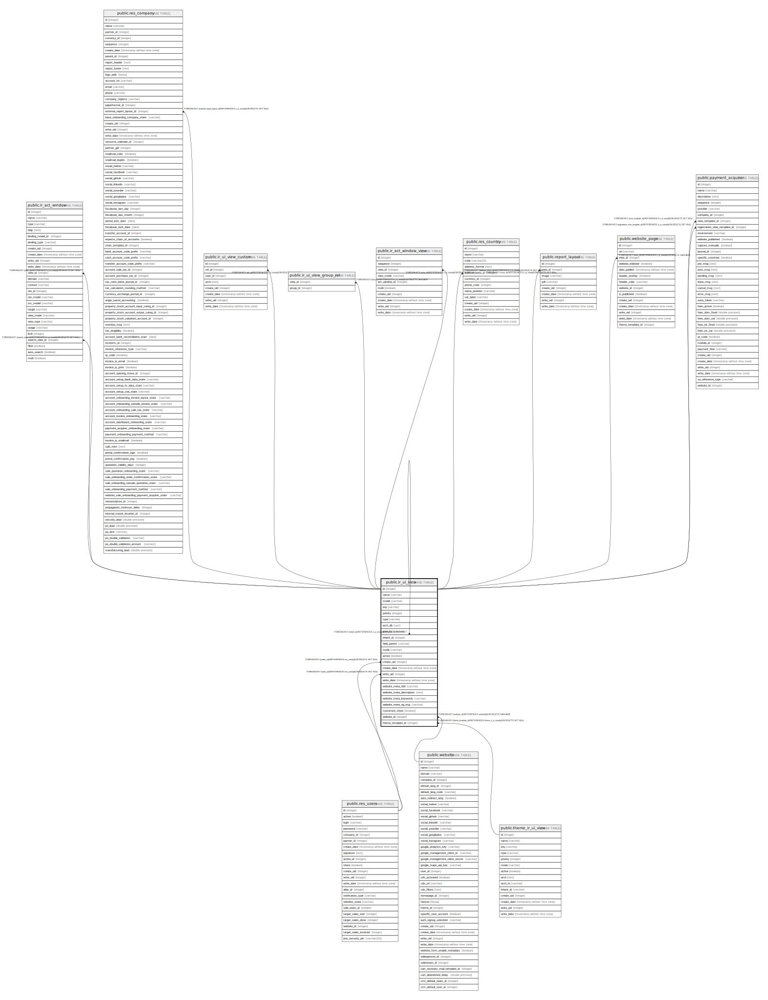

# public.ir_ui_view

## Description

View

## Columns

| Name | Type | Default | Nullable | Children | Parents | Comment |
| ---- | ---- | ------- | -------- | -------- | ------- | ------- |
| id | integer | nextval('ir_ui_view_id_seq'::regclass) | false | [public.ir_act_window](public.ir_act_window.md) [public.res_company](public.res_company.md) [public.ir_ui_view_custom](public.ir_ui_view_custom.md) [public.ir_ui_view](public.ir_ui_view.md) [public.ir_ui_view_group_rel](public.ir_ui_view_group_rel.md) [public.ir_act_window_view](public.ir_act_window_view.md) [public.res_country](public.res_country.md) [public.report_layout](public.report_layout.md) [public.website_page](public.website_page.md) [public.payment_acquirer](public.payment_acquirer.md) |  |  |
| name | varchar |  | false |  |  | View Name |
| model | varchar |  | true |  |  | Model |
| key | varchar |  | true |  |  | Key |
| priority | integer |  | false |  |  | Sequence |
| type | varchar |  | true |  |  | View Type |
| arch_db | text |  | true |  |  | Arch Blob |
| arch_fs | varchar |  | true |  |  | Arch Filename |
| inherit_id | integer |  | true |  | [public.ir_ui_view](public.ir_ui_view.md) | Inherited View |
| field_parent | varchar |  | true |  |  | Child Field |
| mode | varchar |  | false |  |  | View inheritance mode |
| active | boolean |  | true |  |  | Active |
| create_uid | integer |  | true |  | [public.res_users](public.res_users.md) | Created by |
| create_date | timestamp without time zone |  | true |  |  | Created on |
| write_uid | integer |  | true |  | [public.res_users](public.res_users.md) | Last Updated by |
| write_date | timestamp without time zone |  | true |  |  | Last Updated on |
| website_meta_title | varchar |  | true |  |  | Website meta title |
| website_meta_description | text |  | true |  |  | Website meta description |
| website_meta_keywords | varchar |  | true |  |  | Website meta keywords |
| website_meta_og_img | varchar |  | true |  |  | Website opengraph image |
| customize_show | boolean |  | true |  |  | Show As Optional Inherit |
| website_id | integer |  | true |  | [public.website](public.website.md) | Website |
| theme_template_id | integer |  | true |  | [public.theme_ir_ui_view](public.theme_ir_ui_view.md) | Theme Template |

## Constraints

| Name | Type | Definition | Comment |
| ---- | ---- | ---------- | ------- |
| ir_ui_view_inheritance_mode | CHECK | CHECK ((((mode)::text <> 'extension'::text) OR (inherit_id IS NOT NULL))) | CHECK (mode != 'extension' OR inherit_id IS NOT NULL) |
| ir_ui_view_qweb_required_key | CHECK | CHECK ((((type)::text <> 'qweb'::text) OR (key IS NOT NULL))) | CHECK (type != 'qweb' OR key IS NOT NULL) |
| ir_ui_view_create_uid_fkey | FOREIGN KEY | FOREIGN KEY (create_uid) REFERENCES res_users(id) ON DELETE SET NULL |  |
| ir_ui_view_write_uid_fkey | FOREIGN KEY | FOREIGN KEY (write_uid) REFERENCES res_users(id) ON DELETE SET NULL |  |
| ir_ui_view_inherit_id_fkey | FOREIGN KEY | FOREIGN KEY (inherit_id) REFERENCES ir_ui_view(id) ON DELETE RESTRICT |  |
| ir_ui_view_pkey | PRIMARY KEY | PRIMARY KEY (id) |  |
| ir_ui_view_website_id_fkey | FOREIGN KEY | FOREIGN KEY (website_id) REFERENCES website(id) ON DELETE CASCADE |  |
| ir_ui_view_theme_template_id_fkey | FOREIGN KEY | FOREIGN KEY (theme_template_id) REFERENCES theme_ir_ui_view(id) ON DELETE SET NULL |  |

## Indexes

| Name | Definition |
| ---- | ---------- |
| ir_ui_view_pkey | CREATE UNIQUE INDEX ir_ui_view_pkey ON public.ir_ui_view USING btree (id) |
| ir_ui_view_model_index | CREATE INDEX ir_ui_view_model_index ON public.ir_ui_view USING btree (model) |
| ir_ui_view_inherit_id_index | CREATE INDEX ir_ui_view_inherit_id_index ON public.ir_ui_view USING btree (inherit_id) |
| ir_ui_view_model_type_inherit_id | CREATE INDEX ir_ui_view_model_type_inherit_id ON public.ir_ui_view USING btree (model, inherit_id) |

## Relations

---

> Generated by [tbls](https://github.com/k1LoW/tbls)
