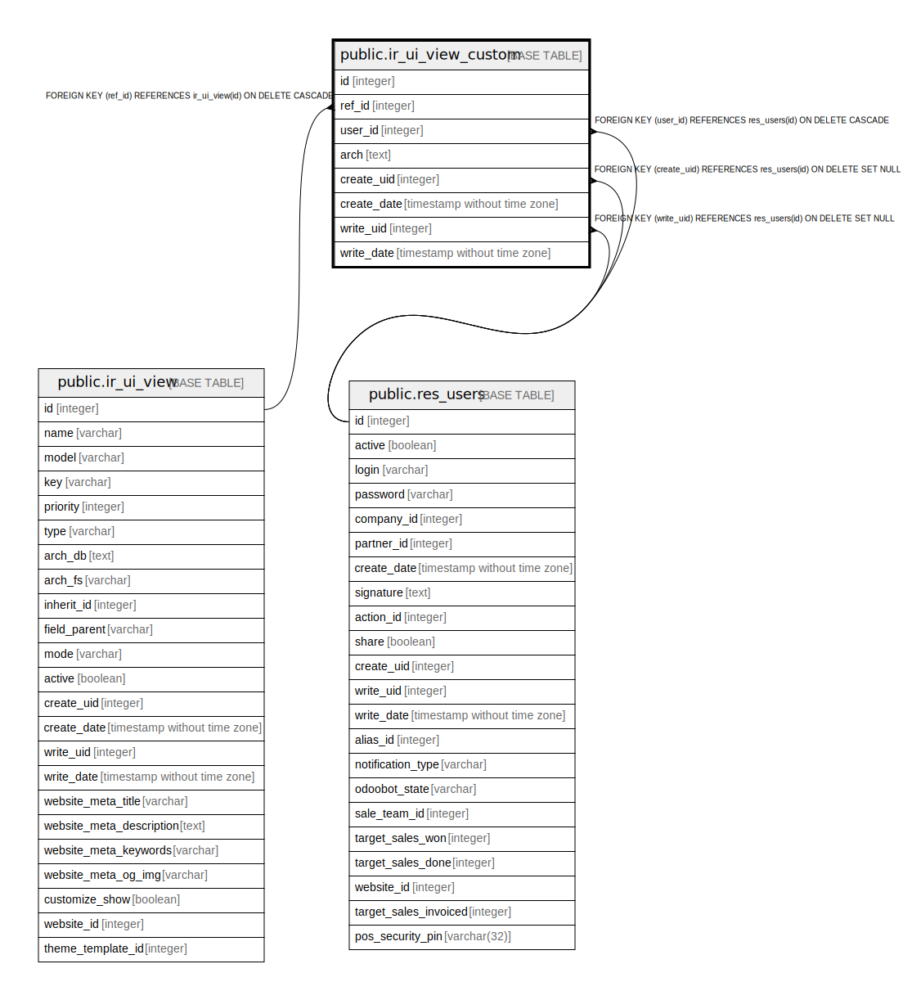

# public.ir_ui_view_custom

## Description

Custom View

## Columns

| Name | Type | Default | Nullable | Children | Parents | Comment |
| ---- | ---- | ------- | -------- | -------- | ------- | ------- |
| id | integer | nextval('ir_ui_view_custom_id_seq'::regclass) | false |  |  |  |
| ref_id | integer |  | false |  | [public.ir_ui_view](public.ir_ui_view.md) | Original View |
| user_id | integer |  | false |  | [public.res_users](public.res_users.md) | User |
| arch | text |  | false |  |  | View Architecture |
| create_uid | integer |  | true |  | [public.res_users](public.res_users.md) | Created by |
| create_date | timestamp without time zone |  | true |  |  | Created on |
| write_uid | integer |  | true |  | [public.res_users](public.res_users.md) | Last Updated by |
| write_date | timestamp without time zone |  | true |  |  | Last Updated on |

## Constraints

| Name | Type | Definition |
| ---- | ---- | ---------- |
| ir_ui_view_custom_create_uid_fkey | FOREIGN KEY | FOREIGN KEY (create_uid) REFERENCES res_users(id) ON DELETE SET NULL |
| ir_ui_view_custom_user_id_fkey | FOREIGN KEY | FOREIGN KEY (user_id) REFERENCES res_users(id) ON DELETE CASCADE |
| ir_ui_view_custom_write_uid_fkey | FOREIGN KEY | FOREIGN KEY (write_uid) REFERENCES res_users(id) ON DELETE SET NULL |
| ir_ui_view_custom_pkey | PRIMARY KEY | PRIMARY KEY (id) |
| ir_ui_view_custom_ref_id_fkey | FOREIGN KEY | FOREIGN KEY (ref_id) REFERENCES ir_ui_view(id) ON DELETE CASCADE |

## Indexes

| Name | Definition |
| ---- | ---------- |
| ir_ui_view_custom_pkey | CREATE UNIQUE INDEX ir_ui_view_custom_pkey ON public.ir_ui_view_custom USING btree (id) |
| ir_ui_view_custom_ref_id_index | CREATE INDEX ir_ui_view_custom_ref_id_index ON public.ir_ui_view_custom USING btree (ref_id) |
| ir_ui_view_custom_user_id_index | CREATE INDEX ir_ui_view_custom_user_id_index ON public.ir_ui_view_custom USING btree (user_id) |
| ir_ui_view_custom_user_id_ref_id | CREATE INDEX ir_ui_view_custom_user_id_ref_id ON public.ir_ui_view_custom USING btree (user_id, ref_id) |

## Relations

---

> Generated by [tbls](https://github.com/k1LoW/tbls)
