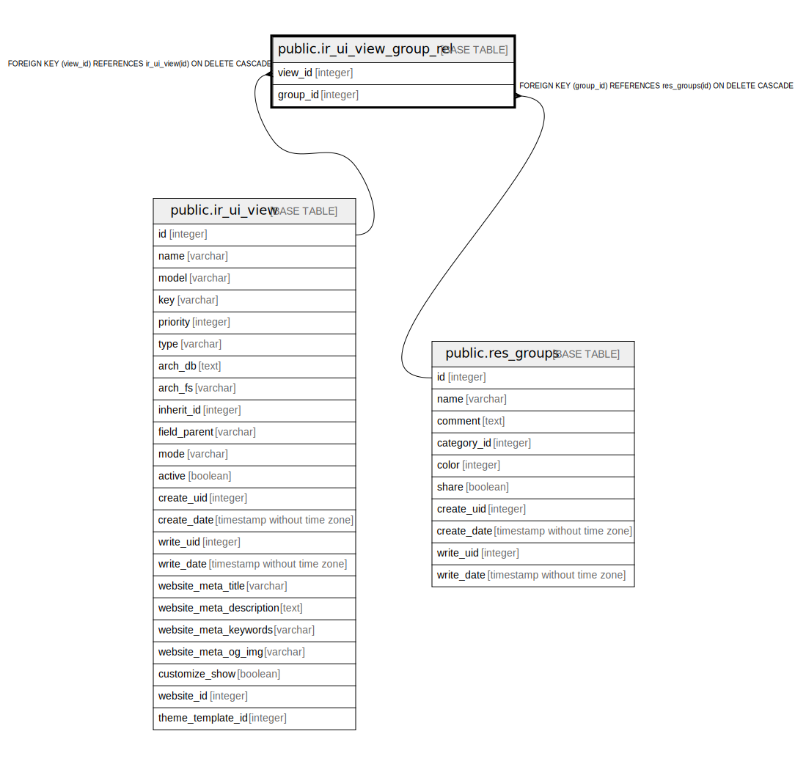

# public.ir_ui_view_group_rel

## Description

RELATION BETWEEN ir_ui_view AND res_groups

## Columns

| Name | Type | Default | Nullable | Children | Parents | Comment |
| ---- | ---- | ------- | -------- | -------- | ------- | ------- |
| view_id | integer |  | false |  | [public.ir_ui_view](public.ir_ui_view.md) |  |
| group_id | integer |  | false |  | [public.res_groups](public.res_groups.md) |  |

## Constraints

| Name | Type | Definition |
| ---- | ---- | ---------- |
| ir_ui_view_group_rel_group_id_fkey | FOREIGN KEY | FOREIGN KEY (group_id) REFERENCES res_groups(id) ON DELETE CASCADE |
| ir_ui_view_group_rel_view_id_fkey | FOREIGN KEY | FOREIGN KEY (view_id) REFERENCES ir_ui_view(id) ON DELETE CASCADE |
| ir_ui_view_group_rel_view_id_group_id_key | UNIQUE | UNIQUE (view_id, group_id) |

## Indexes

| Name | Definition |
| ---- | ---------- |
| ir_ui_view_group_rel_view_id_group_id_key | CREATE UNIQUE INDEX ir_ui_view_group_rel_view_id_group_id_key ON public.ir_ui_view_group_rel USING btree (view_id, group_id) |
| ir_ui_view_group_rel_view_id_idx | CREATE INDEX ir_ui_view_group_rel_view_id_idx ON public.ir_ui_view_group_rel USING btree (view_id) |
| ir_ui_view_group_rel_group_id_idx | CREATE INDEX ir_ui_view_group_rel_group_id_idx ON public.ir_ui_view_group_rel USING btree (group_id) |

## Relations

---

> Generated by [tbls](https://github.com/k1LoW/tbls)
