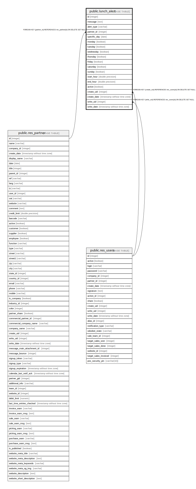

# public.lunch_alert

## Description

Lunch Alert

## Columns

| Name | Type | Default | Nullable | Children | Parents | Comment |
| ---- | ---- | ------- | -------- | -------- | ------- | ------- |
| id | integer | nextval('lunch_alert_id_seq'::regclass) | false |  |  |  |
| message | text |  | false |  |  | Message |
| alert_type | varchar |  | false |  |  | Recurrence |
| partner_id | integer |  | true |  | [public.res_partner](public.res_partner.md) | Vendor |
| specific_day | date |  | true |  |  | Day |
| monday | boolean |  | true |  |  | Monday |
| tuesday | boolean |  | true |  |  | Tuesday |
| wednesday | boolean |  | true |  |  | Wednesday |
| thursday | boolean |  | true |  |  | Thursday |
| friday | boolean |  | true |  |  | Friday |
| saturday | boolean |  | true |  |  | Saturday |
| sunday | boolean |  | true |  |  | Sunday |
| start_hour | double precision |  | false |  |  | Between |
| end_hour | double precision |  | false |  |  | And |
| active | boolean |  | true |  |  | Active |
| create_uid | integer |  | true |  | [public.res_users](public.res_users.md) | Created by |
| create_date | timestamp without time zone |  | true |  |  | Created on |
| write_uid | integer |  | true |  | [public.res_users](public.res_users.md) | Last Updated by |
| write_date | timestamp without time zone |  | true |  |  | Last Updated on |

## Constraints

| Name | Type | Definition |
| ---- | ---- | ---------- |
| lunch_alert_create_uid_fkey | FOREIGN KEY | FOREIGN KEY (create_uid) REFERENCES res_users(id) ON DELETE SET NULL |
| lunch_alert_write_uid_fkey | FOREIGN KEY | FOREIGN KEY (write_uid) REFERENCES res_users(id) ON DELETE SET NULL |
| lunch_alert_partner_id_fkey | FOREIGN KEY | FOREIGN KEY (partner_id) REFERENCES res_partner(id) ON DELETE SET NULL |
| lunch_alert_pkey | PRIMARY KEY | PRIMARY KEY (id) |

## Indexes

| Name | Definition |
| ---- | ---------- |
| lunch_alert_pkey | CREATE UNIQUE INDEX lunch_alert_pkey ON public.lunch_alert USING btree (id) |
| lunch_alert_alert_type_index | CREATE INDEX lunch_alert_alert_type_index ON public.lunch_alert USING btree (alert_type) |

## Relations

---

> Generated by [tbls](https://github.com/k1LoW/tbls)
