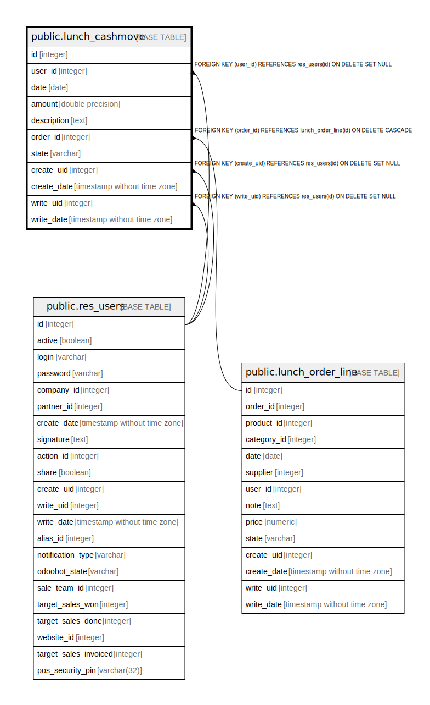

# public.lunch_cashmove

## Description

Lunch Cashmove

## Columns

| Name | Type | Default | Nullable | Children | Parents | Comment |
| ---- | ---- | ------- | -------- | -------- | ------- | ------- |
| id | integer | nextval('lunch_cashmove_id_seq'::regclass) | false |  |  |  |
| user_id | integer |  | true |  | [public.res_users](public.res_users.md) | User |
| date | date |  | false |  |  | Date |
| amount | double precision |  | false |  |  | Amount |
| description | text |  | true |  |  | Description |
| order_id | integer |  | true |  | [public.lunch_order_line](public.lunch_order_line.md) | Order |
| state | varchar |  | true |  |  | Is an order or a payment |
| create_uid | integer |  | true |  | [public.res_users](public.res_users.md) | Created by |
| create_date | timestamp without time zone |  | true |  |  | Created on |
| write_uid | integer |  | true |  | [public.res_users](public.res_users.md) | Last Updated by |
| write_date | timestamp without time zone |  | true |  |  | Last Updated on |

## Constraints

| Name | Type | Definition |
| ---- | ---- | ---------- |
| lunch_cashmove_create_uid_fkey | FOREIGN KEY | FOREIGN KEY (create_uid) REFERENCES res_users(id) ON DELETE SET NULL |
| lunch_cashmove_user_id_fkey | FOREIGN KEY | FOREIGN KEY (user_id) REFERENCES res_users(id) ON DELETE SET NULL |
| lunch_cashmove_write_uid_fkey | FOREIGN KEY | FOREIGN KEY (write_uid) REFERENCES res_users(id) ON DELETE SET NULL |
| lunch_cashmove_order_id_fkey | FOREIGN KEY | FOREIGN KEY (order_id) REFERENCES lunch_order_line(id) ON DELETE CASCADE |
| lunch_cashmove_pkey | PRIMARY KEY | PRIMARY KEY (id) |

## Indexes

| Name | Definition |
| ---- | ---------- |
| lunch_cashmove_pkey | CREATE UNIQUE INDEX lunch_cashmove_pkey ON public.lunch_cashmove USING btree (id) |

## Relations

---

> Generated by [tbls](https://github.com/k1LoW/tbls)
