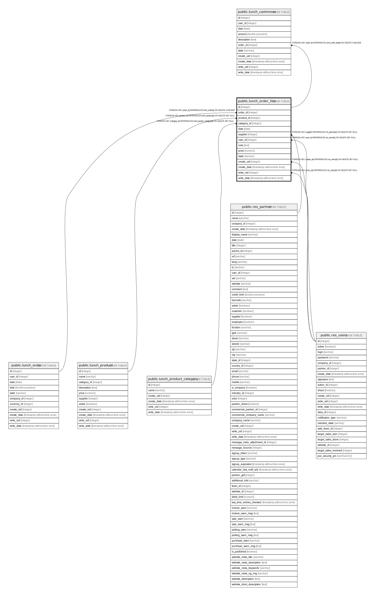

# public.lunch_order_line

## Description

Lunch Order Line

## Columns

| Name | Type | Default | Nullable | Children | Parents | Comment |
| ---- | ---- | ------- | -------- | -------- | ------- | ------- |
| id | integer | nextval('lunch_order_line_id_seq'::regclass) | false | [public.lunch_cashmove](public.lunch_cashmove.md) |  |  |
| order_id | integer |  | false |  | [public.lunch_order](public.lunch_order.md) | Order |
| product_id | integer |  | false |  | [public.lunch_product](public.lunch_product.md) | Product |
| category_id | integer |  | true |  | [public.lunch_product_category](public.lunch_product_category.md) | Product Category |
| date | date |  | true |  |  | Date |
| supplier | integer |  | true |  | [public.res_partner](public.res_partner.md) | Vendor |
| user_id | integer |  | true |  | [public.res_users](public.res_users.md) | User |
| note | text |  | true |  |  | Note |
| price | numeric |  | true |  |  | Price |
| state | varchar |  | true |  |  | Status |
| create_uid | integer |  | true |  | [public.res_users](public.res_users.md) | Created by |
| create_date | timestamp without time zone |  | true |  |  | Created on |
| write_uid | integer |  | true |  | [public.res_users](public.res_users.md) | Last Updated by |
| write_date | timestamp without time zone |  | true |  |  | Last Updated on |

## Constraints

| Name | Type | Definition |
| ---- | ---- | ---------- |
| lunch_order_line_create_uid_fkey | FOREIGN KEY | FOREIGN KEY (create_uid) REFERENCES res_users(id) ON DELETE SET NULL |
| lunch_order_line_user_id_fkey | FOREIGN KEY | FOREIGN KEY (user_id) REFERENCES res_users(id) ON DELETE SET NULL |
| lunch_order_line_write_uid_fkey | FOREIGN KEY | FOREIGN KEY (write_uid) REFERENCES res_users(id) ON DELETE SET NULL |
| lunch_order_line_supplier_fkey | FOREIGN KEY | FOREIGN KEY (supplier) REFERENCES res_partner(id) ON DELETE SET NULL |
| lunch_order_line_order_id_fkey | FOREIGN KEY | FOREIGN KEY (order_id) REFERENCES lunch_order(id) ON DELETE CASCADE |
| lunch_order_line_pkey | PRIMARY KEY | PRIMARY KEY (id) |
| lunch_order_line_product_id_fkey | FOREIGN KEY | FOREIGN KEY (product_id) REFERENCES lunch_product(id) ON DELETE SET NULL |
| lunch_order_line_category_id_fkey | FOREIGN KEY | FOREIGN KEY (category_id) REFERENCES lunch_product_category(id) ON DELETE SET NULL |

## Indexes

| Name | Definition |
| ---- | ---------- |
| lunch_order_line_pkey | CREATE UNIQUE INDEX lunch_order_line_pkey ON public.lunch_order_line USING btree (id) |
| lunch_order_line_state_index | CREATE INDEX lunch_order_line_state_index ON public.lunch_order_line USING btree (state) |

## Relations

---

> Generated by [tbls](https://github.com/k1LoW/tbls)
