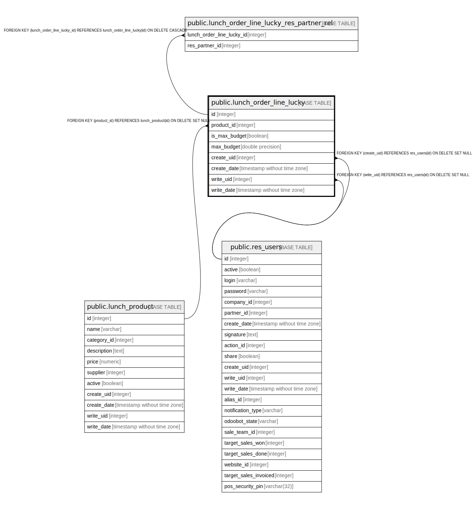

# public.lunch_order_line_lucky

## Description

Lunch Order Line Lucky

## Columns

| Name | Type | Default | Nullable | Children | Parents | Comment |
| ---- | ---- | ------- | -------- | -------- | ------- | ------- |
| id | integer | nextval('lunch_order_line_lucky_id_seq'::regclass) | false | [public.lunch_order_line_lucky_res_partner_rel](public.lunch_order_line_lucky_res_partner_rel.md) |  |  |
| product_id | integer |  | true |  | [public.lunch_product](public.lunch_product.md) | Product |
| is_max_budget | boolean |  | true |  |  | I'm not feeling rich |
| max_budget | double precision |  | true |  |  | Max Budget |
| create_uid | integer |  | true |  | [public.res_users](public.res_users.md) | Created by |
| create_date | timestamp without time zone |  | true |  |  | Created on |
| write_uid | integer |  | true |  | [public.res_users](public.res_users.md) | Last Updated by |
| write_date | timestamp without time zone |  | true |  |  | Last Updated on |

## Constraints

| Name | Type | Definition |
| ---- | ---- | ---------- |
| lunch_order_line_lucky_create_uid_fkey | FOREIGN KEY | FOREIGN KEY (create_uid) REFERENCES res_users(id) ON DELETE SET NULL |
| lunch_order_line_lucky_write_uid_fkey | FOREIGN KEY | FOREIGN KEY (write_uid) REFERENCES res_users(id) ON DELETE SET NULL |
| lunch_order_line_lucky_pkey | PRIMARY KEY | PRIMARY KEY (id) |
| lunch_order_line_lucky_product_id_fkey | FOREIGN KEY | FOREIGN KEY (product_id) REFERENCES lunch_product(id) ON DELETE SET NULL |

## Indexes

| Name | Definition |
| ---- | ---------- |
| lunch_order_line_lucky_pkey | CREATE UNIQUE INDEX lunch_order_line_lucky_pkey ON public.lunch_order_line_lucky USING btree (id) |

## Relations

---

> Generated by [tbls](https://github.com/k1LoW/tbls)
