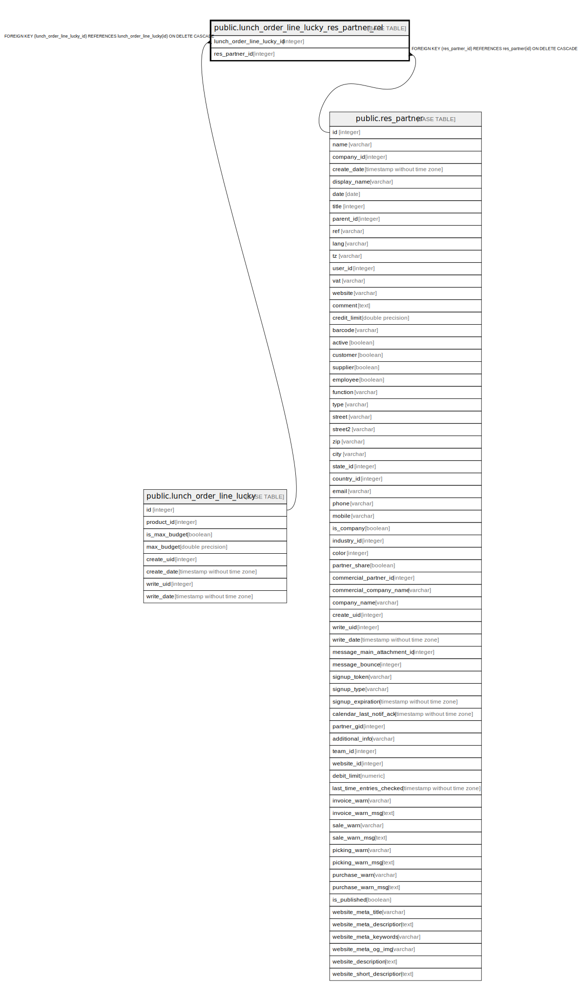

# public.lunch_order_line_lucky_res_partner_rel

## Description

RELATION BETWEEN lunch_order_line_lucky AND res_partner

## Columns

| Name | Type | Default | Nullable | Children | Parents | Comment |
| ---- | ---- | ------- | -------- | -------- | ------- | ------- |
| lunch_order_line_lucky_id | integer |  | false |  | [public.lunch_order_line_lucky](public.lunch_order_line_lucky.md) |  |
| res_partner_id | integer |  | false |  | [public.res_partner](public.res_partner.md) |  |

## Constraints

| Name | Type | Definition |
| ---- | ---- | ---------- |
| lunch_order_line_lucky_res_partner_rel_res_partner_id_fkey | FOREIGN KEY | FOREIGN KEY (res_partner_id) REFERENCES res_partner(id) ON DELETE CASCADE |
| lunch_order_line_lucky_res_partn_lunch_order_line_lucky_id_fkey | FOREIGN KEY | FOREIGN KEY (lunch_order_line_lucky_id) REFERENCES lunch_order_line_lucky(id) ON DELETE CASCADE |
| lunch_order_line_lucky_res_pa_lunch_order_line_lucky_id_res_key | UNIQUE | UNIQUE (lunch_order_line_lucky_id, res_partner_id) |

## Indexes

| Name | Definition |
| ---- | ---------- |
| lunch_order_line_lucky_res_pa_lunch_order_line_lucky_id_res_key | CREATE UNIQUE INDEX lunch_order_line_lucky_res_pa_lunch_order_line_lucky_id_res_key ON public.lunch_order_line_lucky_res_partner_rel USING btree (lunch_order_line_lucky_id, res_partner_id) |
| lunch_order_line_lucky_res_partne_lunch_order_line_lucky_id_idx | CREATE INDEX lunch_order_line_lucky_res_partne_lunch_order_line_lucky_id_idx ON public.lunch_order_line_lucky_res_partner_rel USING btree (lunch_order_line_lucky_id) |
| lunch_order_line_lucky_res_partner_rel_res_partner_id_idx | CREATE INDEX lunch_order_line_lucky_res_partner_rel_res_partner_id_idx ON public.lunch_order_line_lucky_res_partner_rel USING btree (res_partner_id) |

## Relations

---

> Generated by [tbls](https://github.com/k1LoW/tbls)
