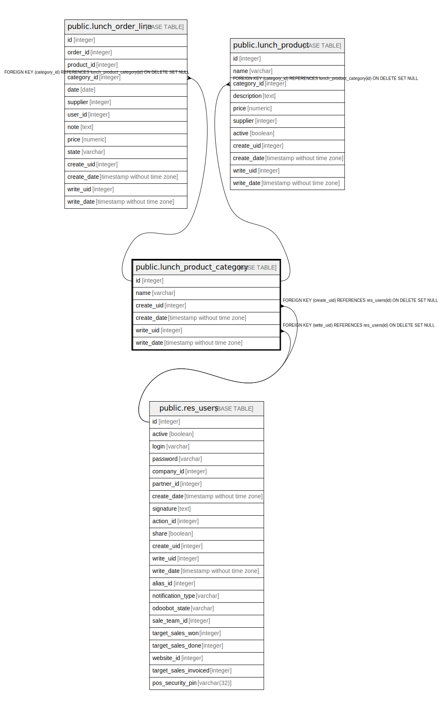

# public.lunch_product_category

## Description

Lunch Product Category

## Columns

| Name | Type | Default | Nullable | Children | Parents | Comment |
| ---- | ---- | ------- | -------- | -------- | ------- | ------- |
| id | integer | nextval('lunch_product_category_id_seq'::regclass) | false | [public.lunch_order_line](public.lunch_order_line.md) [public.lunch_product](public.lunch_product.md) |  |  |
| name | varchar |  | false |  |  | Product Category |
| create_uid | integer |  | true |  | [public.res_users](public.res_users.md) | Created by |
| create_date | timestamp without time zone |  | true |  |  | Created on |
| write_uid | integer |  | true |  | [public.res_users](public.res_users.md) | Last Updated by |
| write_date | timestamp without time zone |  | true |  |  | Last Updated on |

## Constraints

| Name | Type | Definition |
| ---- | ---- | ---------- |
| lunch_product_category_create_uid_fkey | FOREIGN KEY | FOREIGN KEY (create_uid) REFERENCES res_users(id) ON DELETE SET NULL |
| lunch_product_category_write_uid_fkey | FOREIGN KEY | FOREIGN KEY (write_uid) REFERENCES res_users(id) ON DELETE SET NULL |
| lunch_product_category_pkey | PRIMARY KEY | PRIMARY KEY (id) |

## Indexes

| Name | Definition |
| ---- | ---------- |
| lunch_product_category_pkey | CREATE UNIQUE INDEX lunch_product_category_pkey ON public.lunch_product_category USING btree (id) |

## Relations

---

> Generated by [tbls](https://github.com/k1LoW/tbls)
