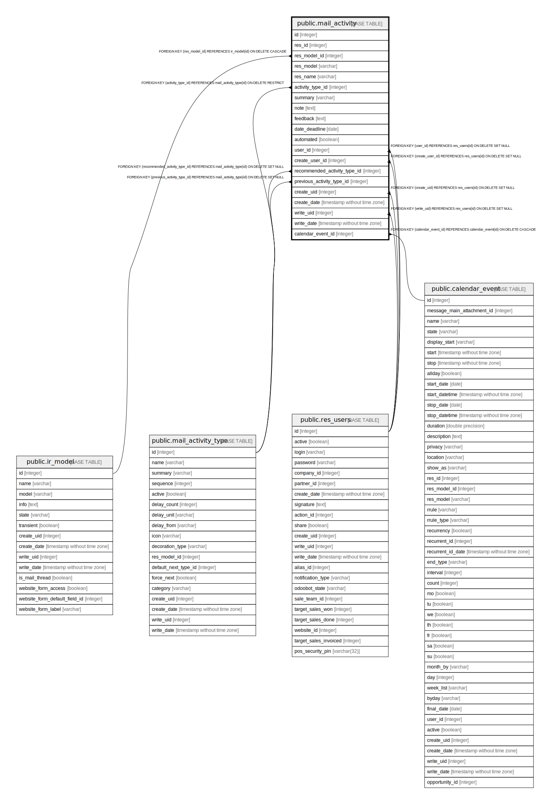

# public.mail_activity

## Description

Activity

## Columns

| Name | Type | Default | Nullable | Children | Parents | Comment |
| ---- | ---- | ------- | -------- | -------- | ------- | ------- |
| id | integer | nextval('mail_activity_id_seq'::regclass) | false |  |  |  |
| res_id | integer |  | false |  |  | Related Document ID |
| res_model_id | integer |  | false |  | [public.ir_model](public.ir_model.md) | Document Model |
| res_model | varchar |  | true |  |  | Related Document Model |
| res_name | varchar |  | true |  |  | Document Name |
| activity_type_id | integer |  | true |  | [public.mail_activity_type](public.mail_activity_type.md) | Activity |
| summary | varchar |  | true |  |  | Summary |
| note | text |  | true |  |  | Note |
| feedback | text |  | true |  |  | Feedback |
| date_deadline | date |  | false |  |  | Due Date |
| automated | boolean |  | true |  |  | Automated activity |
| user_id | integer |  | false |  | [public.res_users](public.res_users.md) | Assigned to |
| create_user_id | integer |  | true |  | [public.res_users](public.res_users.md) | Creator |
| recommended_activity_type_id | integer |  | true |  | [public.mail_activity_type](public.mail_activity_type.md) | Recommended Activity Type |
| previous_activity_type_id | integer |  | true |  | [public.mail_activity_type](public.mail_activity_type.md) | Previous Activity Type |
| create_uid | integer |  | true |  | [public.res_users](public.res_users.md) | Created by |
| create_date | timestamp without time zone |  | true |  |  | Created on |
| write_uid | integer |  | true |  | [public.res_users](public.res_users.md) | Last Updated by |
| write_date | timestamp without time zone |  | true |  |  | Last Updated on |
| calendar_event_id | integer |  | true |  | [public.calendar_event](public.calendar_event.md) | Calendar Meeting |

## Constraints

| Name | Type | Definition |
| ---- | ---- | ---------- |
| mail_activity_create_uid_fkey | FOREIGN KEY | FOREIGN KEY (create_uid) REFERENCES res_users(id) ON DELETE SET NULL |
| mail_activity_create_user_id_fkey | FOREIGN KEY | FOREIGN KEY (create_user_id) REFERENCES res_users(id) ON DELETE SET NULL |
| mail_activity_user_id_fkey | FOREIGN KEY | FOREIGN KEY (user_id) REFERENCES res_users(id) ON DELETE SET NULL |
| mail_activity_write_uid_fkey | FOREIGN KEY | FOREIGN KEY (write_uid) REFERENCES res_users(id) ON DELETE SET NULL |
| mail_activity_res_model_id_fkey | FOREIGN KEY | FOREIGN KEY (res_model_id) REFERENCES ir_model(id) ON DELETE CASCADE |
| mail_activity_activity_type_id_fkey | FOREIGN KEY | FOREIGN KEY (activity_type_id) REFERENCES mail_activity_type(id) ON DELETE RESTRICT |
| mail_activity_previous_activity_type_id_fkey | FOREIGN KEY | FOREIGN KEY (previous_activity_type_id) REFERENCES mail_activity_type(id) ON DELETE SET NULL |
| mail_activity_recommended_activity_type_id_fkey | FOREIGN KEY | FOREIGN KEY (recommended_activity_type_id) REFERENCES mail_activity_type(id) ON DELETE SET NULL |
| mail_activity_pkey | PRIMARY KEY | PRIMARY KEY (id) |
| mail_activity_calendar_event_id_fkey | FOREIGN KEY | FOREIGN KEY (calendar_event_id) REFERENCES calendar_event(id) ON DELETE CASCADE |

## Indexes

| Name | Definition |
| ---- | ---------- |
| mail_activity_pkey | CREATE UNIQUE INDEX mail_activity_pkey ON public.mail_activity USING btree (id) |
| mail_activity_res_id_index | CREATE INDEX mail_activity_res_id_index ON public.mail_activity USING btree (res_id) |
| mail_activity_res_model_id_index | CREATE INDEX mail_activity_res_model_id_index ON public.mail_activity USING btree (res_model_id) |
| mail_activity_res_model_index | CREATE INDEX mail_activity_res_model_index ON public.mail_activity USING btree (res_model) |
| mail_activity_date_deadline_index | CREATE INDEX mail_activity_date_deadline_index ON public.mail_activity USING btree (date_deadline) |
| mail_activity_user_id_index | CREATE INDEX mail_activity_user_id_index ON public.mail_activity USING btree (user_id) |
| mail_activity_create_user_id_index | CREATE INDEX mail_activity_create_user_id_index ON public.mail_activity USING btree (create_user_id) |

## Relations

---

> Generated by [tbls](https://github.com/k1LoW/tbls)
