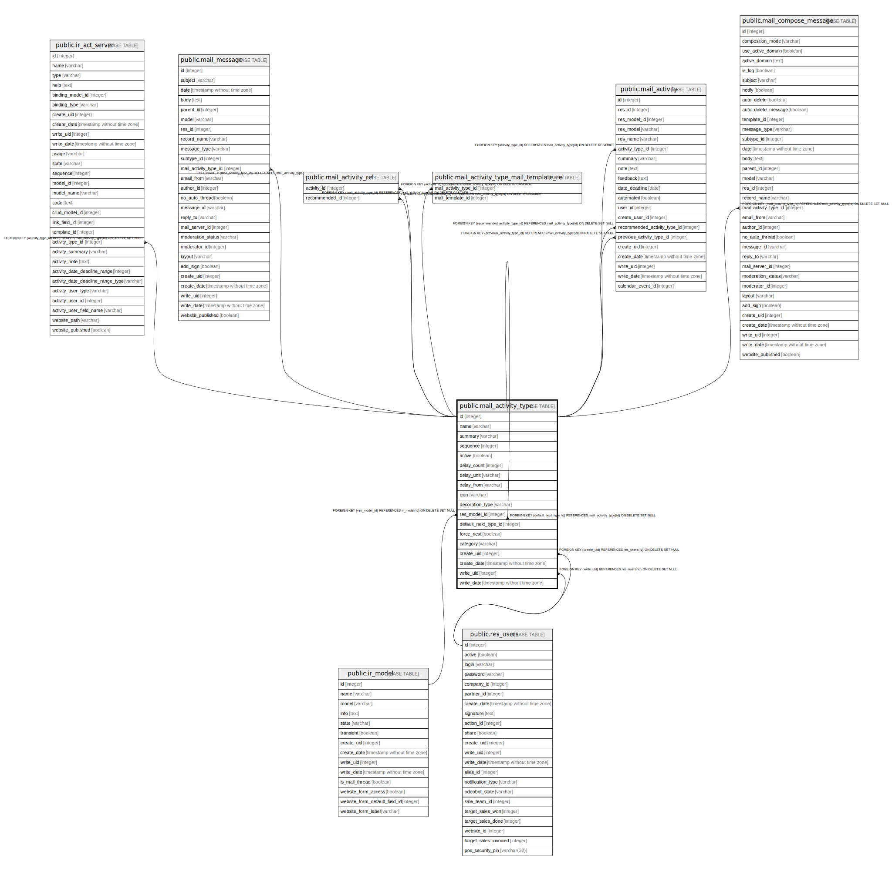

# public.mail_activity_type

## Description

Activity Type

## Columns

| Name | Type | Default | Nullable | Children | Parents | Comment |
| ---- | ---- | ------- | -------- | -------- | ------- | ------- |
| id | integer | nextval('mail_activity_type_id_seq'::regclass) | false | [public.ir_act_server](public.ir_act_server.md) [public.mail_message](public.mail_message.md) [public.mail_activity_type](public.mail_activity_type.md) [public.mail_activity_rel](public.mail_activity_rel.md) [public.mail_activity_type_mail_template_rel](public.mail_activity_type_mail_template_rel.md) [public.mail_activity](public.mail_activity.md) [public.mail_compose_message](public.mail_compose_message.md) |  |  |
| name | varchar |  | false |  |  | Name |
| summary | varchar |  | true |  |  | Summary |
| sequence | integer |  | true |  |  | Sequence |
| active | boolean |  | true |  |  | Active |
| delay_count | integer |  | true |  |  | After |
| delay_unit | varchar |  | false |  |  | Delay units |
| delay_from | varchar |  | false |  |  | Delay Type |
| icon | varchar |  | true |  |  | Icon |
| decoration_type | varchar |  | true |  |  | Decoration Type |
| res_model_id | integer |  | true |  | [public.ir_model](public.ir_model.md) | Model |
| default_next_type_id | integer |  | true |  | [public.mail_activity_type](public.mail_activity_type.md) | Default Next Activity |
| force_next | boolean |  | true |  |  | Auto Schedule Next Activity |
| category | varchar |  | true |  |  | Category |
| create_uid | integer |  | true |  | [public.res_users](public.res_users.md) | Created by |
| create_date | timestamp without time zone |  | true |  |  | Created on |
| write_uid | integer |  | true |  | [public.res_users](public.res_users.md) | Last Updated by |
| write_date | timestamp without time zone |  | true |  |  | Last Updated on |

## Constraints

| Name | Type | Definition |
| ---- | ---- | ---------- |
| mail_activity_type_create_uid_fkey | FOREIGN KEY | FOREIGN KEY (create_uid) REFERENCES res_users(id) ON DELETE SET NULL |
| mail_activity_type_write_uid_fkey | FOREIGN KEY | FOREIGN KEY (write_uid) REFERENCES res_users(id) ON DELETE SET NULL |
| mail_activity_type_res_model_id_fkey | FOREIGN KEY | FOREIGN KEY (res_model_id) REFERENCES ir_model(id) ON DELETE SET NULL |
| mail_activity_type_default_next_type_id_fkey | FOREIGN KEY | FOREIGN KEY (default_next_type_id) REFERENCES mail_activity_type(id) ON DELETE SET NULL |
| mail_activity_type_pkey | PRIMARY KEY | PRIMARY KEY (id) |

## Indexes

| Name | Definition |
| ---- | ---------- |
| mail_activity_type_pkey | CREATE UNIQUE INDEX mail_activity_type_pkey ON public.mail_activity_type USING btree (id) |
| mail_activity_type_res_model_id_index | CREATE INDEX mail_activity_type_res_model_id_index ON public.mail_activity_type USING btree (res_model_id) |

## Relations

---

> Generated by [tbls](https://github.com/k1LoW/tbls)
