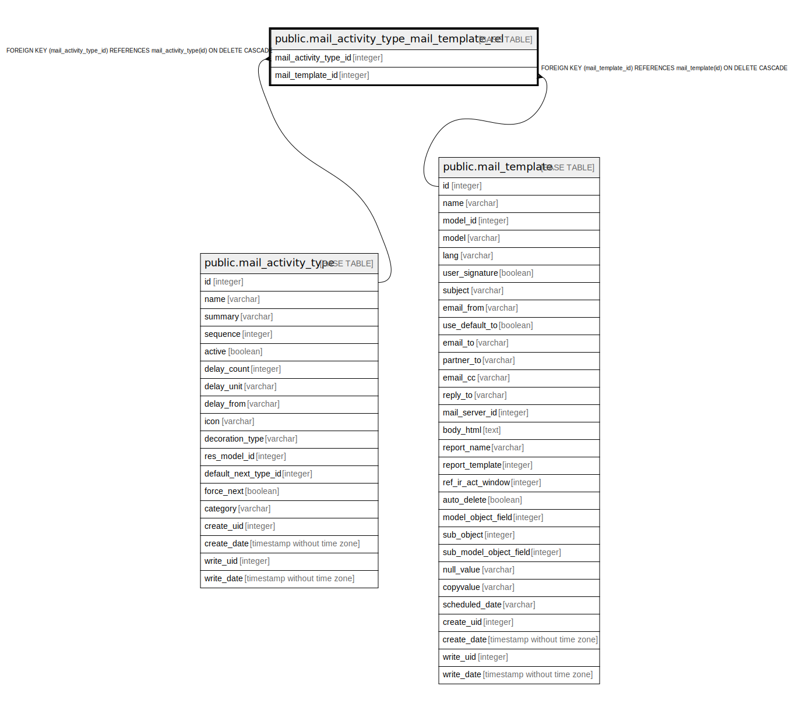

# public.mail_activity_type_mail_template_rel

## Description

RELATION BETWEEN mail_activity_type AND mail_template

## Columns

| Name | Type | Default | Nullable | Children | Parents | Comment |
| ---- | ---- | ------- | -------- | -------- | ------- | ------- |
| mail_activity_type_id | integer |  | false |  | [public.mail_activity_type](public.mail_activity_type.md) |  |
| mail_template_id | integer |  | false |  | [public.mail_template](public.mail_template.md) |  |

## Constraints

| Name | Type | Definition |
| ---- | ---- | ---------- |
| mail_activity_type_mail_template_rel_mail_activity_type_id_fkey | FOREIGN KEY | FOREIGN KEY (mail_activity_type_id) REFERENCES mail_activity_type(id) ON DELETE CASCADE |
| mail_activity_type_mail_templ_mail_activity_type_id_mail_te_key | UNIQUE | UNIQUE (mail_activity_type_id, mail_template_id) |
| mail_activity_type_mail_template_rel_mail_template_id_fkey | FOREIGN KEY | FOREIGN KEY (mail_template_id) REFERENCES mail_template(id) ON DELETE CASCADE |

## Indexes

| Name | Definition |
| ---- | ---------- |
| mail_activity_type_mail_templ_mail_activity_type_id_mail_te_key | CREATE UNIQUE INDEX mail_activity_type_mail_templ_mail_activity_type_id_mail_te_key ON public.mail_activity_type_mail_template_rel USING btree (mail_activity_type_id, mail_template_id) |
| mail_activity_type_mail_template_rel_mail_activity_type_id_idx | CREATE INDEX mail_activity_type_mail_template_rel_mail_activity_type_id_idx ON public.mail_activity_type_mail_template_rel USING btree (mail_activity_type_id) |
| mail_activity_type_mail_template_rel_mail_template_id_idx | CREATE INDEX mail_activity_type_mail_template_rel_mail_template_id_idx ON public.mail_activity_type_mail_template_rel USING btree (mail_template_id) |

## Relations

---

> Generated by [tbls](https://github.com/k1LoW/tbls)
