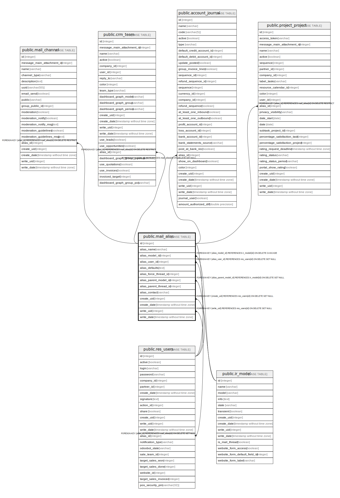

# public.mail_alias

## Description

Email Aliases

## Columns

| Name | Type | Default | Nullable | Children | Parents | Comment |
| ---- | ---- | ------- | -------- | -------- | ------- | ------- |
| id | integer | nextval('mail_alias_id_seq'::regclass) | false | [public.res_users](public.res_users.md) [public.mail_channel](public.mail_channel.md) [public.crm_team](public.crm_team.md) [public.account_journal](public.account_journal.md) [public.project_project](public.project_project.md) |  |  |
| alias_name | varchar |  | true |  |  | Alias Name |
| alias_model_id | integer |  | false |  | [public.ir_model](public.ir_model.md) | Aliased Model |
| alias_user_id | integer |  | true |  | [public.res_users](public.res_users.md) | Owner |
| alias_defaults | text |  | false |  |  | Default Values |
| alias_force_thread_id | integer |  | true |  |  | Record Thread ID |
| alias_parent_model_id | integer |  | true |  | [public.ir_model](public.ir_model.md) | Parent Model |
| alias_parent_thread_id | integer |  | true |  |  | Parent Record Thread ID |
| alias_contact | varchar |  | false |  |  | Alias Contact Security |
| create_uid | integer |  | true |  | [public.res_users](public.res_users.md) | Created by |
| create_date | timestamp without time zone |  | true |  |  | Created on |
| write_uid | integer |  | true |  | [public.res_users](public.res_users.md) | Last Updated by |
| write_date | timestamp without time zone |  | true |  |  | Last Updated on |

## Constraints

| Name | Type | Definition | Comment |
| ---- | ---- | ---------- | ------- |
| mail_alias_alias_user_id_fkey | FOREIGN KEY | FOREIGN KEY (alias_user_id) REFERENCES res_users(id) ON DELETE SET NULL |  |
| mail_alias_create_uid_fkey | FOREIGN KEY | FOREIGN KEY (create_uid) REFERENCES res_users(id) ON DELETE SET NULL |  |
| mail_alias_write_uid_fkey | FOREIGN KEY | FOREIGN KEY (write_uid) REFERENCES res_users(id) ON DELETE SET NULL |  |
| mail_alias_alias_model_id_fkey | FOREIGN KEY | FOREIGN KEY (alias_model_id) REFERENCES ir_model(id) ON DELETE CASCADE |  |
| mail_alias_alias_parent_model_id_fkey | FOREIGN KEY | FOREIGN KEY (alias_parent_model_id) REFERENCES ir_model(id) ON DELETE SET NULL |  |
| mail_alias_pkey | PRIMARY KEY | PRIMARY KEY (id) |  |
| mail_alias_alias_unique | UNIQUE | UNIQUE (alias_name) | UNIQUE(alias_name) |

## Indexes

| Name | Definition |
| ---- | ---------- |
| mail_alias_pkey | CREATE UNIQUE INDEX mail_alias_pkey ON public.mail_alias USING btree (id) |
| mail_alias_alias_unique | CREATE UNIQUE INDEX mail_alias_alias_unique ON public.mail_alias USING btree (alias_name) |

## Relations

---

> Generated by [tbls](https://github.com/k1LoW/tbls)
