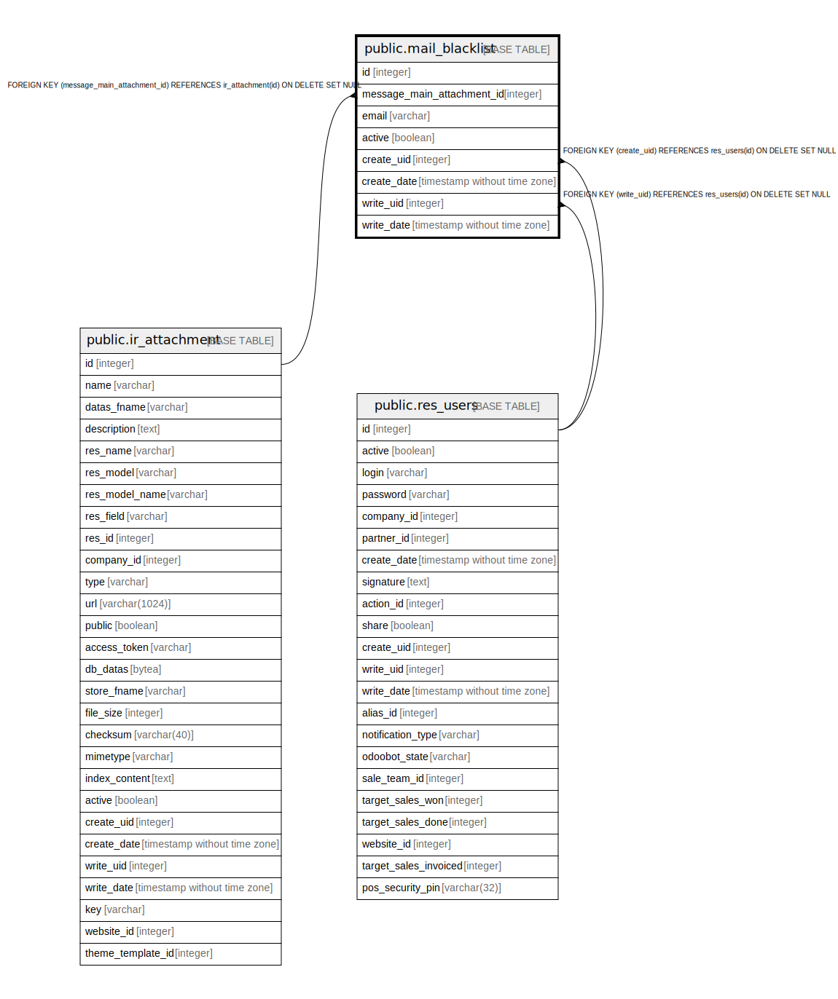

# public.mail_blacklist

## Description

Mail Blacklist

## Columns

| Name | Type | Default | Nullable | Children | Parents | Comment |
| ---- | ---- | ------- | -------- | -------- | ------- | ------- |
| id | integer | nextval('mail_blacklist_id_seq'::regclass) | false |  |  |  |
| message_main_attachment_id | integer |  | true |  | [public.ir_attachment](public.ir_attachment.md) | Main Attachment |
| email | varchar |  | false |  |  | Email Address |
| active | boolean |  | true |  |  | Active |
| create_uid | integer |  | true |  | [public.res_users](public.res_users.md) | Created by |
| create_date | timestamp without time zone |  | true |  |  | Created on |
| write_uid | integer |  | true |  | [public.res_users](public.res_users.md) | Last Updated by |
| write_date | timestamp without time zone |  | true |  |  | Last Updated on |

## Constraints

| Name | Type | Definition | Comment |
| ---- | ---- | ---------- | ------- |
| mail_blacklist_create_uid_fkey | FOREIGN KEY | FOREIGN KEY (create_uid) REFERENCES res_users(id) ON DELETE SET NULL |  |
| mail_blacklist_write_uid_fkey | FOREIGN KEY | FOREIGN KEY (write_uid) REFERENCES res_users(id) ON DELETE SET NULL |  |
| mail_blacklist_message_main_attachment_id_fkey | FOREIGN KEY | FOREIGN KEY (message_main_attachment_id) REFERENCES ir_attachment(id) ON DELETE SET NULL |  |
| mail_blacklist_pkey | PRIMARY KEY | PRIMARY KEY (id) |  |
| mail_blacklist_unique_email | UNIQUE | UNIQUE (email) | unique (email) |

## Indexes

| Name | Definition |
| ---- | ---------- |
| mail_blacklist_pkey | CREATE UNIQUE INDEX mail_blacklist_pkey ON public.mail_blacklist USING btree (id) |
| mail_blacklist_message_main_attachment_id_index | CREATE INDEX mail_blacklist_message_main_attachment_id_index ON public.mail_blacklist USING btree (message_main_attachment_id) |
| mail_blacklist_email_index | CREATE INDEX mail_blacklist_email_index ON public.mail_blacklist USING btree (email) |
| mail_blacklist_unique_email | CREATE UNIQUE INDEX mail_blacklist_unique_email ON public.mail_blacklist USING btree (email) |

## Relations

---

> Generated by [tbls](https://github.com/k1LoW/tbls)
