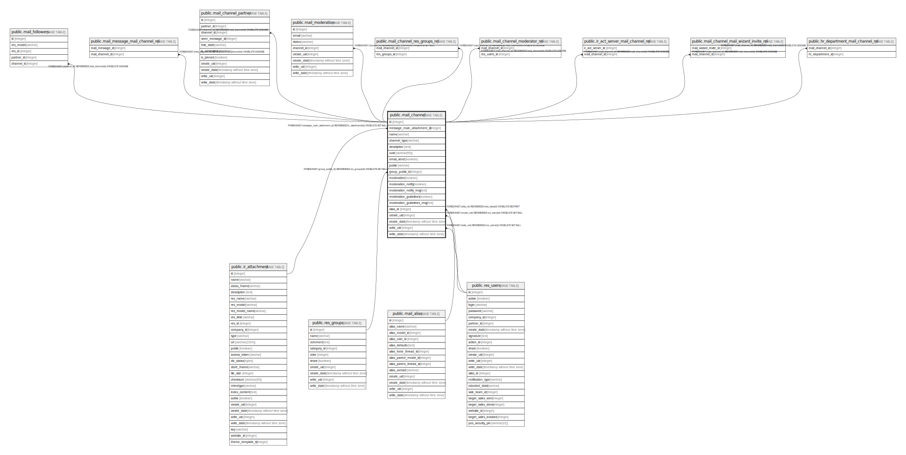

# public.mail_channel

## Description

Discussion Channel

## Columns

| Name | Type | Default | Nullable | Children | Parents | Comment |
| ---- | ---- | ------- | -------- | -------- | ------- | ------- |
| id | integer | nextval('mail_channel_id_seq'::regclass) | false | [public.mail_followers](public.mail_followers.md) [public.mail_message_mail_channel_rel](public.mail_message_mail_channel_rel.md) [public.mail_channel_partner](public.mail_channel_partner.md) [public.mail_moderation](public.mail_moderation.md) [public.mail_channel_res_groups_rel](public.mail_channel_res_groups_rel.md) [public.mail_channel_moderator_rel](public.mail_channel_moderator_rel.md) [public.ir_act_server_mail_channel_rel](public.ir_act_server_mail_channel_rel.md) [public.mail_channel_mail_wizard_invite_rel](public.mail_channel_mail_wizard_invite_rel.md) [public.hr_department_mail_channel_rel](public.hr_department_mail_channel_rel.md) |  |  |
| message_main_attachment_id | integer |  | true |  | [public.ir_attachment](public.ir_attachment.md) | Main Attachment |
| name | varchar |  | false |  |  | Name |
| channel_type | varchar |  | true |  |  | Channel Type |
| description | text |  | true |  |  | Description |
| uuid | varchar(50) |  | true |  |  | UUID |
| email_send | boolean |  | true |  |  | Send messages by email |
| public | varchar |  | false |  |  | Privacy |
| group_public_id | integer |  | true |  | [public.res_groups](public.res_groups.md) | Authorized Group |
| moderation | boolean |  | true |  |  | Moderate this channel |
| moderation_notify | boolean |  | true |  |  | Automatic notification |
| moderation_notify_msg | text |  | true |  |  | Notification message |
| moderation_guidelines | boolean |  | true |  |  | Send guidelines to new subscribers |
| moderation_guidelines_msg | text |  | true |  |  | Guidelines |
| alias_id | integer |  | false |  | [public.mail_alias](public.mail_alias.md) | Alias |
| create_uid | integer |  | true |  | [public.res_users](public.res_users.md) | Created by |
| create_date | timestamp without time zone |  | true |  |  | Created on |
| write_uid | integer |  | true |  | [public.res_users](public.res_users.md) | Last Updated by |
| write_date | timestamp without time zone |  | true |  |  | Last Updated on |

## Constraints

| Name | Type | Definition |
| ---- | ---- | ---------- |
| mail_channel_create_uid_fkey | FOREIGN KEY | FOREIGN KEY (create_uid) REFERENCES res_users(id) ON DELETE SET NULL |
| mail_channel_write_uid_fkey | FOREIGN KEY | FOREIGN KEY (write_uid) REFERENCES res_users(id) ON DELETE SET NULL |
| mail_channel_group_public_id_fkey | FOREIGN KEY | FOREIGN KEY (group_public_id) REFERENCES res_groups(id) ON DELETE SET NULL |
| mail_channel_message_main_attachment_id_fkey | FOREIGN KEY | FOREIGN KEY (message_main_attachment_id) REFERENCES ir_attachment(id) ON DELETE SET NULL |
| mail_channel_alias_id_fkey | FOREIGN KEY | FOREIGN KEY (alias_id) REFERENCES mail_alias(id) ON DELETE RESTRICT |
| mail_channel_pkey | PRIMARY KEY | PRIMARY KEY (id) |

## Indexes

| Name | Definition |
| ---- | ---------- |
| mail_channel_pkey | CREATE UNIQUE INDEX mail_channel_pkey ON public.mail_channel USING btree (id) |
| mail_channel_message_main_attachment_id_index | CREATE INDEX mail_channel_message_main_attachment_id_index ON public.mail_channel USING btree (message_main_attachment_id) |
| mail_channel_uuid_index | CREATE INDEX mail_channel_uuid_index ON public.mail_channel USING btree (uuid) |

## Relations

---

> Generated by [tbls](https://github.com/k1LoW/tbls)
