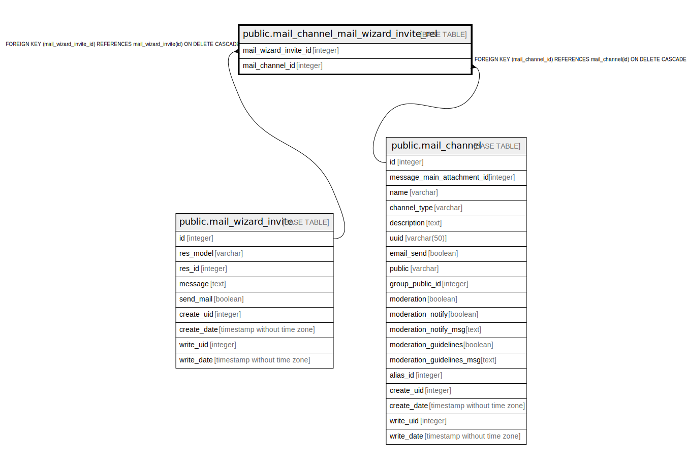

# public.mail_channel_mail_wizard_invite_rel

## Description

RELATION BETWEEN mail_wizard_invite AND mail_channel

## Columns

| Name | Type | Default | Nullable | Children | Parents | Comment |
| ---- | ---- | ------- | -------- | -------- | ------- | ------- |
| mail_wizard_invite_id | integer |  | false |  | [public.mail_wizard_invite](public.mail_wizard_invite.md) |  |
| mail_channel_id | integer |  | false |  | [public.mail_channel](public.mail_channel.md) |  |

## Constraints

| Name | Type | Definition |
| ---- | ---- | ---------- |
| mail_channel_mail_wizard_invite_rel_mail_channel_id_fkey | FOREIGN KEY | FOREIGN KEY (mail_channel_id) REFERENCES mail_channel(id) ON DELETE CASCADE |
| mail_channel_mail_wizard_invite_rel_mail_wizard_invite_id_fkey | FOREIGN KEY | FOREIGN KEY (mail_wizard_invite_id) REFERENCES mail_wizard_invite(id) ON DELETE CASCADE |
| mail_channel_mail_wizard_invi_mail_wizard_invite_id_mail_ch_key | UNIQUE | UNIQUE (mail_wizard_invite_id, mail_channel_id) |

## Indexes

| Name | Definition |
| ---- | ---------- |
| mail_channel_mail_wizard_invi_mail_wizard_invite_id_mail_ch_key | CREATE UNIQUE INDEX mail_channel_mail_wizard_invi_mail_wizard_invite_id_mail_ch_key ON public.mail_channel_mail_wizard_invite_rel USING btree (mail_wizard_invite_id, mail_channel_id) |
| mail_channel_mail_wizard_invite_rel_mail_wizard_invite_id_idx | CREATE INDEX mail_channel_mail_wizard_invite_rel_mail_wizard_invite_id_idx ON public.mail_channel_mail_wizard_invite_rel USING btree (mail_wizard_invite_id) |
| mail_channel_mail_wizard_invite_rel_mail_channel_id_idx | CREATE INDEX mail_channel_mail_wizard_invite_rel_mail_channel_id_idx ON public.mail_channel_mail_wizard_invite_rel USING btree (mail_channel_id) |

## Relations

---

> Generated by [tbls](https://github.com/k1LoW/tbls)
