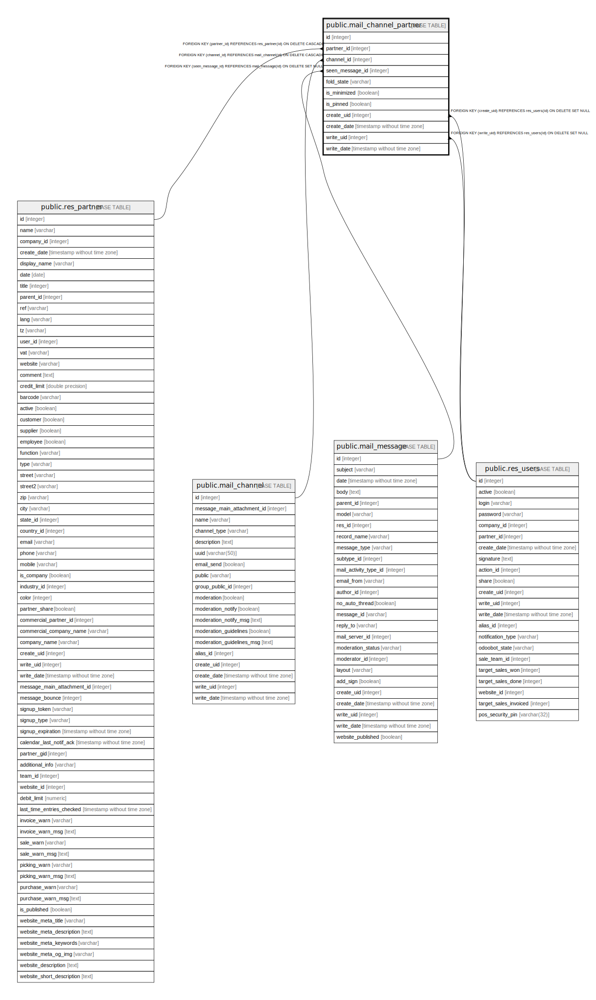

# public.mail_channel_partner

## Description

Listeners of a Channel

## Columns

| Name | Type | Default | Nullable | Children | Parents | Comment |
| ---- | ---- | ------- | -------- | -------- | ------- | ------- |
| id | integer | nextval('mail_channel_partner_id_seq'::regclass) | false |  |  |  |
| partner_id | integer |  | true |  | [public.res_partner](public.res_partner.md) | Recipient |
| channel_id | integer |  | true |  | [public.mail_channel](public.mail_channel.md) | Channel |
| seen_message_id | integer |  | true |  | [public.mail_message](public.mail_message.md) | Last Seen |
| fold_state | varchar |  | true |  |  | Conversation Fold State |
| is_minimized | boolean |  | true |  |  | Conversation is minimized |
| is_pinned | boolean |  | true |  |  | Is pinned on the interface |
| create_uid | integer |  | true |  | [public.res_users](public.res_users.md) | Created by |
| create_date | timestamp without time zone |  | true |  |  | Created on |
| write_uid | integer |  | true |  | [public.res_users](public.res_users.md) | Last Updated by |
| write_date | timestamp without time zone |  | true |  |  | Last Updated on |

## Constraints

| Name | Type | Definition |
| ---- | ---- | ---------- |
| mail_channel_partner_create_uid_fkey | FOREIGN KEY | FOREIGN KEY (create_uid) REFERENCES res_users(id) ON DELETE SET NULL |
| mail_channel_partner_write_uid_fkey | FOREIGN KEY | FOREIGN KEY (write_uid) REFERENCES res_users(id) ON DELETE SET NULL |
| mail_channel_partner_partner_id_fkey | FOREIGN KEY | FOREIGN KEY (partner_id) REFERENCES res_partner(id) ON DELETE CASCADE |
| mail_channel_partner_seen_message_id_fkey | FOREIGN KEY | FOREIGN KEY (seen_message_id) REFERENCES mail_message(id) ON DELETE SET NULL |
| mail_channel_partner_pkey | PRIMARY KEY | PRIMARY KEY (id) |
| mail_channel_partner_channel_id_fkey | FOREIGN KEY | FOREIGN KEY (channel_id) REFERENCES mail_channel(id) ON DELETE CASCADE |

## Indexes

| Name | Definition |
| ---- | ---------- |
| mail_channel_partner_pkey | CREATE UNIQUE INDEX mail_channel_partner_pkey ON public.mail_channel_partner USING btree (id) |
| mail_channel_partner_seen_message_id_idx | CREATE INDEX mail_channel_partner_seen_message_id_idx ON public.mail_channel_partner USING btree (channel_id, partner_id, seen_message_id) |

## Relations

---

> Generated by [tbls](https://github.com/k1LoW/tbls)
