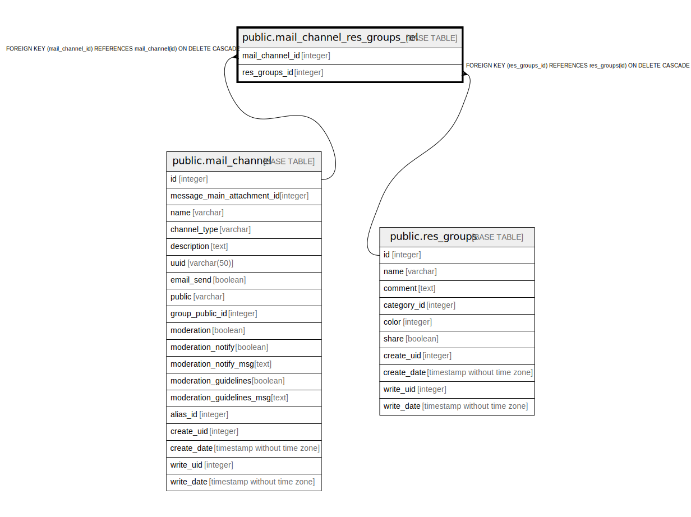

# public.mail_channel_res_groups_rel

## Description

RELATION BETWEEN mail_channel AND res_groups

## Columns

| Name | Type | Default | Nullable | Children | Parents | Comment |
| ---- | ---- | ------- | -------- | -------- | ------- | ------- |
| mail_channel_id | integer |  | false |  | [public.mail_channel](public.mail_channel.md) |  |
| res_groups_id | integer |  | false |  | [public.res_groups](public.res_groups.md) |  |

## Constraints

| Name | Type | Definition |
| ---- | ---- | ---------- |
| mail_channel_res_groups_rel_res_groups_id_fkey | FOREIGN KEY | FOREIGN KEY (res_groups_id) REFERENCES res_groups(id) ON DELETE CASCADE |
| mail_channel_res_groups_rel_mail_channel_id_fkey | FOREIGN KEY | FOREIGN KEY (mail_channel_id) REFERENCES mail_channel(id) ON DELETE CASCADE |
| mail_channel_res_groups_rel_mail_channel_id_res_groups_id_key | UNIQUE | UNIQUE (mail_channel_id, res_groups_id) |

## Indexes

| Name | Definition |
| ---- | ---------- |
| mail_channel_res_groups_rel_mail_channel_id_res_groups_id_key | CREATE UNIQUE INDEX mail_channel_res_groups_rel_mail_channel_id_res_groups_id_key ON public.mail_channel_res_groups_rel USING btree (mail_channel_id, res_groups_id) |
| mail_channel_res_groups_rel_mail_channel_id_idx | CREATE INDEX mail_channel_res_groups_rel_mail_channel_id_idx ON public.mail_channel_res_groups_rel USING btree (mail_channel_id) |
| mail_channel_res_groups_rel_res_groups_id_idx | CREATE INDEX mail_channel_res_groups_rel_res_groups_id_idx ON public.mail_channel_res_groups_rel USING btree (res_groups_id) |

## Relations

---

> Generated by [tbls](https://github.com/k1LoW/tbls)
