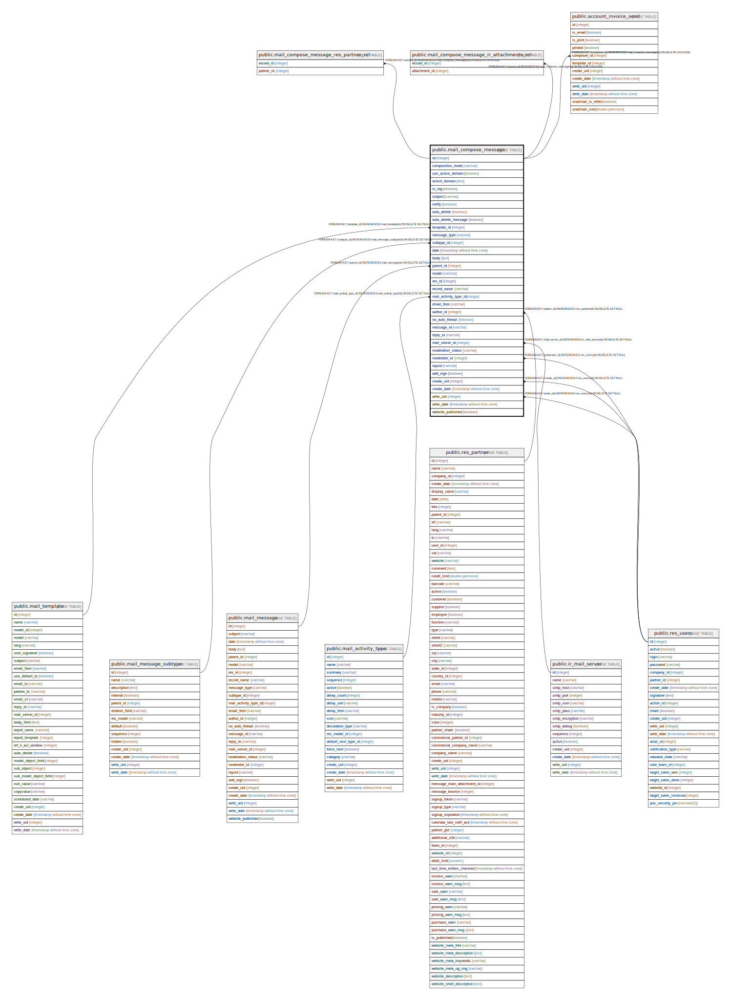

# public.mail_compose_message

## Description

Email composition wizard

## Columns

| Name | Type | Default | Nullable | Children | Parents | Comment |
| ---- | ---- | ------- | -------- | -------- | ------- | ------- |
| id | integer | nextval('mail_compose_message_id_seq'::regclass) | false | [public.mail_compose_message_res_partner_rel](public.mail_compose_message_res_partner_rel.md) [public.mail_compose_message_ir_attachments_rel](public.mail_compose_message_ir_attachments_rel.md) [public.account_invoice_send](public.account_invoice_send.md) |  |  |
| composition_mode | varchar |  | true |  |  | Composition mode |
| use_active_domain | boolean |  | true |  |  | Use active domain |
| active_domain | text |  | true |  |  | Active domain |
| is_log | boolean |  | true |  |  | Log an Internal Note |
| subject | varchar |  | true |  |  | Subject |
| notify | boolean |  | true |  |  | Notify followers |
| auto_delete | boolean |  | true |  |  | Delete Emails |
| auto_delete_message | boolean |  | true |  |  | Delete Message Copy |
| template_id | integer |  | true |  | [public.mail_template](public.mail_template.md) | Use template |
| message_type | varchar |  | false |  |  | Type |
| subtype_id | integer |  | true |  | [public.mail_message_subtype](public.mail_message_subtype.md) | Subtype |
| date | timestamp without time zone |  | true |  |  | Date |
| body | text |  | true |  |  | Contents |
| parent_id | integer |  | true |  | [public.mail_message](public.mail_message.md) | Parent Message |
| model | varchar |  | true |  |  | Related Document Model |
| res_id | integer |  | true |  |  | Related Document ID |
| record_name | varchar |  | true |  |  | Message Record Name |
| mail_activity_type_id | integer |  | true |  | [public.mail_activity_type](public.mail_activity_type.md) | Mail Activity Type |
| email_from | varchar |  | true |  |  | From |
| author_id | integer |  | true |  | [public.res_partner](public.res_partner.md) | Author |
| no_auto_thread | boolean |  | true |  |  | No threading for answers |
| message_id | varchar |  | true |  |  | Message-Id |
| reply_to | varchar |  | true |  |  | Reply-To |
| mail_server_id | integer |  | true |  | [public.ir_mail_server](public.ir_mail_server.md) | Outgoing mail server |
| moderation_status | varchar |  | true |  |  | Moderation Status |
| moderator_id | integer |  | true |  | [public.res_users](public.res_users.md) | Moderated By |
| layout | varchar |  | true |  |  | Layout |
| add_sign | boolean |  | true |  |  | Add Sign |
| create_uid | integer |  | true |  | [public.res_users](public.res_users.md) | Created by |
| create_date | timestamp without time zone |  | true |  |  | Created on |
| write_uid | integer |  | true |  | [public.res_users](public.res_users.md) | Last Updated by |
| write_date | timestamp without time zone |  | true |  |  | Last Updated on |
| website_published | boolean |  | true |  |  | Published |

## Constraints

| Name | Type | Definition |
| ---- | ---- | ---------- |
| mail_compose_message_create_uid_fkey | FOREIGN KEY | FOREIGN KEY (create_uid) REFERENCES res_users(id) ON DELETE SET NULL |
| mail_compose_message_moderator_id_fkey | FOREIGN KEY | FOREIGN KEY (moderator_id) REFERENCES res_users(id) ON DELETE SET NULL |
| mail_compose_message_write_uid_fkey | FOREIGN KEY | FOREIGN KEY (write_uid) REFERENCES res_users(id) ON DELETE SET NULL |
| mail_compose_message_author_id_fkey | FOREIGN KEY | FOREIGN KEY (author_id) REFERENCES res_partner(id) ON DELETE SET NULL |
| mail_compose_message_mail_server_id_fkey | FOREIGN KEY | FOREIGN KEY (mail_server_id) REFERENCES ir_mail_server(id) ON DELETE SET NULL |
| mail_compose_message_subtype_id_fkey | FOREIGN KEY | FOREIGN KEY (subtype_id) REFERENCES mail_message_subtype(id) ON DELETE SET NULL |
| mail_compose_message_parent_id_fkey | FOREIGN KEY | FOREIGN KEY (parent_id) REFERENCES mail_message(id) ON DELETE SET NULL |
| mail_compose_message_mail_activity_type_id_fkey | FOREIGN KEY | FOREIGN KEY (mail_activity_type_id) REFERENCES mail_activity_type(id) ON DELETE SET NULL |
| mail_compose_message_template_id_fkey | FOREIGN KEY | FOREIGN KEY (template_id) REFERENCES mail_template(id) ON DELETE SET NULL |
| mail_compose_message_pkey | PRIMARY KEY | PRIMARY KEY (id) |

## Indexes

| Name | Definition |
| ---- | ---------- |
| mail_compose_message_pkey | CREATE UNIQUE INDEX mail_compose_message_pkey ON public.mail_compose_message USING btree (id) |
| mail_compose_message_template_id_index | CREATE INDEX mail_compose_message_template_id_index ON public.mail_compose_message USING btree (template_id) |
| mail_compose_message_subtype_id_index | CREATE INDEX mail_compose_message_subtype_id_index ON public.mail_compose_message USING btree (subtype_id) |
| mail_compose_message_parent_id_index | CREATE INDEX mail_compose_message_parent_id_index ON public.mail_compose_message USING btree (parent_id) |
| mail_compose_message_model_index | CREATE INDEX mail_compose_message_model_index ON public.mail_compose_message USING btree (model) |
| mail_compose_message_res_id_index | CREATE INDEX mail_compose_message_res_id_index ON public.mail_compose_message USING btree (res_id) |
| mail_compose_message_mail_activity_type_id_index | CREATE INDEX mail_compose_message_mail_activity_type_id_index ON public.mail_compose_message USING btree (mail_activity_type_id) |
| mail_compose_message_author_id_index | CREATE INDEX mail_compose_message_author_id_index ON public.mail_compose_message USING btree (author_id) |
| mail_compose_message_message_id_index | CREATE INDEX mail_compose_message_message_id_index ON public.mail_compose_message USING btree (message_id) |
| mail_compose_message_moderation_status_index | CREATE INDEX mail_compose_message_moderation_status_index ON public.mail_compose_message USING btree (moderation_status) |
| mail_compose_message_moderator_id_index | CREATE INDEX mail_compose_message_moderator_id_index ON public.mail_compose_message USING btree (moderator_id) |

## Relations

---

> Generated by [tbls](https://github.com/k1LoW/tbls)
