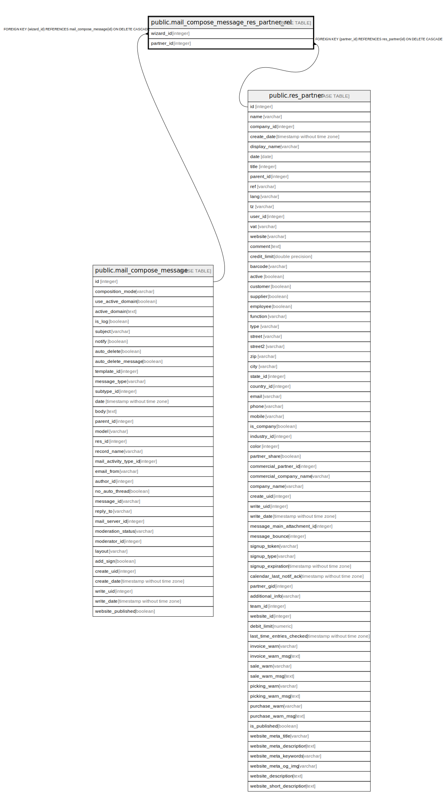

# public.mail_compose_message_res_partner_rel

## Description

RELATION BETWEEN mail_compose_message AND res_partner

## Columns

| Name | Type | Default | Nullable | Children | Parents | Comment |
| ---- | ---- | ------- | -------- | -------- | ------- | ------- |
| wizard_id | integer |  | false |  | [public.mail_compose_message](public.mail_compose_message.md) |  |
| partner_id | integer |  | false |  | [public.res_partner](public.res_partner.md) |  |

## Constraints

| Name | Type | Definition |
| ---- | ---- | ---------- |
| mail_compose_message_res_partner_rel_partner_id_fkey | FOREIGN KEY | FOREIGN KEY (partner_id) REFERENCES res_partner(id) ON DELETE CASCADE |
| mail_compose_message_res_partner_rel_wizard_id_fkey | FOREIGN KEY | FOREIGN KEY (wizard_id) REFERENCES mail_compose_message(id) ON DELETE CASCADE |
| mail_compose_message_res_partner_rel_wizard_id_partner_id_key | UNIQUE | UNIQUE (wizard_id, partner_id) |

## Indexes

| Name | Definition |
| ---- | ---------- |
| mail_compose_message_res_partner_rel_wizard_id_partner_id_key | CREATE UNIQUE INDEX mail_compose_message_res_partner_rel_wizard_id_partner_id_key ON public.mail_compose_message_res_partner_rel USING btree (wizard_id, partner_id) |
| mail_compose_message_res_partner_rel_wizard_id_idx | CREATE INDEX mail_compose_message_res_partner_rel_wizard_id_idx ON public.mail_compose_message_res_partner_rel USING btree (wizard_id) |
| mail_compose_message_res_partner_rel_partner_id_idx | CREATE INDEX mail_compose_message_res_partner_rel_partner_id_idx ON public.mail_compose_message_res_partner_rel USING btree (partner_id) |

## Relations

---

> Generated by [tbls](https://github.com/k1LoW/tbls)
