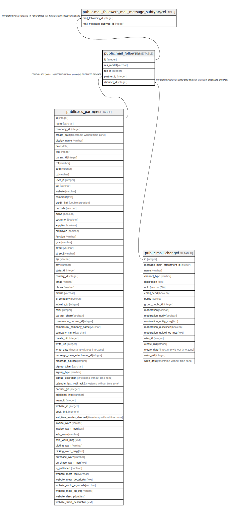

# public.mail_followers

## Description

Document Followers

## Columns

| Name | Type | Default | Nullable | Children | Parents | Comment |
| ---- | ---- | ------- | -------- | -------- | ------- | ------- |
| id | integer | nextval('mail_followers_id_seq'::regclass) | false | [public.mail_followers_mail_message_subtype_rel](public.mail_followers_mail_message_subtype_rel.md) |  |  |
| res_model | varchar |  | false |  |  | Related Document Model Name |
| res_id | integer |  | true |  |  | Related Document ID |
| partner_id | integer |  | true |  | [public.res_partner](public.res_partner.md) | Related Partner |
| channel_id | integer |  | true |  | [public.mail_channel](public.mail_channel.md) | Listener |

## Constraints

| Name | Type | Definition | Comment |
| ---- | ---- | ---------- | ------- |
| mail_followers_partner_xor_channel | CHECK | CHECK (((partner_id IS NULL) <> (channel_id IS NULL))) | CHECK((partner_id IS NULL) != (channel_id IS NULL)) |
| mail_followers_partner_id_fkey | FOREIGN KEY | FOREIGN KEY (partner_id) REFERENCES res_partner(id) ON DELETE CASCADE |  |
| mail_followers_pkey | PRIMARY KEY | PRIMARY KEY (id) |  |
| mail_followers_mail_followers_res_partner_res_model_id_uniq | UNIQUE | UNIQUE (res_model, res_id, partner_id) | unique(res_model,res_id,partner_id) |
| mail_followers_mail_followers_res_channel_res_model_id_uniq | UNIQUE | UNIQUE (res_model, res_id, channel_id) | unique(res_model,res_id,channel_id) |
| mail_followers_channel_id_fkey | FOREIGN KEY | FOREIGN KEY (channel_id) REFERENCES mail_channel(id) ON DELETE CASCADE |  |

## Indexes

| Name | Definition |
| ---- | ---------- |
| mail_followers_pkey | CREATE UNIQUE INDEX mail_followers_pkey ON public.mail_followers USING btree (id) |
| mail_followers_res_model_index | CREATE INDEX mail_followers_res_model_index ON public.mail_followers USING btree (res_model) |
| mail_followers_res_id_index | CREATE INDEX mail_followers_res_id_index ON public.mail_followers USING btree (res_id) |
| mail_followers_partner_id_index | CREATE INDEX mail_followers_partner_id_index ON public.mail_followers USING btree (partner_id) |
| mail_followers_channel_id_index | CREATE INDEX mail_followers_channel_id_index ON public.mail_followers USING btree (channel_id) |
| mail_followers_mail_followers_res_partner_res_model_id_uniq | CREATE UNIQUE INDEX mail_followers_mail_followers_res_partner_res_model_id_uniq ON public.mail_followers USING btree (res_model, res_id, partner_id) |
| mail_followers_mail_followers_res_channel_res_model_id_uniq | CREATE UNIQUE INDEX mail_followers_mail_followers_res_channel_res_model_id_uniq ON public.mail_followers USING btree (res_model, res_id, channel_id) |

## Relations

---

> Generated by [tbls](https://github.com/k1LoW/tbls)
