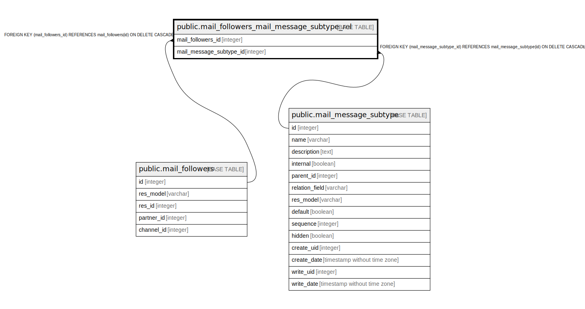

# public.mail_followers_mail_message_subtype_rel

## Description

RELATION BETWEEN mail_followers AND mail_message_subtype

## Columns

| Name | Type | Default | Nullable | Children | Parents | Comment |
| ---- | ---- | ------- | -------- | -------- | ------- | ------- |
| mail_followers_id | integer |  | false |  | [public.mail_followers](public.mail_followers.md) |  |
| mail_message_subtype_id | integer |  | false |  | [public.mail_message_subtype](public.mail_message_subtype.md) |  |

## Constraints

| Name | Type | Definition |
| ---- | ---- | ---------- |
| mail_followers_mail_message_subtyp_mail_message_subtype_id_fkey | FOREIGN KEY | FOREIGN KEY (mail_message_subtype_id) REFERENCES mail_message_subtype(id) ON DELETE CASCADE |
| mail_followers_mail_message_subtype_rel_mail_followers_id_fkey | FOREIGN KEY | FOREIGN KEY (mail_followers_id) REFERENCES mail_followers(id) ON DELETE CASCADE |
| mail_followers_mail_message_s_mail_followers_id_mail_messag_key | UNIQUE | UNIQUE (mail_followers_id, mail_message_subtype_id) |

## Indexes

| Name | Definition |
| ---- | ---------- |
| mail_followers_mail_message_s_mail_followers_id_mail_messag_key | CREATE UNIQUE INDEX mail_followers_mail_message_s_mail_followers_id_mail_messag_key ON public.mail_followers_mail_message_subtype_rel USING btree (mail_followers_id, mail_message_subtype_id) |
| mail_followers_mail_message_subtype_rel_mail_followers_id_idx | CREATE INDEX mail_followers_mail_message_subtype_rel_mail_followers_id_idx ON public.mail_followers_mail_message_subtype_rel USING btree (mail_followers_id) |
| mail_followers_mail_message_subtype_mail_message_subtype_id_idx | CREATE INDEX mail_followers_mail_message_subtype_mail_message_subtype_id_idx ON public.mail_followers_mail_message_subtype_rel USING btree (mail_message_subtype_id) |

## Relations

---

> Generated by [tbls](https://github.com/k1LoW/tbls)
