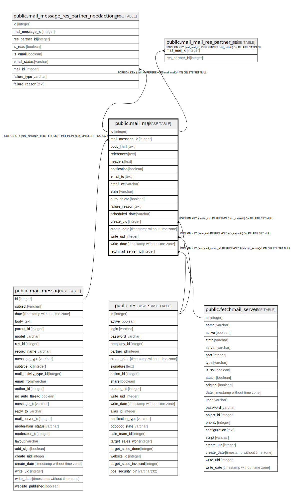

# public.mail_mail

## Description

Outgoing Mails

## Columns

| Name | Type | Default | Nullable | Children | Parents | Comment |
| ---- | ---- | ------- | -------- | -------- | ------- | ------- |
| id | integer | nextval('mail_mail_id_seq'::regclass) | false | [public.mail_message_res_partner_needaction_rel](public.mail_message_res_partner_needaction_rel.md) [public.mail_mail_res_partner_rel](public.mail_mail_res_partner_rel.md) |  |  |
| mail_message_id | integer |  | false |  | [public.mail_message](public.mail_message.md) | Message |
| body_html | text |  | true |  |  | Rich-text Contents |
| references | text |  | true |  |  | References |
| headers | text |  | true |  |  | Headers |
| notification | boolean |  | true |  |  | Is Notification |
| email_to | text |  | true |  |  | To |
| email_cc | varchar |  | true |  |  | Cc |
| state | varchar |  | true |  |  | Status |
| auto_delete | boolean |  | true |  |  | Auto Delete |
| failure_reason | text |  | true |  |  | Failure Reason |
| scheduled_date | varchar |  | true |  |  | Scheduled Send Date |
| create_uid | integer |  | true |  | [public.res_users](public.res_users.md) | Created by |
| create_date | timestamp without time zone |  | true |  |  | Created on |
| write_uid | integer |  | true |  | [public.res_users](public.res_users.md) | Last Updated by |
| write_date | timestamp without time zone |  | true |  |  | Last Updated on |
| fetchmail_server_id | integer |  | true |  | [public.fetchmail_server](public.fetchmail_server.md) | Inbound Mail Server |

## Constraints

| Name | Type | Definition |
| ---- | ---- | ---------- |
| mail_mail_create_uid_fkey | FOREIGN KEY | FOREIGN KEY (create_uid) REFERENCES res_users(id) ON DELETE SET NULL |
| mail_mail_write_uid_fkey | FOREIGN KEY | FOREIGN KEY (write_uid) REFERENCES res_users(id) ON DELETE SET NULL |
| mail_mail_mail_message_id_fkey | FOREIGN KEY | FOREIGN KEY (mail_message_id) REFERENCES mail_message(id) ON DELETE CASCADE |
| mail_mail_pkey | PRIMARY KEY | PRIMARY KEY (id) |
| mail_mail_fetchmail_server_id_fkey | FOREIGN KEY | FOREIGN KEY (fetchmail_server_id) REFERENCES fetchmail_server(id) ON DELETE SET NULL |

## Indexes

| Name | Definition |
| ---- | ---------- |
| mail_mail_pkey | CREATE UNIQUE INDEX mail_mail_pkey ON public.mail_mail USING btree (id) |
| mail_mail_mail_message_id_index | CREATE INDEX mail_mail_mail_message_id_index ON public.mail_mail USING btree (mail_message_id) |
| mail_mail_fetchmail_server_id_index | CREATE INDEX mail_mail_fetchmail_server_id_index ON public.mail_mail USING btree (fetchmail_server_id) |

## Relations

---

> Generated by [tbls](https://github.com/k1LoW/tbls)
