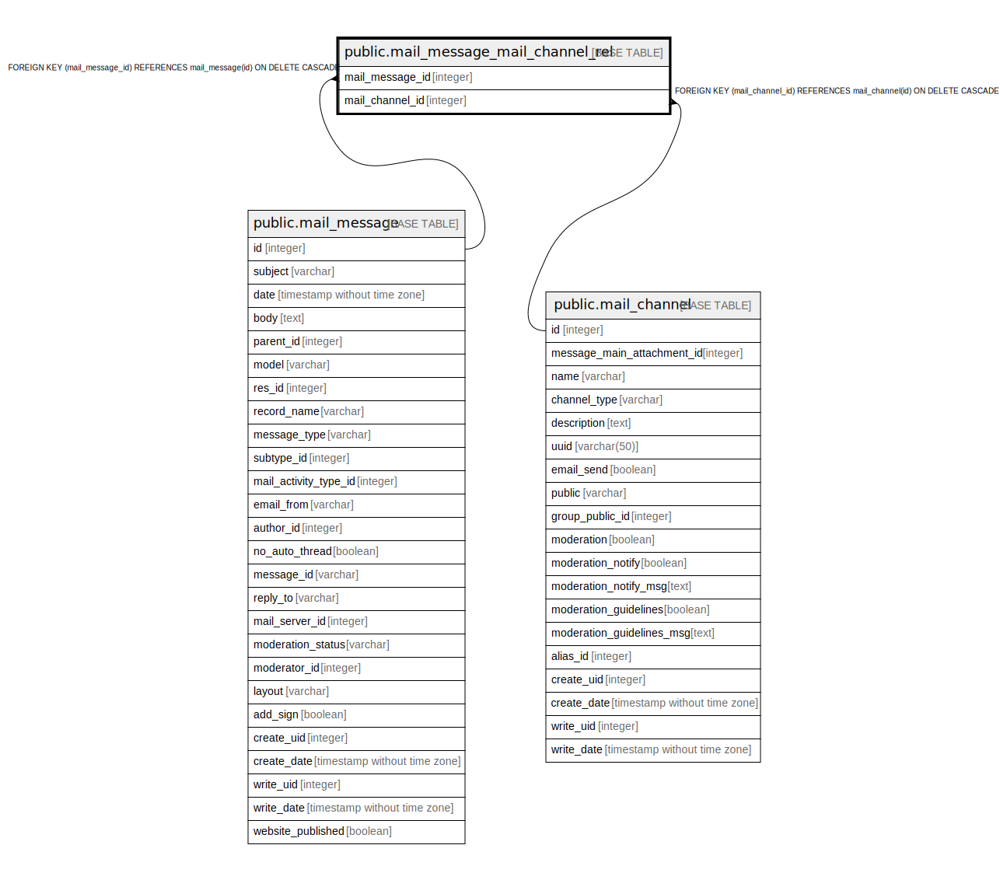

# public.mail_message_mail_channel_rel

## Description

RELATION BETWEEN mail_message AND mail_channel

## Columns

| Name | Type | Default | Nullable | Children | Parents | Comment |
| ---- | ---- | ------- | -------- | -------- | ------- | ------- |
| mail_message_id | integer |  | false |  | [public.mail_message](public.mail_message.md) |  |
| mail_channel_id | integer |  | false |  | [public.mail_channel](public.mail_channel.md) |  |

## Constraints

| Name | Type | Definition |
| ---- | ---- | ---------- |
| mail_message_mail_channel_rel_mail_message_id_fkey | FOREIGN KEY | FOREIGN KEY (mail_message_id) REFERENCES mail_message(id) ON DELETE CASCADE |
| mail_message_mail_channel_rel_mail_message_id_mail_channel__key | UNIQUE | UNIQUE (mail_message_id, mail_channel_id) |
| mail_message_mail_channel_rel_mail_channel_id_fkey | FOREIGN KEY | FOREIGN KEY (mail_channel_id) REFERENCES mail_channel(id) ON DELETE CASCADE |

## Indexes

| Name | Definition |
| ---- | ---------- |
| mail_message_mail_channel_rel_mail_message_id_mail_channel__key | CREATE UNIQUE INDEX mail_message_mail_channel_rel_mail_message_id_mail_channel__key ON public.mail_message_mail_channel_rel USING btree (mail_message_id, mail_channel_id) |
| mail_message_mail_channel_rel_mail_message_id_idx | CREATE INDEX mail_message_mail_channel_rel_mail_message_id_idx ON public.mail_message_mail_channel_rel USING btree (mail_message_id) |
| mail_message_mail_channel_rel_mail_channel_id_idx | CREATE INDEX mail_message_mail_channel_rel_mail_channel_id_idx ON public.mail_message_mail_channel_rel USING btree (mail_channel_id) |

## Relations

---

> Generated by [tbls](https://github.com/k1LoW/tbls)
