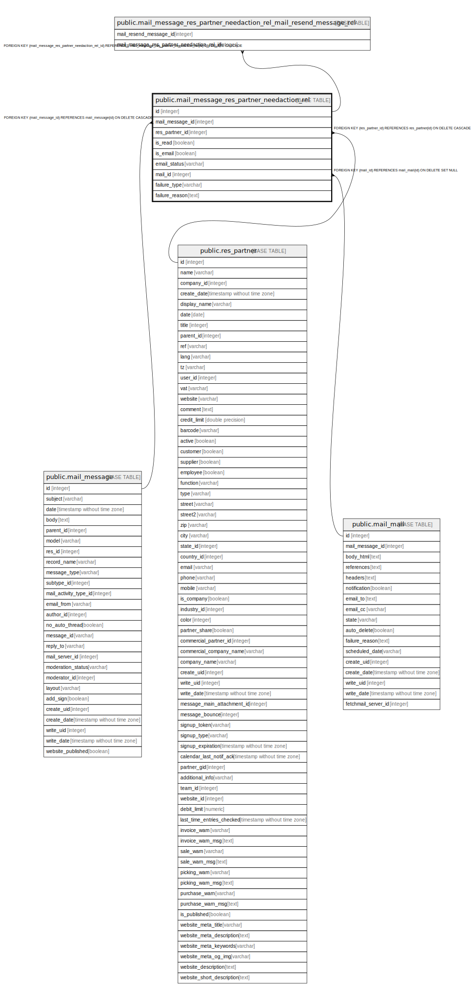

# public.mail_message_res_partner_needaction_rel

## Description

Message Notifications

## Columns

| Name | Type | Default | Nullable | Children | Parents | Comment |
| ---- | ---- | ------- | -------- | -------- | ------- | ------- |
| id | integer | nextval('mail_message_res_partner_needaction_rel_id_seq'::regclass) | false | [public.mail_message_res_partner_needaction_rel_mail_resend_message_rel](public.mail_message_res_partner_needaction_rel_mail_resend_message_rel.md) |  |  |
| mail_message_id | integer |  | false |  | [public.mail_message](public.mail_message.md) | Message |
| res_partner_id | integer |  | false |  | [public.res_partner](public.res_partner.md) | Needaction Recipient |
| is_read | boolean |  | true |  |  | Is Read |
| is_email | boolean |  | true |  |  | Sent by Email |
| email_status | varchar |  | true |  |  | Email Status |
| mail_id | integer |  | true |  | [public.mail_mail](public.mail_mail.md) | Mail |
| failure_type | varchar |  | true |  |  | Failure type |
| failure_reason | text |  | true |  |  | Failure reason |

## Constraints

| Name | Type | Definition |
| ---- | ---- | ---------- |
| mail_message_res_partner_needaction_rel_res_partner_id_fkey | FOREIGN KEY | FOREIGN KEY (res_partner_id) REFERENCES res_partner(id) ON DELETE CASCADE |
| mail_message_res_partner_needaction_rel_pkey | PRIMARY KEY | PRIMARY KEY (id) |
| mail_message_res_partner_needaction_rel_mail_message_id_fkey | FOREIGN KEY | FOREIGN KEY (mail_message_id) REFERENCES mail_message(id) ON DELETE CASCADE |
| mail_message_res_partner_needaction_rel_mail_id_fkey | FOREIGN KEY | FOREIGN KEY (mail_id) REFERENCES mail_mail(id) ON DELETE SET NULL |

## Indexes

| Name | Definition |
| ---- | ---------- |
| mail_message_res_partner_needaction_rel_pkey | CREATE UNIQUE INDEX mail_message_res_partner_needaction_rel_pkey ON public.mail_message_res_partner_needaction_rel USING btree (id) |
| mail_message_res_partner_needaction_rel_mail_message_id_index | CREATE INDEX mail_message_res_partner_needaction_rel_mail_message_id_index ON public.mail_message_res_partner_needaction_rel USING btree (mail_message_id) |
| mail_message_res_partner_needaction_rel_res_partner_id_index | CREATE INDEX mail_message_res_partner_needaction_rel_res_partner_id_index ON public.mail_message_res_partner_needaction_rel USING btree (res_partner_id) |
| mail_message_res_partner_needaction_rel_is_read_index | CREATE INDEX mail_message_res_partner_needaction_rel_is_read_index ON public.mail_message_res_partner_needaction_rel USING btree (is_read) |
| mail_message_res_partner_needaction_rel_is_email_index | CREATE INDEX mail_message_res_partner_needaction_rel_is_email_index ON public.mail_message_res_partner_needaction_rel USING btree (is_email) |
| mail_message_res_partner_needaction_rel_email_status_index | CREATE INDEX mail_message_res_partner_needaction_rel_email_status_index ON public.mail_message_res_partner_needaction_rel USING btree (email_status) |
| mail_message_res_partner_needaction_rel_mail_id_index | CREATE INDEX mail_message_res_partner_needaction_rel_mail_id_index ON public.mail_message_res_partner_needaction_rel USING btree (mail_id) |
| mail_notification_res_partner_id_is_read_email_status_mail_mess | CREATE INDEX mail_notification_res_partner_id_is_read_email_status_mail_mess ON public.mail_message_res_partner_needaction_rel USING btree (res_partner_id, is_read, email_status, mail_message_id) |

## Relations

---

> Generated by [tbls](https://github.com/k1LoW/tbls)
