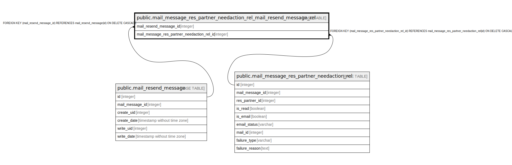

# public.mail_message_res_partner_needaction_rel_mail_resend_message_rel

## Description

RELATION BETWEEN mail_resend_message AND mail_message_res_partner_needaction_rel

## Columns

| Name | Type | Default | Nullable | Children | Parents | Comment |
| ---- | ---- | ------- | -------- | -------- | ------- | ------- |
| mail_resend_message_id | integer |  | false |  | [public.mail_resend_message](public.mail_resend_message.md) |  |
| mail_message_res_partner_needaction_rel_id | integer |  | false |  | [public.mail_message_res_partner_needaction_rel](public.mail_message_res_partner_needaction_rel.md) |  |

## Constraints

| Name | Type | Definition |
| ---- | ---- | ---------- |
| mail_message_res_partner_need_mail_message_res_partner_nee_fkey | FOREIGN KEY | FOREIGN KEY (mail_message_res_partner_needaction_rel_id) REFERENCES mail_message_res_partner_needaction_rel(id) ON DELETE CASCADE |
| mail_message_res_partner_needaction_mail_resend_message_id_fkey | FOREIGN KEY | FOREIGN KEY (mail_resend_message_id) REFERENCES mail_resend_message(id) ON DELETE CASCADE |
| mail_message_res_partner_need_mail_resend_message_id_mail_m_key | UNIQUE | UNIQUE (mail_resend_message_id, mail_message_res_partner_needaction_rel_id) |

## Indexes

| Name | Definition |
| ---- | ---------- |
| mail_message_res_partner_need_mail_resend_message_id_mail_m_key | CREATE UNIQUE INDEX mail_message_res_partner_need_mail_resend_message_id_mail_m_key ON public.mail_message_res_partner_needaction_rel_mail_resend_message_rel USING btree (mail_resend_message_id, mail_message_res_partner_needaction_rel_id) |
| mail_message_res_partner_needaction__mail_resend_message_id_idx | CREATE INDEX mail_message_res_partner_needaction__mail_resend_message_id_idx ON public.mail_message_res_partner_needaction_rel_mail_resend_message_rel USING btree (mail_resend_message_id) |
| mail_message_res_partner_need_mail_message_res_partner_need_idx | CREATE INDEX mail_message_res_partner_need_mail_message_res_partner_need_idx ON public.mail_message_res_partner_needaction_rel_mail_resend_message_rel USING btree (mail_message_res_partner_needaction_rel_id) |

## Relations

---

> Generated by [tbls](https://github.com/k1LoW/tbls)
