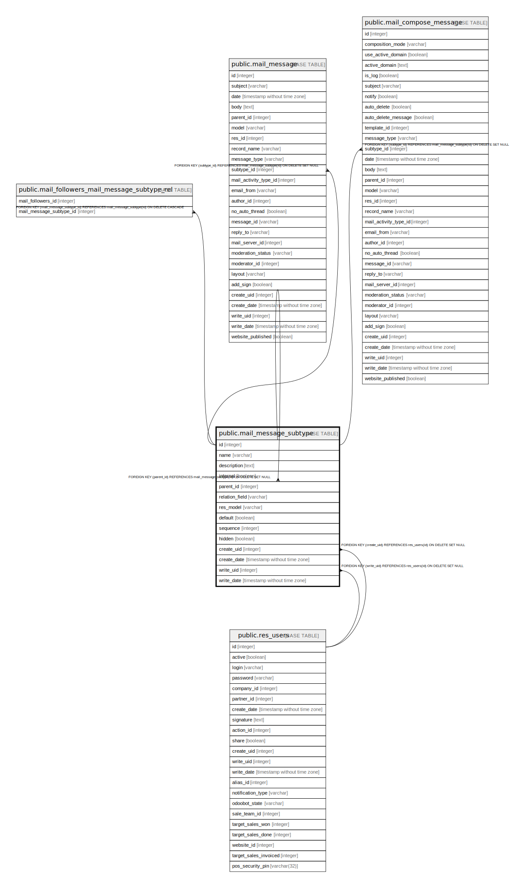

# public.mail_message_subtype

## Description

Message subtypes

## Columns

| Name | Type | Default | Nullable | Children | Parents | Comment |
| ---- | ---- | ------- | -------- | -------- | ------- | ------- |
| id | integer | nextval('mail_message_subtype_id_seq'::regclass) | false | [public.mail_message_subtype](public.mail_message_subtype.md) [public.mail_followers_mail_message_subtype_rel](public.mail_followers_mail_message_subtype_rel.md) [public.mail_message](public.mail_message.md) [public.mail_compose_message](public.mail_compose_message.md) |  |  |
| name | varchar |  | false |  |  | Message Type |
| description | text |  | true |  |  | Description |
| internal | boolean |  | true |  |  | Internal Only |
| parent_id | integer |  | true |  | [public.mail_message_subtype](public.mail_message_subtype.md) | Parent |
| relation_field | varchar |  | true |  |  | Relation field |
| res_model | varchar |  | true |  |  | Model |
| default | boolean |  | true |  |  | Default |
| sequence | integer |  | true |  |  | Sequence |
| hidden | boolean |  | true |  |  | Hidden |
| create_uid | integer |  | true |  | [public.res_users](public.res_users.md) | Created by |
| create_date | timestamp without time zone |  | true |  |  | Created on |
| write_uid | integer |  | true |  | [public.res_users](public.res_users.md) | Last Updated by |
| write_date | timestamp without time zone |  | true |  |  | Last Updated on |

## Constraints

| Name | Type | Definition |
| ---- | ---- | ---------- |
| mail_message_subtype_create_uid_fkey | FOREIGN KEY | FOREIGN KEY (create_uid) REFERENCES res_users(id) ON DELETE SET NULL |
| mail_message_subtype_write_uid_fkey | FOREIGN KEY | FOREIGN KEY (write_uid) REFERENCES res_users(id) ON DELETE SET NULL |
| mail_message_subtype_parent_id_fkey | FOREIGN KEY | FOREIGN KEY (parent_id) REFERENCES mail_message_subtype(id) ON DELETE SET NULL |
| mail_message_subtype_pkey | PRIMARY KEY | PRIMARY KEY (id) |

## Indexes

| Name | Definition |
| ---- | ---------- |
| mail_message_subtype_pkey | CREATE UNIQUE INDEX mail_message_subtype_pkey ON public.mail_message_subtype USING btree (id) |

## Relations

---

> Generated by [tbls](https://github.com/k1LoW/tbls)
