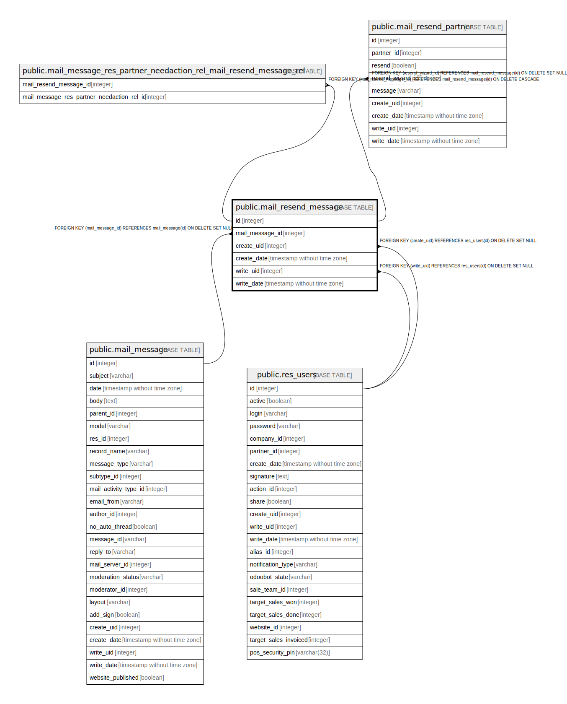

# public.mail_resend_message

## Description

Email resend wizard

## Columns

| Name | Type | Default | Nullable | Children | Parents | Comment |
| ---- | ---- | ------- | -------- | -------- | ------- | ------- |
| id | integer | nextval('mail_resend_message_id_seq'::regclass) | false | [public.mail_message_res_partner_needaction_rel_mail_resend_message_rel](public.mail_message_res_partner_needaction_rel_mail_resend_message_rel.md) [public.mail_resend_partner](public.mail_resend_partner.md) |  |  |
| mail_message_id | integer |  | true |  | [public.mail_message](public.mail_message.md) | Message |
| create_uid | integer |  | true |  | [public.res_users](public.res_users.md) | Created by |
| create_date | timestamp without time zone |  | true |  |  | Created on |
| write_uid | integer |  | true |  | [public.res_users](public.res_users.md) | Last Updated by |
| write_date | timestamp without time zone |  | true |  |  | Last Updated on |

## Constraints

| Name | Type | Definition |
| ---- | ---- | ---------- |
| mail_resend_message_create_uid_fkey | FOREIGN KEY | FOREIGN KEY (create_uid) REFERENCES res_users(id) ON DELETE SET NULL |
| mail_resend_message_write_uid_fkey | FOREIGN KEY | FOREIGN KEY (write_uid) REFERENCES res_users(id) ON DELETE SET NULL |
| mail_resend_message_mail_message_id_fkey | FOREIGN KEY | FOREIGN KEY (mail_message_id) REFERENCES mail_message(id) ON DELETE SET NULL |
| mail_resend_message_pkey | PRIMARY KEY | PRIMARY KEY (id) |

## Indexes

| Name | Definition |
| ---- | ---------- |
| mail_resend_message_pkey | CREATE UNIQUE INDEX mail_resend_message_pkey ON public.mail_resend_message USING btree (id) |

## Relations

---

> Generated by [tbls](https://github.com/k1LoW/tbls)
