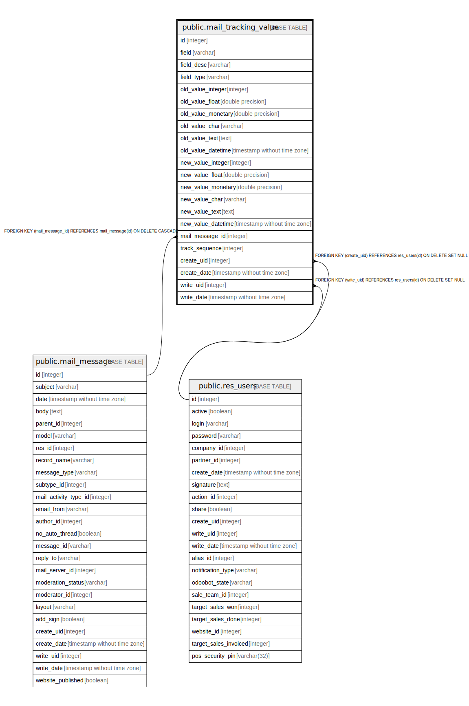

# public.mail_tracking_value

## Description

Mail Tracking Value

## Columns

| Name | Type | Default | Nullable | Children | Parents | Comment |
| ---- | ---- | ------- | -------- | -------- | ------- | ------- |
| id | integer | nextval('mail_tracking_value_id_seq'::regclass) | false |  |  |  |
| field | varchar |  | false |  |  | Changed Field |
| field_desc | varchar |  | false |  |  | Field Description |
| field_type | varchar |  | true |  |  | Field Type |
| old_value_integer | integer |  | true |  |  | Old Value Integer |
| old_value_float | double precision |  | true |  |  | Old Value Float |
| old_value_monetary | double precision |  | true |  |  | Old Value Monetary |
| old_value_char | varchar |  | true |  |  | Old Value Char |
| old_value_text | text |  | true |  |  | Old Value Text |
| old_value_datetime | timestamp without time zone |  | true |  |  | Old Value DateTime |
| new_value_integer | integer |  | true |  |  | New Value Integer |
| new_value_float | double precision |  | true |  |  | New Value Float |
| new_value_monetary | double precision |  | true |  |  | New Value Monetary |
| new_value_char | varchar |  | true |  |  | New Value Char |
| new_value_text | text |  | true |  |  | New Value Text |
| new_value_datetime | timestamp without time zone |  | true |  |  | New Value Datetime |
| mail_message_id | integer |  | false |  | [public.mail_message](public.mail_message.md) | Message ID |
| track_sequence | integer |  | true |  |  | Tracking field sequence |
| create_uid | integer |  | true |  | [public.res_users](public.res_users.md) | Created by |
| create_date | timestamp without time zone |  | true |  |  | Created on |
| write_uid | integer |  | true |  | [public.res_users](public.res_users.md) | Last Updated by |
| write_date | timestamp without time zone |  | true |  |  | Last Updated on |

## Constraints

| Name | Type | Definition |
| ---- | ---- | ---------- |
| mail_tracking_value_create_uid_fkey | FOREIGN KEY | FOREIGN KEY (create_uid) REFERENCES res_users(id) ON DELETE SET NULL |
| mail_tracking_value_write_uid_fkey | FOREIGN KEY | FOREIGN KEY (write_uid) REFERENCES res_users(id) ON DELETE SET NULL |
| mail_tracking_value_pkey | PRIMARY KEY | PRIMARY KEY (id) |
| mail_tracking_value_mail_message_id_fkey | FOREIGN KEY | FOREIGN KEY (mail_message_id) REFERENCES mail_message(id) ON DELETE CASCADE |

## Indexes

| Name | Definition |
| ---- | ---------- |
| mail_tracking_value_pkey | CREATE UNIQUE INDEX mail_tracking_value_pkey ON public.mail_tracking_value USING btree (id) |
| mail_tracking_value_mail_message_id_index | CREATE INDEX mail_tracking_value_mail_message_id_index ON public.mail_tracking_value USING btree (mail_message_id) |

## Relations

---

> Generated by [tbls](https://github.com/k1LoW/tbls)
