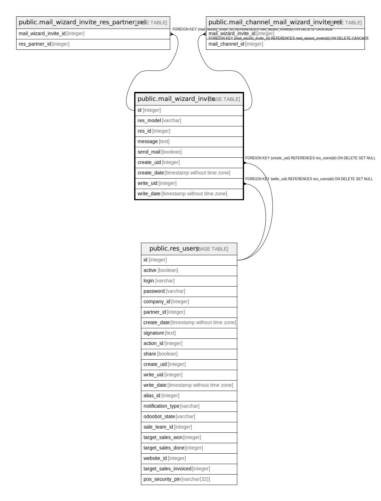

# public.mail_wizard_invite

## Description

Invite wizard

## Columns

| Name | Type | Default | Nullable | Children | Parents | Comment |
| ---- | ---- | ------- | -------- | -------- | ------- | ------- |
| id | integer | nextval('mail_wizard_invite_id_seq'::regclass) | false | [public.mail_wizard_invite_res_partner_rel](public.mail_wizard_invite_res_partner_rel.md) [public.mail_channel_mail_wizard_invite_rel](public.mail_channel_mail_wizard_invite_rel.md) |  |  |
| res_model | varchar |  | false |  |  | Related Document Model |
| res_id | integer |  | true |  |  | Related Document ID |
| message | text |  | true |  |  | Message |
| send_mail | boolean |  | true |  |  | Send Email |
| create_uid | integer |  | true |  | [public.res_users](public.res_users.md) | Created by |
| create_date | timestamp without time zone |  | true |  |  | Created on |
| write_uid | integer |  | true |  | [public.res_users](public.res_users.md) | Last Updated by |
| write_date | timestamp without time zone |  | true |  |  | Last Updated on |

## Constraints

| Name | Type | Definition |
| ---- | ---- | ---------- |
| mail_wizard_invite_create_uid_fkey | FOREIGN KEY | FOREIGN KEY (create_uid) REFERENCES res_users(id) ON DELETE SET NULL |
| mail_wizard_invite_write_uid_fkey | FOREIGN KEY | FOREIGN KEY (write_uid) REFERENCES res_users(id) ON DELETE SET NULL |
| mail_wizard_invite_pkey | PRIMARY KEY | PRIMARY KEY (id) |

## Indexes

| Name | Definition |
| ---- | ---------- |
| mail_wizard_invite_pkey | CREATE UNIQUE INDEX mail_wizard_invite_pkey ON public.mail_wizard_invite USING btree (id) |
| mail_wizard_invite_res_model_index | CREATE INDEX mail_wizard_invite_res_model_index ON public.mail_wizard_invite USING btree (res_model) |
| mail_wizard_invite_res_id_index | CREATE INDEX mail_wizard_invite_res_id_index ON public.mail_wizard_invite USING btree (res_id) |

## Relations

---

> Generated by [tbls](https://github.com/k1LoW/tbls)
