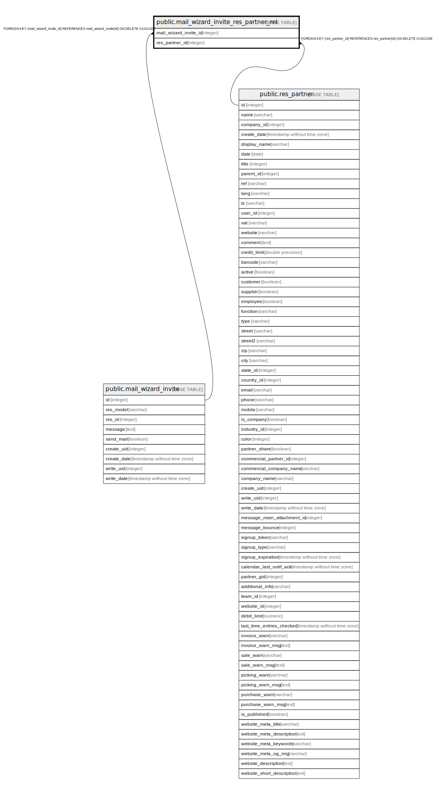

# public.mail_wizard_invite_res_partner_rel

## Description

RELATION BETWEEN mail_wizard_invite AND res_partner

## Columns

| Name | Type | Default | Nullable | Children | Parents | Comment |
| ---- | ---- | ------- | -------- | -------- | ------- | ------- |
| mail_wizard_invite_id | integer |  | false |  | [public.mail_wizard_invite](public.mail_wizard_invite.md) |  |
| res_partner_id | integer |  | false |  | [public.res_partner](public.res_partner.md) |  |

## Constraints

| Name | Type | Definition |
| ---- | ---- | ---------- |
| mail_wizard_invite_res_partner_rel_res_partner_id_fkey | FOREIGN KEY | FOREIGN KEY (res_partner_id) REFERENCES res_partner(id) ON DELETE CASCADE |
| mail_wizard_invite_res_partner_rel_mail_wizard_invite_id_fkey | FOREIGN KEY | FOREIGN KEY (mail_wizard_invite_id) REFERENCES mail_wizard_invite(id) ON DELETE CASCADE |
| mail_wizard_invite_res_partne_mail_wizard_invite_id_res_par_key | UNIQUE | UNIQUE (mail_wizard_invite_id, res_partner_id) |

## Indexes

| Name | Definition |
| ---- | ---------- |
| mail_wizard_invite_res_partne_mail_wizard_invite_id_res_par_key | CREATE UNIQUE INDEX mail_wizard_invite_res_partne_mail_wizard_invite_id_res_par_key ON public.mail_wizard_invite_res_partner_rel USING btree (mail_wizard_invite_id, res_partner_id) |
| mail_wizard_invite_res_partner_rel_mail_wizard_invite_id_idx | CREATE INDEX mail_wizard_invite_res_partner_rel_mail_wizard_invite_id_idx ON public.mail_wizard_invite_res_partner_rel USING btree (mail_wizard_invite_id) |
| mail_wizard_invite_res_partner_rel_res_partner_id_idx | CREATE INDEX mail_wizard_invite_res_partner_rel_res_partner_id_idx ON public.mail_wizard_invite_res_partner_rel USING btree (res_partner_id) |

## Relations

---

> Generated by [tbls](https://github.com/k1LoW/tbls)
