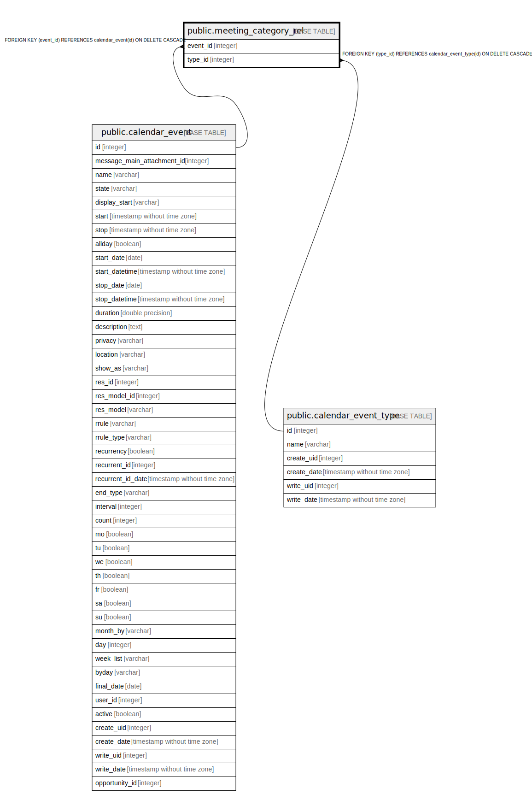

# public.meeting_category_rel

## Description

RELATION BETWEEN calendar_event AND calendar_event_type

## Columns

| Name | Type | Default | Nullable | Children | Parents | Comment |
| ---- | ---- | ------- | -------- | -------- | ------- | ------- |
| event_id | integer |  | false |  | [public.calendar_event](public.calendar_event.md) |  |
| type_id | integer |  | false |  | [public.calendar_event_type](public.calendar_event_type.md) |  |

## Constraints

| Name | Type | Definition |
| ---- | ---- | ---------- |
| meeting_category_rel_type_id_fkey | FOREIGN KEY | FOREIGN KEY (type_id) REFERENCES calendar_event_type(id) ON DELETE CASCADE |
| meeting_category_rel_event_id_fkey | FOREIGN KEY | FOREIGN KEY (event_id) REFERENCES calendar_event(id) ON DELETE CASCADE |
| meeting_category_rel_event_id_type_id_key | UNIQUE | UNIQUE (event_id, type_id) |

## Indexes

| Name | Definition |
| ---- | ---------- |
| meeting_category_rel_event_id_type_id_key | CREATE UNIQUE INDEX meeting_category_rel_event_id_type_id_key ON public.meeting_category_rel USING btree (event_id, type_id) |
| meeting_category_rel_event_id_idx | CREATE INDEX meeting_category_rel_event_id_idx ON public.meeting_category_rel USING btree (event_id) |
| meeting_category_rel_type_id_idx | CREATE INDEX meeting_category_rel_type_id_idx ON public.meeting_category_rel USING btree (type_id) |

## Relations

---

> Generated by [tbls](https://github.com/k1LoW/tbls)
