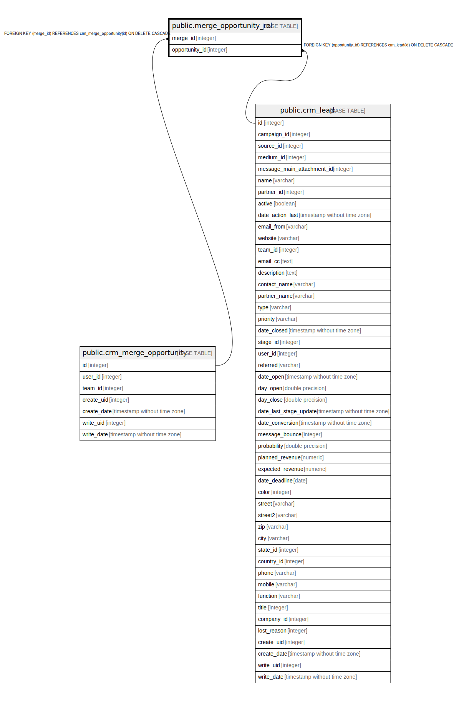

# public.merge_opportunity_rel

## Description

RELATION BETWEEN crm_merge_opportunity AND crm_lead

## Columns

| Name | Type | Default | Nullable | Children | Parents | Comment |
| ---- | ---- | ------- | -------- | -------- | ------- | ------- |
| merge_id | integer |  | false |  | [public.crm_merge_opportunity](public.crm_merge_opportunity.md) |  |
| opportunity_id | integer |  | false |  | [public.crm_lead](public.crm_lead.md) |  |

## Constraints

| Name | Type | Definition |
| ---- | ---- | ---------- |
| merge_opportunity_rel_opportunity_id_fkey | FOREIGN KEY | FOREIGN KEY (opportunity_id) REFERENCES crm_lead(id) ON DELETE CASCADE |
| merge_opportunity_rel_merge_id_fkey | FOREIGN KEY | FOREIGN KEY (merge_id) REFERENCES crm_merge_opportunity(id) ON DELETE CASCADE |
| merge_opportunity_rel_merge_id_opportunity_id_key | UNIQUE | UNIQUE (merge_id, opportunity_id) |

## Indexes

| Name | Definition |
| ---- | ---------- |
| merge_opportunity_rel_merge_id_opportunity_id_key | CREATE UNIQUE INDEX merge_opportunity_rel_merge_id_opportunity_id_key ON public.merge_opportunity_rel USING btree (merge_id, opportunity_id) |
| merge_opportunity_rel_merge_id_idx | CREATE INDEX merge_opportunity_rel_merge_id_idx ON public.merge_opportunity_rel USING btree (merge_id) |
| merge_opportunity_rel_opportunity_id_idx | CREATE INDEX merge_opportunity_rel_opportunity_id_idx ON public.merge_opportunity_rel USING btree (opportunity_id) |

## Relations

---

> Generated by [tbls](https://github.com/k1LoW/tbls)
