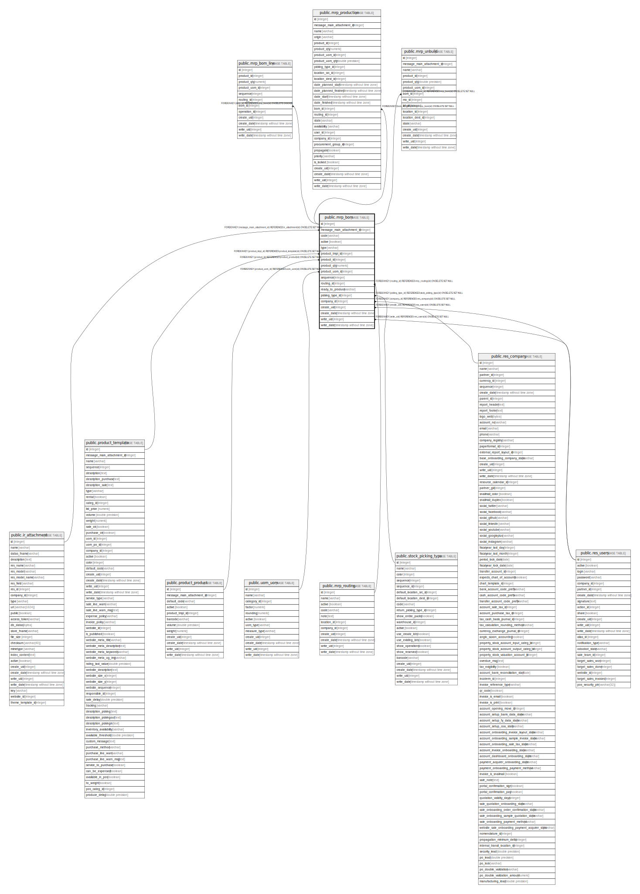

# public.mrp_bom

## Description

Bill of Material

## Columns

| Name | Type | Default | Nullable | Children | Parents | Comment |
| ---- | ---- | ------- | -------- | -------- | ------- | ------- |
| id | integer | nextval('mrp_bom_id_seq'::regclass) | false | [public.mrp_bom_line](public.mrp_bom_line.md) [public.mrp_production](public.mrp_production.md) [public.mrp_unbuild](public.mrp_unbuild.md) |  |  |
| message_main_attachment_id | integer |  | true |  | [public.ir_attachment](public.ir_attachment.md) | Main Attachment |
| code | varchar |  | true |  |  | Reference |
| active | boolean |  | true |  |  | Active |
| type | varchar |  | false |  |  | BoM Type |
| product_tmpl_id | integer |  | false |  | [public.product_template](public.product_template.md) | Product |
| product_id | integer |  | true |  | [public.product_product](public.product_product.md) | Product Variant |
| product_qty | numeric |  | false |  |  | Quantity |
| product_uom_id | integer |  | false |  | [public.uom_uom](public.uom_uom.md) | Product Unit of Measure |
| sequence | integer |  | true |  |  | Sequence |
| routing_id | integer |  | true |  | [public.mrp_routing](public.mrp_routing.md) | Routing |
| ready_to_produce | varchar |  | false |  |  | Manufacturing Readiness |
| picking_type_id | integer |  | true |  | [public.stock_picking_type](public.stock_picking_type.md) | Operation Type |
| company_id | integer |  | false |  | [public.res_company](public.res_company.md) | Company |
| create_uid | integer |  | true |  | [public.res_users](public.res_users.md) | Created by |
| create_date | timestamp without time zone |  | true |  |  | Created on |
| write_uid | integer |  | true |  | [public.res_users](public.res_users.md) | Last Updated by |
| write_date | timestamp without time zone |  | true |  |  | Last Updated on |

## Constraints

| Name | Type | Definition |
| ---- | ---- | ---------- |
| mrp_bom_create_uid_fkey | FOREIGN KEY | FOREIGN KEY (create_uid) REFERENCES res_users(id) ON DELETE SET NULL |
| mrp_bom_write_uid_fkey | FOREIGN KEY | FOREIGN KEY (write_uid) REFERENCES res_users(id) ON DELETE SET NULL |
| mrp_bom_company_id_fkey | FOREIGN KEY | FOREIGN KEY (company_id) REFERENCES res_company(id) ON DELETE SET NULL |
| mrp_bom_message_main_attachment_id_fkey | FOREIGN KEY | FOREIGN KEY (message_main_attachment_id) REFERENCES ir_attachment(id) ON DELETE SET NULL |
| mrp_bom_product_uom_id_fkey | FOREIGN KEY | FOREIGN KEY (product_uom_id) REFERENCES uom_uom(id) ON DELETE SET NULL |
| mrp_bom_product_tmpl_id_fkey | FOREIGN KEY | FOREIGN KEY (product_tmpl_id) REFERENCES product_template(id) ON DELETE SET NULL |
| mrp_bom_product_id_fkey | FOREIGN KEY | FOREIGN KEY (product_id) REFERENCES product_product(id) ON DELETE SET NULL |
| mrp_bom_picking_type_id_fkey | FOREIGN KEY | FOREIGN KEY (picking_type_id) REFERENCES stock_picking_type(id) ON DELETE SET NULL |
| mrp_bom_pkey | PRIMARY KEY | PRIMARY KEY (id) |
| mrp_bom_routing_id_fkey | FOREIGN KEY | FOREIGN KEY (routing_id) REFERENCES mrp_routing(id) ON DELETE SET NULL |

## Indexes

| Name | Definition |
| ---- | ---------- |
| mrp_bom_pkey | CREATE UNIQUE INDEX mrp_bom_pkey ON public.mrp_bom USING btree (id) |
| mrp_bom_message_main_attachment_id_index | CREATE INDEX mrp_bom_message_main_attachment_id_index ON public.mrp_bom USING btree (message_main_attachment_id) |

## Relations

---

> Generated by [tbls](https://github.com/k1LoW/tbls)
