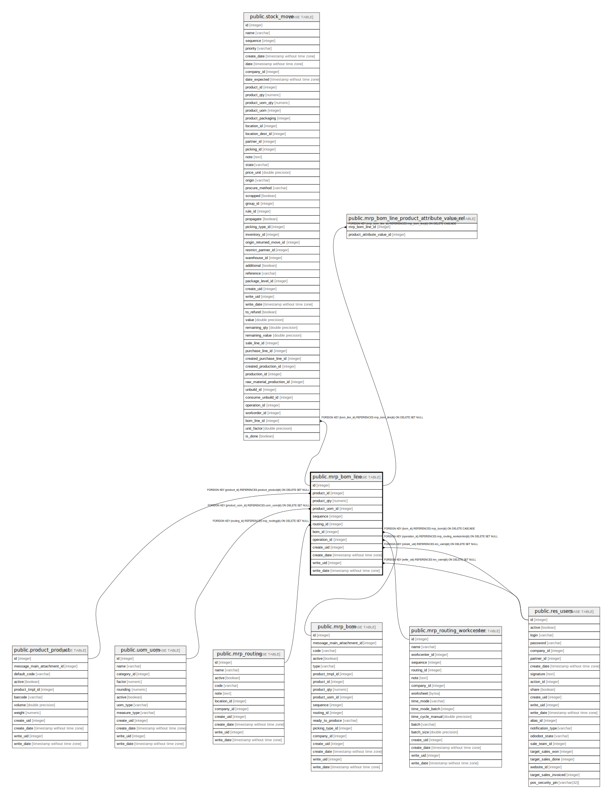

# public.mrp_bom_line

## Description

Bill of Material Line

## Columns

| Name | Type | Default | Nullable | Children | Parents | Comment |
| ---- | ---- | ------- | -------- | -------- | ------- | ------- |
| id | integer | nextval('mrp_bom_line_id_seq'::regclass) | false | [public.stock_move](public.stock_move.md) [public.mrp_bom_line_product_attribute_value_rel](public.mrp_bom_line_product_attribute_value_rel.md) |  |  |
| product_id | integer |  | false |  | [public.product_product](public.product_product.md) | Component |
| product_qty | numeric |  | false |  |  | Quantity |
| product_uom_id | integer |  | false |  | [public.uom_uom](public.uom_uom.md) | Product Unit of Measure |
| sequence | integer |  | true |  |  | Sequence |
| routing_id | integer |  | true |  | [public.mrp_routing](public.mrp_routing.md) | Routing |
| bom_id | integer |  | false |  | [public.mrp_bom](public.mrp_bom.md) | Parent BoM |
| operation_id | integer |  | true |  | [public.mrp_routing_workcenter](public.mrp_routing_workcenter.md) | Consumed in Operation |
| create_uid | integer |  | true |  | [public.res_users](public.res_users.md) | Created by |
| create_date | timestamp without time zone |  | true |  |  | Created on |
| write_uid | integer |  | true |  | [public.res_users](public.res_users.md) | Last Updated by |
| write_date | timestamp without time zone |  | true |  |  | Last Updated on |

## Constraints

| Name | Type | Definition | Comment |
| ---- | ---- | ---------- | ------- |
| mrp_bom_line_bom_qty_zero | CHECK | CHECK ((product_qty >= (0)::numeric)) | CHECK (product_qty>=0) |
| mrp_bom_line_create_uid_fkey | FOREIGN KEY | FOREIGN KEY (create_uid) REFERENCES res_users(id) ON DELETE SET NULL |  |
| mrp_bom_line_write_uid_fkey | FOREIGN KEY | FOREIGN KEY (write_uid) REFERENCES res_users(id) ON DELETE SET NULL |  |
| mrp_bom_line_product_uom_id_fkey | FOREIGN KEY | FOREIGN KEY (product_uom_id) REFERENCES uom_uom(id) ON DELETE SET NULL |  |
| mrp_bom_line_product_id_fkey | FOREIGN KEY | FOREIGN KEY (product_id) REFERENCES product_product(id) ON DELETE SET NULL |  |
| mrp_bom_line_bom_id_fkey | FOREIGN KEY | FOREIGN KEY (bom_id) REFERENCES mrp_bom(id) ON DELETE CASCADE |  |
| mrp_bom_line_pkey | PRIMARY KEY | PRIMARY KEY (id) |  |
| mrp_bom_line_routing_id_fkey | FOREIGN KEY | FOREIGN KEY (routing_id) REFERENCES mrp_routing(id) ON DELETE SET NULL |  |
| mrp_bom_line_operation_id_fkey | FOREIGN KEY | FOREIGN KEY (operation_id) REFERENCES mrp_routing_workcenter(id) ON DELETE SET NULL |  |

## Indexes

| Name | Definition |
| ---- | ---------- |
| mrp_bom_line_pkey | CREATE UNIQUE INDEX mrp_bom_line_pkey ON public.mrp_bom_line USING btree (id) |
| mrp_bom_line_bom_id_index | CREATE INDEX mrp_bom_line_bom_id_index ON public.mrp_bom_line USING btree (bom_id) |

## Relations

---

> Generated by [tbls](https://github.com/k1LoW/tbls)
