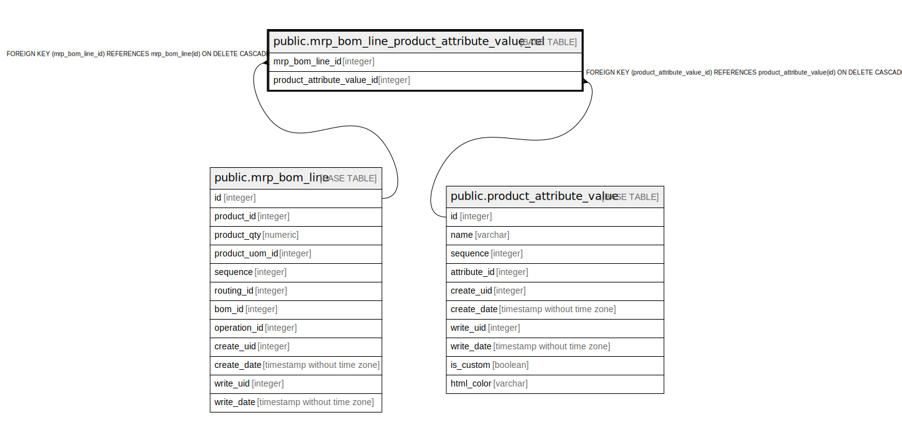

# public.mrp_bom_line_product_attribute_value_rel

## Description

RELATION BETWEEN mrp_bom_line AND product_attribute_value

## Columns

| Name | Type | Default | Nullable | Children | Parents | Comment |
| ---- | ---- | ------- | -------- | -------- | ------- | ------- |
| mrp_bom_line_id | integer |  | false |  | [public.mrp_bom_line](public.mrp_bom_line.md) |  |
| product_attribute_value_id | integer |  | false |  | [public.product_attribute_value](public.product_attribute_value.md) |  |

## Constraints

| Name | Type | Definition |
| ---- | ---- | ---------- |
| mrp_bom_line_product_attribute__product_attribute_value_id_fkey | FOREIGN KEY | FOREIGN KEY (product_attribute_value_id) REFERENCES product_attribute_value(id) ON DELETE CASCADE |
| mrp_bom_line_product_attribute_value_rel_mrp_bom_line_id_fkey | FOREIGN KEY | FOREIGN KEY (mrp_bom_line_id) REFERENCES mrp_bom_line(id) ON DELETE CASCADE |
| mrp_bom_line_product_attribut_mrp_bom_line_id_product_attri_key | UNIQUE | UNIQUE (mrp_bom_line_id, product_attribute_value_id) |

## Indexes

| Name | Definition |
| ---- | ---------- |
| mrp_bom_line_product_attribut_mrp_bom_line_id_product_attri_key | CREATE UNIQUE INDEX mrp_bom_line_product_attribut_mrp_bom_line_id_product_attri_key ON public.mrp_bom_line_product_attribute_value_rel USING btree (mrp_bom_line_id, product_attribute_value_id) |
| mrp_bom_line_product_attribute_value_rel_mrp_bom_line_id_idx | CREATE INDEX mrp_bom_line_product_attribute_value_rel_mrp_bom_line_id_idx ON public.mrp_bom_line_product_attribute_value_rel USING btree (mrp_bom_line_id) |
| mrp_bom_line_product_attribute_v_product_attribute_value_id_idx | CREATE INDEX mrp_bom_line_product_attribute_v_product_attribute_value_id_idx ON public.mrp_bom_line_product_attribute_value_rel USING btree (product_attribute_value_id) |

## Relations

---

> Generated by [tbls](https://github.com/k1LoW/tbls)
