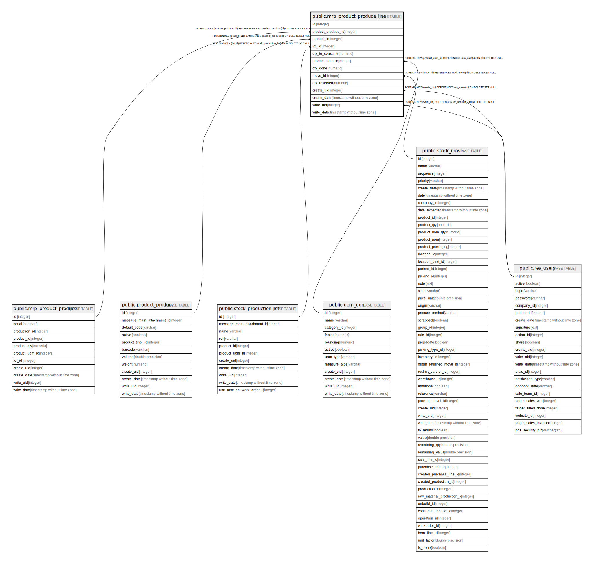

# public.mrp_product_produce_line

## Description

Record Production Line

## Columns

| Name | Type | Default | Nullable | Children | Parents | Comment |
| ---- | ---- | ------- | -------- | -------- | ------- | ------- |
| id | integer | nextval('mrp_product_produce_line_id_seq'::regclass) | false |  |  |  |
| product_produce_id | integer |  | true |  | [public.mrp_product_produce](public.mrp_product_produce.md) | Product Produce |
| product_id | integer |  | true |  | [public.product_product](public.product_product.md) | Product |
| lot_id | integer |  | true |  | [public.stock_production_lot](public.stock_production_lot.md) | Lot/Serial Number |
| qty_to_consume | numeric |  | true |  |  | To Consume |
| product_uom_id | integer |  | true |  | [public.uom_uom](public.uom_uom.md) | Unit of Measure |
| qty_done | numeric |  | true |  |  | Consumed |
| move_id | integer |  | true |  | [public.stock_move](public.stock_move.md) | Move |
| qty_reserved | numeric |  | true |  |  | Reserved |
| create_uid | integer |  | true |  | [public.res_users](public.res_users.md) | Created by |
| create_date | timestamp without time zone |  | true |  |  | Created on |
| write_uid | integer |  | true |  | [public.res_users](public.res_users.md) | Last Updated by |
| write_date | timestamp without time zone |  | true |  |  | Last Updated on |

## Constraints

| Name | Type | Definition |
| ---- | ---- | ---------- |
| mrp_product_produce_line_create_uid_fkey | FOREIGN KEY | FOREIGN KEY (create_uid) REFERENCES res_users(id) ON DELETE SET NULL |
| mrp_product_produce_line_write_uid_fkey | FOREIGN KEY | FOREIGN KEY (write_uid) REFERENCES res_users(id) ON DELETE SET NULL |
| mrp_product_produce_line_product_uom_id_fkey | FOREIGN KEY | FOREIGN KEY (product_uom_id) REFERENCES uom_uom(id) ON DELETE SET NULL |
| mrp_product_produce_line_product_id_fkey | FOREIGN KEY | FOREIGN KEY (product_id) REFERENCES product_product(id) ON DELETE SET NULL |
| mrp_product_produce_line_move_id_fkey | FOREIGN KEY | FOREIGN KEY (move_id) REFERENCES stock_move(id) ON DELETE SET NULL |
| mrp_product_produce_line_lot_id_fkey | FOREIGN KEY | FOREIGN KEY (lot_id) REFERENCES stock_production_lot(id) ON DELETE SET NULL |
| mrp_product_produce_line_product_produce_id_fkey | FOREIGN KEY | FOREIGN KEY (product_produce_id) REFERENCES mrp_product_produce(id) ON DELETE SET NULL |
| mrp_product_produce_line_pkey | PRIMARY KEY | PRIMARY KEY (id) |

## Indexes

| Name | Definition |
| ---- | ---------- |
| mrp_product_produce_line_pkey | CREATE UNIQUE INDEX mrp_product_produce_line_pkey ON public.mrp_product_produce_line USING btree (id) |

## Relations

---

> Generated by [tbls](https://github.com/k1LoW/tbls)
