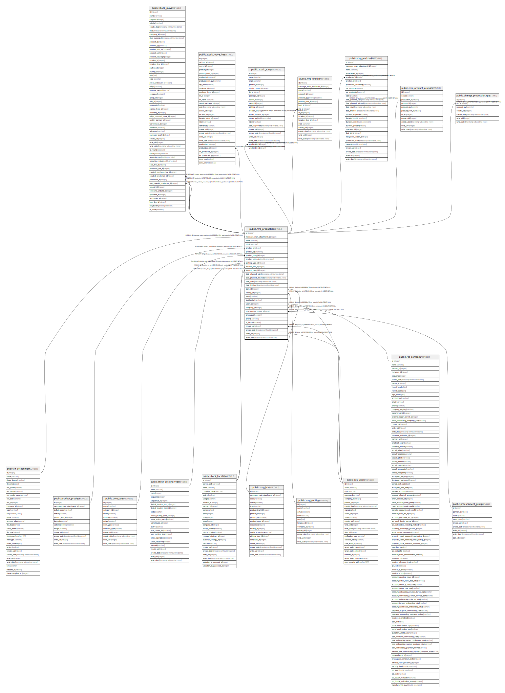

# public.mrp_production

## Description

Production Order

## Columns

| Name | Type | Default | Nullable | Children | Parents | Comment |
| ---- | ---- | ------- | -------- | -------- | ------- | ------- |
| id | integer | nextval('mrp_production_id_seq'::regclass) | false | [public.stock_move](public.stock_move.md) [public.stock_move_line](public.stock_move_line.md) [public.stock_scrap](public.stock_scrap.md) [public.mrp_unbuild](public.mrp_unbuild.md) [public.mrp_workorder](public.mrp_workorder.md) [public.mrp_product_produce](public.mrp_product_produce.md) [public.change_production_qty](public.change_production_qty.md) |  |  |
| message_main_attachment_id | integer |  | true |  | [public.ir_attachment](public.ir_attachment.md) | Main Attachment |
| name | varchar |  | true |  |  | Reference |
| origin | varchar |  | true |  |  | Source |
| product_id | integer |  | false |  | [public.product_product](public.product_product.md) | Product |
| product_qty | numeric |  | false |  |  | Quantity To Produce |
| product_uom_id | integer |  | false |  | [public.uom_uom](public.uom_uom.md) | Product Unit of Measure |
| product_uom_qty | double precision |  | true |  |  | Total Quantity |
| picking_type_id | integer |  | false |  | [public.stock_picking_type](public.stock_picking_type.md) | Operation Type |
| location_src_id | integer |  | false |  | [public.stock_location](public.stock_location.md) | Raw Materials Location |
| location_dest_id | integer |  | false |  | [public.stock_location](public.stock_location.md) | Finished Products Location |
| date_planned_start | timestamp without time zone |  | false |  |  | Deadline Start |
| date_planned_finished | timestamp without time zone |  | true |  |  | Deadline End |
| date_start | timestamp without time zone |  | true |  |  | Start Date |
| date_finished | timestamp without time zone |  | true |  |  | End Date |
| bom_id | integer |  | true |  | [public.mrp_bom](public.mrp_bom.md) | Bill of Material |
| routing_id | integer |  | true |  | [public.mrp_routing](public.mrp_routing.md) | Routing |
| state | varchar |  | true |  |  | State |
| availability | varchar |  | true |  |  | Materials Availability |
| user_id | integer |  | true |  | [public.res_users](public.res_users.md) | Responsible |
| company_id | integer |  | false |  | [public.res_company](public.res_company.md) | Company |
| procurement_group_id | integer |  | true |  | [public.procurement_group](public.procurement_group.md) | Procurement Group |
| propagate | boolean |  | true |  |  | Propagate cancel and split |
| priority | varchar |  | true |  |  | Priority |
| is_locked | boolean |  | true |  |  | Is Locked |
| create_uid | integer |  | true |  | [public.res_users](public.res_users.md) | Created by |
| create_date | timestamp without time zone |  | true |  |  | Created on |
| write_uid | integer |  | true |  | [public.res_users](public.res_users.md) | Last Updated by |
| write_date | timestamp without time zone |  | true |  |  | Last Updated on |

## Constraints

| Name | Type | Definition | Comment |
| ---- | ---- | ---------- | ------- |
| mrp_production_qty_positive | CHECK | CHECK ((product_qty > (0)::numeric)) | check (product_qty > 0) |
| mrp_production_create_uid_fkey | FOREIGN KEY | FOREIGN KEY (create_uid) REFERENCES res_users(id) ON DELETE SET NULL |  |
| mrp_production_user_id_fkey | FOREIGN KEY | FOREIGN KEY (user_id) REFERENCES res_users(id) ON DELETE SET NULL |  |
| mrp_production_write_uid_fkey | FOREIGN KEY | FOREIGN KEY (write_uid) REFERENCES res_users(id) ON DELETE SET NULL |  |
| mrp_production_company_id_fkey | FOREIGN KEY | FOREIGN KEY (company_id) REFERENCES res_company(id) ON DELETE SET NULL |  |
| mrp_production_message_main_attachment_id_fkey | FOREIGN KEY | FOREIGN KEY (message_main_attachment_id) REFERENCES ir_attachment(id) ON DELETE SET NULL |  |
| mrp_production_product_uom_id_fkey | FOREIGN KEY | FOREIGN KEY (product_uom_id) REFERENCES uom_uom(id) ON DELETE SET NULL |  |
| mrp_production_product_id_fkey | FOREIGN KEY | FOREIGN KEY (product_id) REFERENCES product_product(id) ON DELETE SET NULL |  |
| mrp_production_location_dest_id_fkey | FOREIGN KEY | FOREIGN KEY (location_dest_id) REFERENCES stock_location(id) ON DELETE SET NULL |  |
| mrp_production_location_src_id_fkey | FOREIGN KEY | FOREIGN KEY (location_src_id) REFERENCES stock_location(id) ON DELETE SET NULL |  |
| mrp_production_picking_type_id_fkey | FOREIGN KEY | FOREIGN KEY (picking_type_id) REFERENCES stock_picking_type(id) ON DELETE SET NULL |  |
| mrp_production_procurement_group_id_fkey | FOREIGN KEY | FOREIGN KEY (procurement_group_id) REFERENCES procurement_group(id) ON DELETE SET NULL |  |
| mrp_production_bom_id_fkey | FOREIGN KEY | FOREIGN KEY (bom_id) REFERENCES mrp_bom(id) ON DELETE SET NULL |  |
| mrp_production_routing_id_fkey | FOREIGN KEY | FOREIGN KEY (routing_id) REFERENCES mrp_routing(id) ON DELETE SET NULL |  |
| mrp_production_pkey | PRIMARY KEY | PRIMARY KEY (id) |  |
| mrp_production_name_uniq | UNIQUE | UNIQUE (name, company_id) | unique(name, company_id) |

## Indexes

| Name | Definition |
| ---- | ---------- |
| mrp_production_pkey | CREATE UNIQUE INDEX mrp_production_pkey ON public.mrp_production USING btree (id) |
| mrp_production_message_main_attachment_id_index | CREATE INDEX mrp_production_message_main_attachment_id_index ON public.mrp_production USING btree (message_main_attachment_id) |
| mrp_production_date_planned_start_index | CREATE INDEX mrp_production_date_planned_start_index ON public.mrp_production USING btree (date_planned_start) |
| mrp_production_date_planned_finished_index | CREATE INDEX mrp_production_date_planned_finished_index ON public.mrp_production USING btree (date_planned_finished) |
| mrp_production_date_start_index | CREATE INDEX mrp_production_date_start_index ON public.mrp_production USING btree (date_start) |
| mrp_production_date_finished_index | CREATE INDEX mrp_production_date_finished_index ON public.mrp_production USING btree (date_finished) |
| mrp_production_name_uniq | CREATE UNIQUE INDEX mrp_production_name_uniq ON public.mrp_production USING btree (name, company_id) |

## Relations

---

> Generated by [tbls](https://github.com/k1LoW/tbls)
