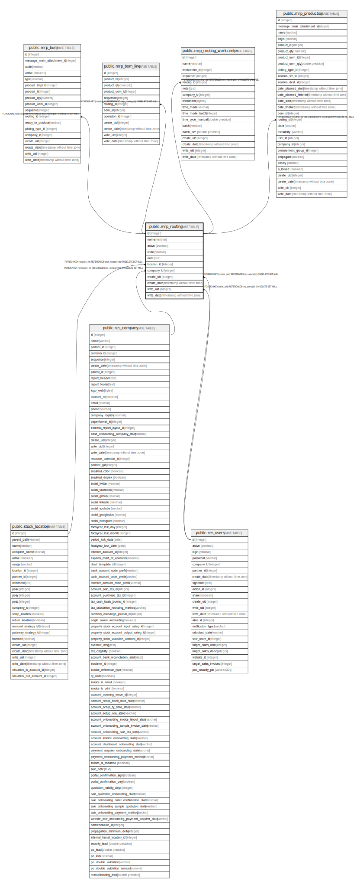

# public.mrp_routing

## Description

Routings

## Columns

| Name | Type | Default | Nullable | Children | Parents | Comment |
| ---- | ---- | ------- | -------- | -------- | ------- | ------- |
| id | integer | nextval('mrp_routing_id_seq'::regclass) | false | [public.mrp_bom](public.mrp_bom.md) [public.mrp_bom_line](public.mrp_bom_line.md) [public.mrp_routing_workcenter](public.mrp_routing_workcenter.md) [public.mrp_production](public.mrp_production.md) |  |  |
| name | varchar |  | false |  |  | Routing |
| active | boolean |  | true |  |  | Active |
| code | varchar |  | true |  |  | Reference |
| note | text |  | true |  |  | Description |
| location_id | integer |  | true |  | [public.stock_location](public.stock_location.md) | Raw Materials Location |
| company_id | integer |  | true |  | [public.res_company](public.res_company.md) | Company |
| create_uid | integer |  | true |  | [public.res_users](public.res_users.md) | Created by |
| create_date | timestamp without time zone |  | true |  |  | Created on |
| write_uid | integer |  | true |  | [public.res_users](public.res_users.md) | Last Updated by |
| write_date | timestamp without time zone |  | true |  |  | Last Updated on |

## Constraints

| Name | Type | Definition |
| ---- | ---- | ---------- |
| mrp_routing_create_uid_fkey | FOREIGN KEY | FOREIGN KEY (create_uid) REFERENCES res_users(id) ON DELETE SET NULL |
| mrp_routing_write_uid_fkey | FOREIGN KEY | FOREIGN KEY (write_uid) REFERENCES res_users(id) ON DELETE SET NULL |
| mrp_routing_company_id_fkey | FOREIGN KEY | FOREIGN KEY (company_id) REFERENCES res_company(id) ON DELETE SET NULL |
| mrp_routing_location_id_fkey | FOREIGN KEY | FOREIGN KEY (location_id) REFERENCES stock_location(id) ON DELETE SET NULL |
| mrp_routing_pkey | PRIMARY KEY | PRIMARY KEY (id) |

## Indexes

| Name | Definition |
| ---- | ---------- |
| mrp_routing_pkey | CREATE UNIQUE INDEX mrp_routing_pkey ON public.mrp_routing USING btree (id) |

## Relations

---

> Generated by [tbls](https://github.com/k1LoW/tbls)
