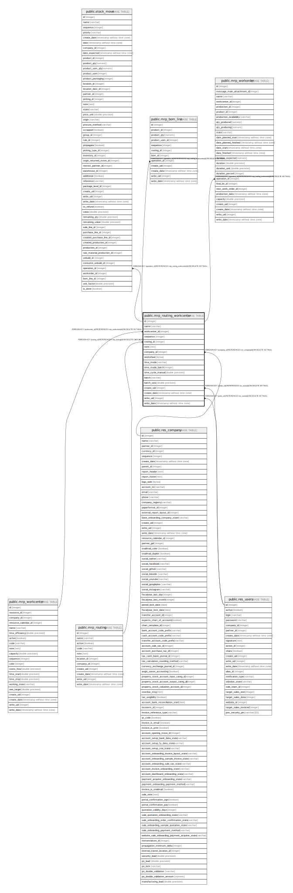

# public.mrp_routing_workcenter

## Description

Work Center Usage

## Columns

| Name | Type | Default | Nullable | Children | Parents | Comment |
| ---- | ---- | ------- | -------- | -------- | ------- | ------- |
| id | integer | nextval('mrp_routing_workcenter_id_seq'::regclass) | false | [public.stock_move](public.stock_move.md) [public.mrp_bom_line](public.mrp_bom_line.md) [public.mrp_workorder](public.mrp_workorder.md) |  |  |
| name | varchar |  | false |  |  | Operation |
| workcenter_id | integer |  | false |  | [public.mrp_workcenter](public.mrp_workcenter.md) | Work Center |
| sequence | integer |  | true |  |  | Sequence |
| routing_id | integer |  | false |  | [public.mrp_routing](public.mrp_routing.md) | Parent Routing |
| note | text |  | true |  |  | Description |
| company_id | integer |  | true |  | [public.res_company](public.res_company.md) | Company |
| worksheet | bytea |  | true |  |  | worksheet |
| time_mode | varchar |  | true |  |  | Duration Computation |
| time_mode_batch | integer |  | true |  |  | Based on |
| time_cycle_manual | double precision |  | true |  |  | Manual Duration |
| batch | varchar |  | false |  |  | Next Operation |
| batch_size | double precision |  | true |  |  | Quantity to Process |
| create_uid | integer |  | true |  | [public.res_users](public.res_users.md) | Created by |
| create_date | timestamp without time zone |  | true |  |  | Created on |
| write_uid | integer |  | true |  | [public.res_users](public.res_users.md) | Last Updated by |
| write_date | timestamp without time zone |  | true |  |  | Last Updated on |

## Constraints

| Name | Type | Definition |
| ---- | ---- | ---------- |
| mrp_routing_workcenter_create_uid_fkey | FOREIGN KEY | FOREIGN KEY (create_uid) REFERENCES res_users(id) ON DELETE SET NULL |
| mrp_routing_workcenter_write_uid_fkey | FOREIGN KEY | FOREIGN KEY (write_uid) REFERENCES res_users(id) ON DELETE SET NULL |
| mrp_routing_workcenter_company_id_fkey | FOREIGN KEY | FOREIGN KEY (company_id) REFERENCES res_company(id) ON DELETE SET NULL |
| mrp_routing_workcenter_routing_id_fkey | FOREIGN KEY | FOREIGN KEY (routing_id) REFERENCES mrp_routing(id) ON DELETE CASCADE |
| mrp_routing_workcenter_pkey | PRIMARY KEY | PRIMARY KEY (id) |
| mrp_routing_workcenter_workcenter_id_fkey | FOREIGN KEY | FOREIGN KEY (workcenter_id) REFERENCES mrp_workcenter(id) ON DELETE SET NULL |

## Indexes

| Name | Definition |
| ---- | ---------- |
| mrp_routing_workcenter_pkey | CREATE UNIQUE INDEX mrp_routing_workcenter_pkey ON public.mrp_routing_workcenter USING btree (id) |
| mrp_routing_workcenter_routing_id_index | CREATE INDEX mrp_routing_workcenter_routing_id_index ON public.mrp_routing_workcenter USING btree (routing_id) |

## Relations

---

> Generated by [tbls](https://github.com/k1LoW/tbls)
