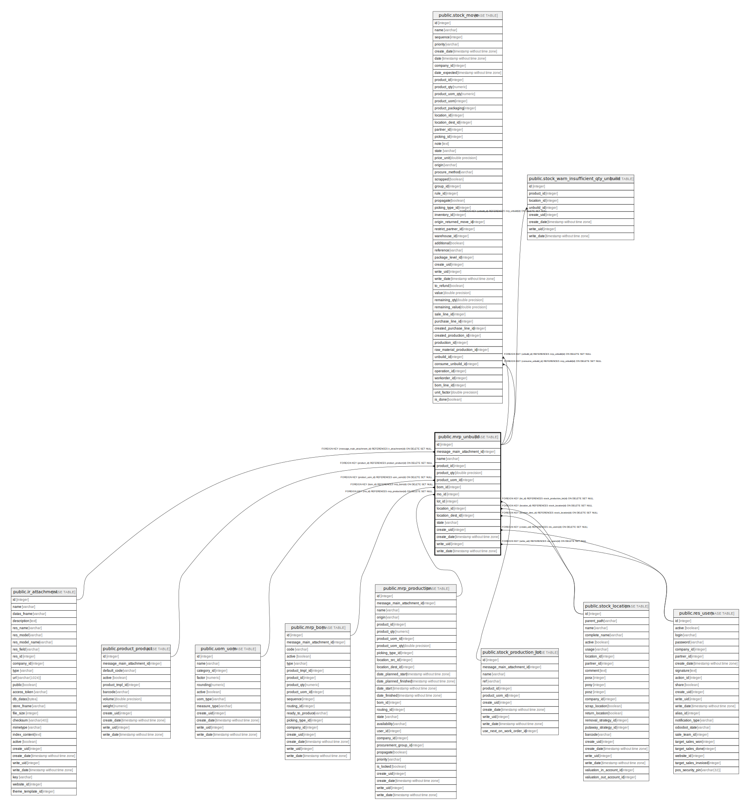

# public.mrp_unbuild

## Description

Unbuild Order

## Columns

| Name | Type | Default | Nullable | Children | Parents | Comment |
| ---- | ---- | ------- | -------- | -------- | ------- | ------- |
| id | integer | nextval('mrp_unbuild_id_seq'::regclass) | false | [public.stock_move](public.stock_move.md) [public.stock_warn_insufficient_qty_unbuild](public.stock_warn_insufficient_qty_unbuild.md) |  |  |
| message_main_attachment_id | integer |  | true |  | [public.ir_attachment](public.ir_attachment.md) | Main Attachment |
| name | varchar |  | true |  |  | Reference |
| product_id | integer |  | false |  | [public.product_product](public.product_product.md) | Product |
| product_qty | double precision |  | false |  |  | Quantity |
| product_uom_id | integer |  | false |  | [public.uom_uom](public.uom_uom.md) | Unit of Measure |
| bom_id | integer |  | false |  | [public.mrp_bom](public.mrp_bom.md) | Bill of Material |
| mo_id | integer |  | true |  | [public.mrp_production](public.mrp_production.md) | Manufacturing Order |
| lot_id | integer |  | true |  | [public.stock_production_lot](public.stock_production_lot.md) | Lot |
| location_id | integer |  | false |  | [public.stock_location](public.stock_location.md) | Location |
| location_dest_id | integer |  | false |  | [public.stock_location](public.stock_location.md) | Destination Location |
| state | varchar |  | true |  |  | Status |
| create_uid | integer |  | true |  | [public.res_users](public.res_users.md) | Created by |
| create_date | timestamp without time zone |  | true |  |  | Created on |
| write_uid | integer |  | true |  | [public.res_users](public.res_users.md) | Last Updated by |
| write_date | timestamp without time zone |  | true |  |  | Last Updated on |

## Constraints

| Name | Type | Definition |
| ---- | ---- | ---------- |
| mrp_unbuild_create_uid_fkey | FOREIGN KEY | FOREIGN KEY (create_uid) REFERENCES res_users(id) ON DELETE SET NULL |
| mrp_unbuild_write_uid_fkey | FOREIGN KEY | FOREIGN KEY (write_uid) REFERENCES res_users(id) ON DELETE SET NULL |
| mrp_unbuild_message_main_attachment_id_fkey | FOREIGN KEY | FOREIGN KEY (message_main_attachment_id) REFERENCES ir_attachment(id) ON DELETE SET NULL |
| mrp_unbuild_product_uom_id_fkey | FOREIGN KEY | FOREIGN KEY (product_uom_id) REFERENCES uom_uom(id) ON DELETE SET NULL |
| mrp_unbuild_product_id_fkey | FOREIGN KEY | FOREIGN KEY (product_id) REFERENCES product_product(id) ON DELETE SET NULL |
| mrp_unbuild_location_dest_id_fkey | FOREIGN KEY | FOREIGN KEY (location_dest_id) REFERENCES stock_location(id) ON DELETE SET NULL |
| mrp_unbuild_location_id_fkey | FOREIGN KEY | FOREIGN KEY (location_id) REFERENCES stock_location(id) ON DELETE SET NULL |
| mrp_unbuild_lot_id_fkey | FOREIGN KEY | FOREIGN KEY (lot_id) REFERENCES stock_production_lot(id) ON DELETE SET NULL |
| mrp_unbuild_bom_id_fkey | FOREIGN KEY | FOREIGN KEY (bom_id) REFERENCES mrp_bom(id) ON DELETE SET NULL |
| mrp_unbuild_mo_id_fkey | FOREIGN KEY | FOREIGN KEY (mo_id) REFERENCES mrp_production(id) ON DELETE SET NULL |
| mrp_unbuild_pkey | PRIMARY KEY | PRIMARY KEY (id) |

## Indexes

| Name | Definition |
| ---- | ---------- |
| mrp_unbuild_pkey | CREATE UNIQUE INDEX mrp_unbuild_pkey ON public.mrp_unbuild USING btree (id) |
| mrp_unbuild_message_main_attachment_id_index | CREATE INDEX mrp_unbuild_message_main_attachment_id_index ON public.mrp_unbuild USING btree (message_main_attachment_id) |
| mrp_unbuild_state_index | CREATE INDEX mrp_unbuild_state_index ON public.mrp_unbuild USING btree (state) |

## Relations

---

> Generated by [tbls](https://github.com/k1LoW/tbls)
