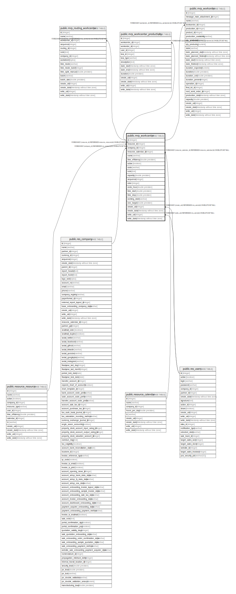

# public.mrp_workcenter

## Description

Work Center

## Columns

| Name | Type | Default | Nullable | Children | Parents | Comment |
| ---- | ---- | ------- | -------- | -------- | ------- | ------- |
| id | integer | nextval('mrp_workcenter_id_seq'::regclass) | false | [public.mrp_routing_workcenter](public.mrp_routing_workcenter.md) [public.mrp_workcenter_productivity](public.mrp_workcenter_productivity.md) [public.mrp_workorder](public.mrp_workorder.md) |  |  |
| resource_id | integer |  | false |  | [public.resource_resource](public.resource_resource.md) | Resource |
| company_id | integer |  | true |  | [public.res_company](public.res_company.md) | Company |
| resource_calendar_id | integer |  | true |  | [public.resource_calendar](public.resource_calendar.md) | Working Hours |
| name | varchar |  | true |  |  | Work Center |
| time_efficiency | double precision |  | true |  |  | Time Efficiency |
| active | boolean |  | true |  |  | Active |
| code | varchar |  | true |  |  | Code |
| note | text |  | true |  |  | Description |
| capacity | double precision |  | true |  |  | Capacity |
| sequence | integer |  | false |  |  | Sequence |
| color | integer |  | true |  |  | Color |
| costs_hour | double precision |  | true |  |  | Cost per hour |
| time_start | double precision |  | true |  |  | Time before prod. |
| time_stop | double precision |  | true |  |  | Time after prod. |
| working_state | varchar |  | true |  |  | Workcenter Status |
| oee_target | double precision |  | true |  |  | OEE Target |
| create_uid | integer |  | true |  | [public.res_users](public.res_users.md) | Created by |
| create_date | timestamp without time zone |  | true |  |  | Created on |
| write_uid | integer |  | true |  | [public.res_users](public.res_users.md) | Last Updated by |
| write_date | timestamp without time zone |  | true |  |  | Last Updated on |

## Constraints

| Name | Type | Definition |
| ---- | ---- | ---------- |
| mrp_workcenter_create_uid_fkey | FOREIGN KEY | FOREIGN KEY (create_uid) REFERENCES res_users(id) ON DELETE SET NULL |
| mrp_workcenter_write_uid_fkey | FOREIGN KEY | FOREIGN KEY (write_uid) REFERENCES res_users(id) ON DELETE SET NULL |
| mrp_workcenter_company_id_fkey | FOREIGN KEY | FOREIGN KEY (company_id) REFERENCES res_company(id) ON DELETE SET NULL |
| mrp_workcenter_resource_calendar_id_fkey | FOREIGN KEY | FOREIGN KEY (resource_calendar_id) REFERENCES resource_calendar(id) ON DELETE SET NULL |
| mrp_workcenter_resource_id_fkey | FOREIGN KEY | FOREIGN KEY (resource_id) REFERENCES resource_resource(id) ON DELETE RESTRICT |
| mrp_workcenter_pkey | PRIMARY KEY | PRIMARY KEY (id) |

## Indexes

| Name | Definition |
| ---- | ---------- |
| mrp_workcenter_pkey | CREATE UNIQUE INDEX mrp_workcenter_pkey ON public.mrp_workcenter USING btree (id) |
| mrp_workcenter_resource_id_index | CREATE INDEX mrp_workcenter_resource_id_index ON public.mrp_workcenter USING btree (resource_id) |
| mrp_workcenter_company_id_index | CREATE INDEX mrp_workcenter_company_id_index ON public.mrp_workcenter USING btree (company_id) |
| mrp_workcenter_resource_calendar_id_index | CREATE INDEX mrp_workcenter_resource_calendar_id_index ON public.mrp_workcenter USING btree (resource_calendar_id) |

## Relations

---

> Generated by [tbls](https://github.com/k1LoW/tbls)
