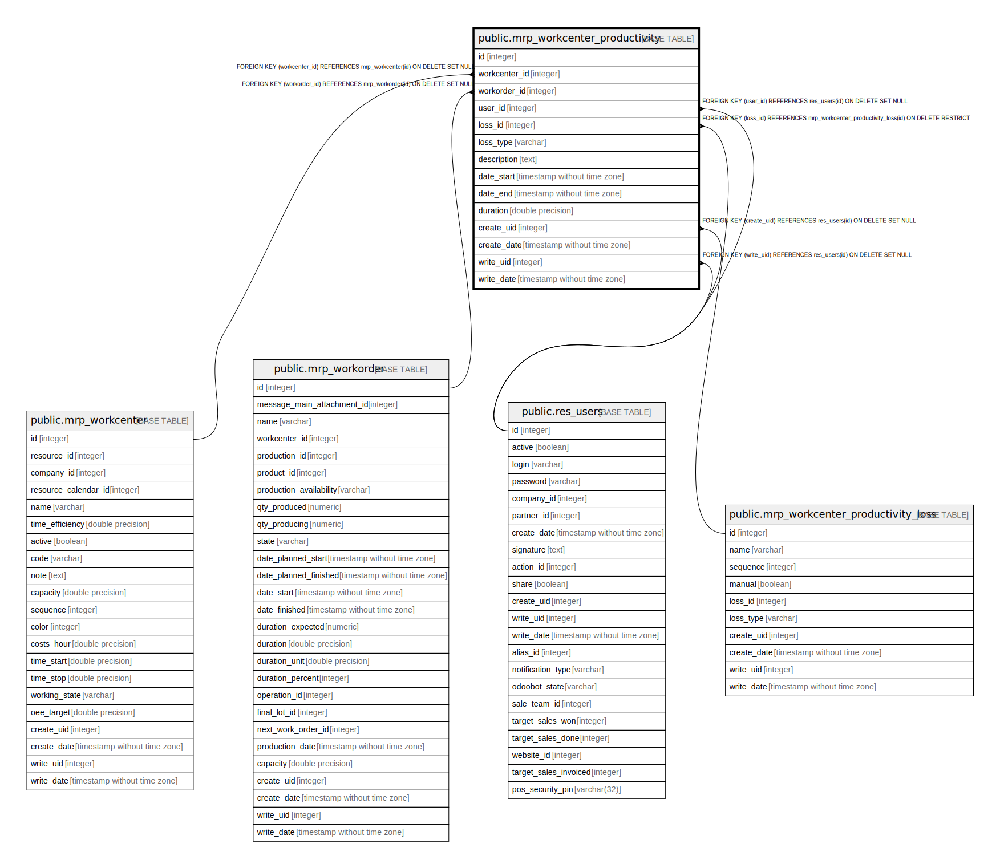

# public.mrp_workcenter_productivity

## Description

Workcenter Productivity Log

## Columns

| Name | Type | Default | Nullable | Children | Parents | Comment |
| ---- | ---- | ------- | -------- | -------- | ------- | ------- |
| id | integer | nextval('mrp_workcenter_productivity_id_seq'::regclass) | false |  |  |  |
| workcenter_id | integer |  | false |  | [public.mrp_workcenter](public.mrp_workcenter.md) | Work Center |
| workorder_id | integer |  | true |  | [public.mrp_workorder](public.mrp_workorder.md) | Work Order |
| user_id | integer |  | true |  | [public.res_users](public.res_users.md) | User |
| loss_id | integer |  | false |  | [public.mrp_workcenter_productivity_loss](public.mrp_workcenter_productivity_loss.md) | Loss Reason |
| loss_type | varchar |  | true |  |  | Effectiveness Category |
| description | text |  | true |  |  | Description |
| date_start | timestamp without time zone |  | false |  |  | Start Date |
| date_end | timestamp without time zone |  | true |  |  | End Date |
| duration | double precision |  | true |  |  | Duration |
| create_uid | integer |  | true |  | [public.res_users](public.res_users.md) | Created by |
| create_date | timestamp without time zone |  | true |  |  | Created on |
| write_uid | integer |  | true |  | [public.res_users](public.res_users.md) | Last Updated by |
| write_date | timestamp without time zone |  | true |  |  | Last Updated on |

## Constraints

| Name | Type | Definition |
| ---- | ---- | ---------- |
| mrp_workcenter_productivity_create_uid_fkey | FOREIGN KEY | FOREIGN KEY (create_uid) REFERENCES res_users(id) ON DELETE SET NULL |
| mrp_workcenter_productivity_user_id_fkey | FOREIGN KEY | FOREIGN KEY (user_id) REFERENCES res_users(id) ON DELETE SET NULL |
| mrp_workcenter_productivity_write_uid_fkey | FOREIGN KEY | FOREIGN KEY (write_uid) REFERENCES res_users(id) ON DELETE SET NULL |
| mrp_workcenter_productivity_workcenter_id_fkey | FOREIGN KEY | FOREIGN KEY (workcenter_id) REFERENCES mrp_workcenter(id) ON DELETE SET NULL |
| mrp_workcenter_productivity_loss_id_fkey | FOREIGN KEY | FOREIGN KEY (loss_id) REFERENCES mrp_workcenter_productivity_loss(id) ON DELETE RESTRICT |
| mrp_workcenter_productivity_pkey | PRIMARY KEY | PRIMARY KEY (id) |
| mrp_workcenter_productivity_workorder_id_fkey | FOREIGN KEY | FOREIGN KEY (workorder_id) REFERENCES mrp_workorder(id) ON DELETE SET NULL |

## Indexes

| Name | Definition |
| ---- | ---------- |
| mrp_workcenter_productivity_pkey | CREATE UNIQUE INDEX mrp_workcenter_productivity_pkey ON public.mrp_workcenter_productivity USING btree (id) |

## Relations

---

> Generated by [tbls](https://github.com/k1LoW/tbls)
