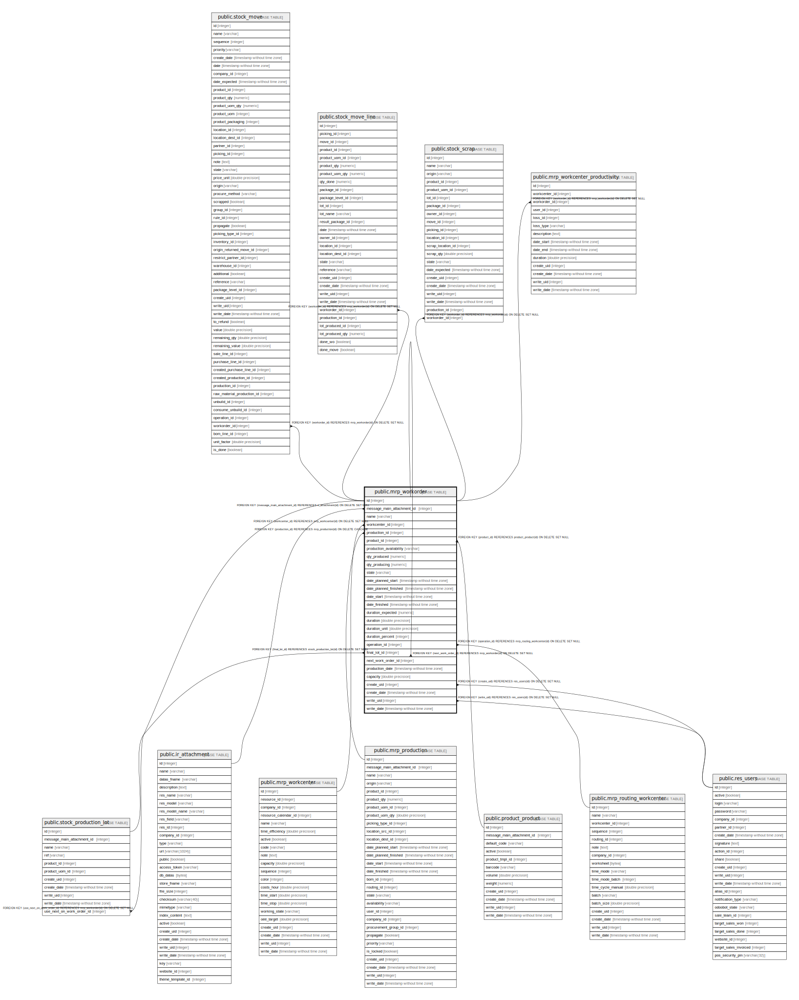

# public.mrp_workorder

## Description

Work Order

## Columns

| Name | Type | Default | Nullable | Children | Parents | Comment |
| ---- | ---- | ------- | -------- | -------- | ------- | ------- |
| id | integer | nextval('mrp_workorder_id_seq'::regclass) | false | [public.stock_move](public.stock_move.md) [public.stock_move_line](public.stock_move_line.md) [public.stock_production_lot](public.stock_production_lot.md) [public.stock_scrap](public.stock_scrap.md) [public.mrp_workcenter_productivity](public.mrp_workcenter_productivity.md) [public.mrp_workorder](public.mrp_workorder.md) |  |  |
| message_main_attachment_id | integer |  | true |  | [public.ir_attachment](public.ir_attachment.md) | Main Attachment |
| name | varchar |  | false |  |  | Work Order |
| workcenter_id | integer |  | false |  | [public.mrp_workcenter](public.mrp_workcenter.md) | Work Center |
| production_id | integer |  | false |  | [public.mrp_production](public.mrp_production.md) | Manufacturing Order |
| product_id | integer |  | true |  | [public.product_product](public.product_product.md) | Product |
| production_availability | varchar |  | true |  |  | Materials Availability |
| qty_produced | numeric |  | true |  |  | Quantity |
| qty_producing | numeric |  | true |  |  | Currently Produced Quantity |
| state | varchar |  | true |  |  | Status |
| date_planned_start | timestamp without time zone |  | true |  |  | Scheduled Date Start |
| date_planned_finished | timestamp without time zone |  | true |  |  | Scheduled Date Finished |
| date_start | timestamp without time zone |  | true |  |  | Effective Start Date |
| date_finished | timestamp without time zone |  | true |  |  | Effective End Date |
| duration_expected | numeric |  | true |  |  | Expected Duration |
| duration | double precision |  | true |  |  | Real Duration |
| duration_unit | double precision |  | true |  |  | Duration Per Unit |
| duration_percent | integer |  | true |  |  | Duration Deviation (%) |
| operation_id | integer |  | true |  | [public.mrp_routing_workcenter](public.mrp_routing_workcenter.md) | Operation |
| final_lot_id | integer |  | true |  | [public.stock_production_lot](public.stock_production_lot.md) | Lot/Serial Number |
| next_work_order_id | integer |  | true |  | [public.mrp_workorder](public.mrp_workorder.md) | Next Work Order |
| production_date | timestamp without time zone |  | true |  |  | Production Date |
| capacity | double precision |  | true |  |  | Capacity |
| create_uid | integer |  | true |  | [public.res_users](public.res_users.md) | Created by |
| create_date | timestamp without time zone |  | true |  |  | Created on |
| write_uid | integer |  | true |  | [public.res_users](public.res_users.md) | Last Updated by |
| write_date | timestamp without time zone |  | true |  |  | Last Updated on |

## Constraints

| Name | Type | Definition |
| ---- | ---- | ---------- |
| mrp_workorder_create_uid_fkey | FOREIGN KEY | FOREIGN KEY (create_uid) REFERENCES res_users(id) ON DELETE SET NULL |
| mrp_workorder_write_uid_fkey | FOREIGN KEY | FOREIGN KEY (write_uid) REFERENCES res_users(id) ON DELETE SET NULL |
| mrp_workorder_message_main_attachment_id_fkey | FOREIGN KEY | FOREIGN KEY (message_main_attachment_id) REFERENCES ir_attachment(id) ON DELETE SET NULL |
| mrp_workorder_product_id_fkey | FOREIGN KEY | FOREIGN KEY (product_id) REFERENCES product_product(id) ON DELETE SET NULL |
| mrp_workorder_final_lot_id_fkey | FOREIGN KEY | FOREIGN KEY (final_lot_id) REFERENCES stock_production_lot(id) ON DELETE SET NULL |
| mrp_workorder_operation_id_fkey | FOREIGN KEY | FOREIGN KEY (operation_id) REFERENCES mrp_routing_workcenter(id) ON DELETE SET NULL |
| mrp_workorder_workcenter_id_fkey | FOREIGN KEY | FOREIGN KEY (workcenter_id) REFERENCES mrp_workcenter(id) ON DELETE SET NULL |
| mrp_workorder_production_id_fkey | FOREIGN KEY | FOREIGN KEY (production_id) REFERENCES mrp_production(id) ON DELETE CASCADE |
| mrp_workorder_next_work_order_id_fkey | FOREIGN KEY | FOREIGN KEY (next_work_order_id) REFERENCES mrp_workorder(id) ON DELETE SET NULL |
| mrp_workorder_pkey | PRIMARY KEY | PRIMARY KEY (id) |

## Indexes

| Name | Definition |
| ---- | ---------- |
| mrp_workorder_pkey | CREATE UNIQUE INDEX mrp_workorder_pkey ON public.mrp_workorder USING btree (id) |
| mrp_workorder_message_main_attachment_id_index | CREATE INDEX mrp_workorder_message_main_attachment_id_index ON public.mrp_workorder USING btree (message_main_attachment_id) |
| mrp_workorder_production_id_index | CREATE INDEX mrp_workorder_production_id_index ON public.mrp_workorder USING btree (production_id) |

## Relations

---

> Generated by [tbls](https://github.com/k1LoW/tbls)
