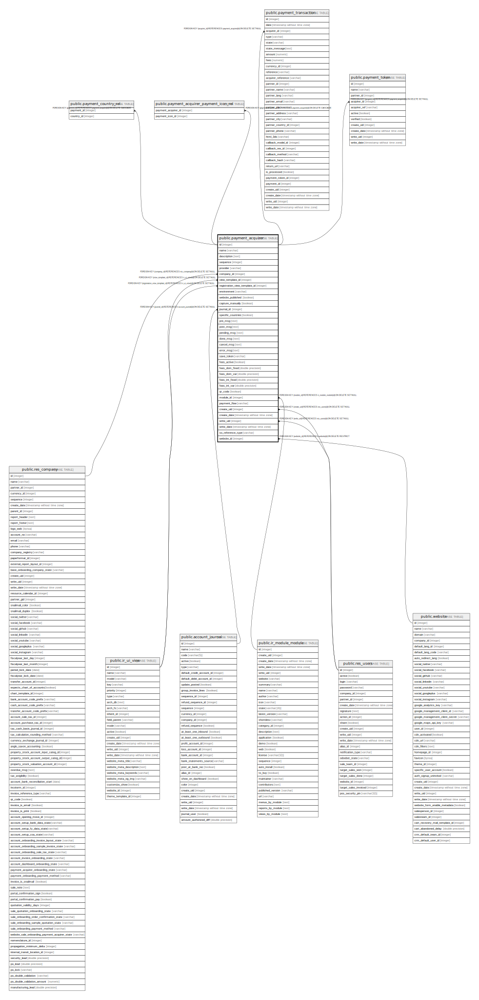

# public.payment_acquirer

## Description

Payment Acquirer

## Columns

| Name | Type | Default | Nullable | Children | Parents | Comment |
| ---- | ---- | ------- | -------- | -------- | ------- | ------- |
| id | integer | nextval('payment_acquirer_id_seq'::regclass) | false | [public.payment_country_rel](public.payment_country_rel.md) [public.payment_acquirer_payment_icon_rel](public.payment_acquirer_payment_icon_rel.md) [public.payment_transaction](public.payment_transaction.md) [public.payment_token](public.payment_token.md) |  |  |
| name | varchar |  | false |  |  | Name |
| description | text |  | true |  |  | Description |
| sequence | integer |  | true |  |  | Sequence |
| provider | varchar |  | false |  |  | Provider |
| company_id | integer |  | false |  | [public.res_company](public.res_company.md) | Company |
| view_template_id | integer |  | false |  | [public.ir_ui_view](public.ir_ui_view.md) | Form Button Template |
| registration_view_template_id | integer |  | true |  | [public.ir_ui_view](public.ir_ui_view.md) | S2S Form Template |
| environment | varchar |  | false |  |  | Environment |
| website_published | boolean |  | true |  |  | Visible in Portal / Website |
| capture_manually | boolean |  | true |  |  | Capture Amount Manually |
| journal_id | integer |  | true |  | [public.account_journal](public.account_journal.md) | Payment Journal |
| specific_countries | boolean |  | true |  |  | Specific Countries |
| pre_msg | text |  | true |  |  | Help Message |
| post_msg | text |  | true |  |  | Thanks Message |
| pending_msg | text |  | true |  |  | Pending Message |
| done_msg | text |  | true |  |  | Done Message |
| cancel_msg | text |  | true |  |  | Cancel Message |
| error_msg | text |  | true |  |  | Error Message |
| save_token | varchar |  | true |  |  | Save Cards |
| fees_active | boolean |  | true |  |  | Add Extra Fees |
| fees_dom_fixed | double precision |  | true |  |  | Fixed domestic fees |
| fees_dom_var | double precision |  | true |  |  | Variable domestic fees (in percents) |
| fees_int_fixed | double precision |  | true |  |  | Fixed international fees |
| fees_int_var | double precision |  | true |  |  | Variable international fees (in percents) |
| qr_code | boolean |  | true |  |  | Use SEPA QR Code |
| module_id | integer |  | true |  | [public.ir_module_module](public.ir_module_module.md) | Corresponding Module |
| payment_flow | varchar |  | false |  |  | Payment Flow |
| create_uid | integer |  | true |  | [public.res_users](public.res_users.md) | Created by |
| create_date | timestamp without time zone |  | true |  |  | Created on |
| write_uid | integer |  | true |  | [public.res_users](public.res_users.md) | Last Updated by |
| write_date | timestamp without time zone |  | true |  |  | Last Updated on |
| so_reference_type | varchar |  | true |  |  | Communication |
| website_id | integer |  | true |  | [public.website](public.website.md) | Website |

## Constraints

| Name | Type | Definition |
| ---- | ---- | ---------- |
| payment_acquirer_create_uid_fkey | FOREIGN KEY | FOREIGN KEY (create_uid) REFERENCES res_users(id) ON DELETE SET NULL |
| payment_acquirer_write_uid_fkey | FOREIGN KEY | FOREIGN KEY (write_uid) REFERENCES res_users(id) ON DELETE SET NULL |
| payment_acquirer_module_id_fkey | FOREIGN KEY | FOREIGN KEY (module_id) REFERENCES ir_module_module(id) ON DELETE SET NULL |
| payment_acquirer_company_id_fkey | FOREIGN KEY | FOREIGN KEY (company_id) REFERENCES res_company(id) ON DELETE SET NULL |
| payment_acquirer_registration_view_template_id_fkey | FOREIGN KEY | FOREIGN KEY (registration_view_template_id) REFERENCES ir_ui_view(id) ON DELETE SET NULL |
| payment_acquirer_view_template_id_fkey | FOREIGN KEY | FOREIGN KEY (view_template_id) REFERENCES ir_ui_view(id) ON DELETE SET NULL |
| payment_acquirer_website_id_fkey | FOREIGN KEY | FOREIGN KEY (website_id) REFERENCES website(id) ON DELETE RESTRICT |
| payment_acquirer_journal_id_fkey | FOREIGN KEY | FOREIGN KEY (journal_id) REFERENCES account_journal(id) ON DELETE SET NULL |
| payment_acquirer_pkey | PRIMARY KEY | PRIMARY KEY (id) |

## Indexes

| Name | Definition |
| ---- | ---------- |
| payment_acquirer_pkey | CREATE UNIQUE INDEX payment_acquirer_pkey ON public.payment_acquirer USING btree (id) |

## Relations

---

> Generated by [tbls](https://github.com/k1LoW/tbls)
