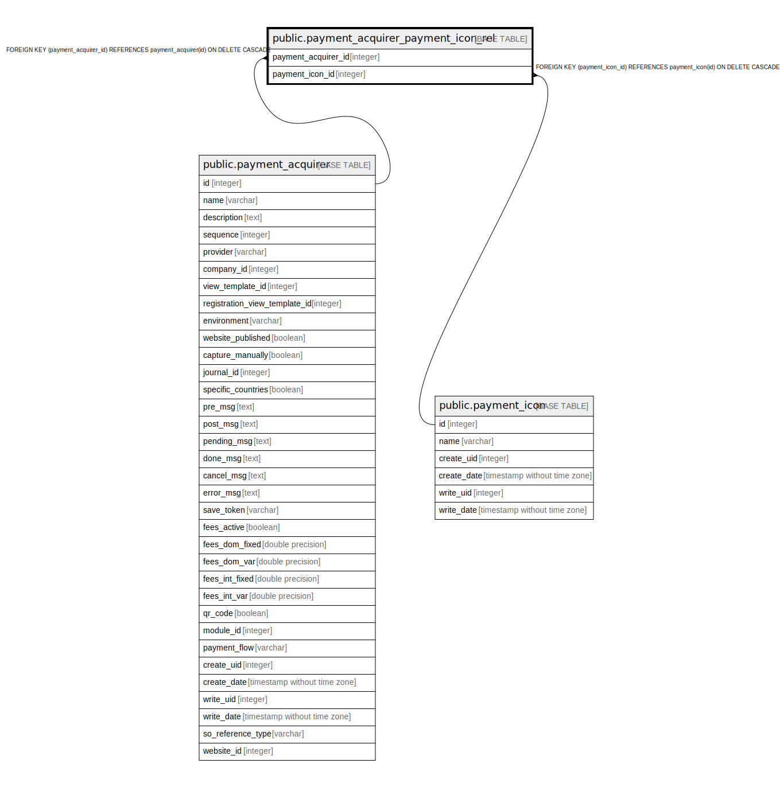

# public.payment_acquirer_payment_icon_rel

## Description

RELATION BETWEEN payment_acquirer AND payment_icon

## Columns

| Name | Type | Default | Nullable | Children | Parents | Comment |
| ---- | ---- | ------- | -------- | -------- | ------- | ------- |
| payment_acquirer_id | integer |  | false |  | [public.payment_acquirer](public.payment_acquirer.md) |  |
| payment_icon_id | integer |  | false |  | [public.payment_icon](public.payment_icon.md) |  |

## Constraints

| Name | Type | Definition |
| ---- | ---- | ---------- |
| payment_acquirer_payment_icon_rel_payment_acquirer_id_fkey | FOREIGN KEY | FOREIGN KEY (payment_acquirer_id) REFERENCES payment_acquirer(id) ON DELETE CASCADE |
| payment_acquirer_payment_icon_payment_acquirer_id_payment_i_key | UNIQUE | UNIQUE (payment_acquirer_id, payment_icon_id) |
| payment_acquirer_payment_icon_rel_payment_icon_id_fkey | FOREIGN KEY | FOREIGN KEY (payment_icon_id) REFERENCES payment_icon(id) ON DELETE CASCADE |

## Indexes

| Name | Definition |
| ---- | ---------- |
| payment_acquirer_payment_icon_payment_acquirer_id_payment_i_key | CREATE UNIQUE INDEX payment_acquirer_payment_icon_payment_acquirer_id_payment_i_key ON public.payment_acquirer_payment_icon_rel USING btree (payment_acquirer_id, payment_icon_id) |
| payment_acquirer_payment_icon_rel_payment_acquirer_id_idx | CREATE INDEX payment_acquirer_payment_icon_rel_payment_acquirer_id_idx ON public.payment_acquirer_payment_icon_rel USING btree (payment_acquirer_id) |
| payment_acquirer_payment_icon_rel_payment_icon_id_idx | CREATE INDEX payment_acquirer_payment_icon_rel_payment_icon_id_idx ON public.payment_acquirer_payment_icon_rel USING btree (payment_icon_id) |

## Relations

---

> Generated by [tbls](https://github.com/k1LoW/tbls)
